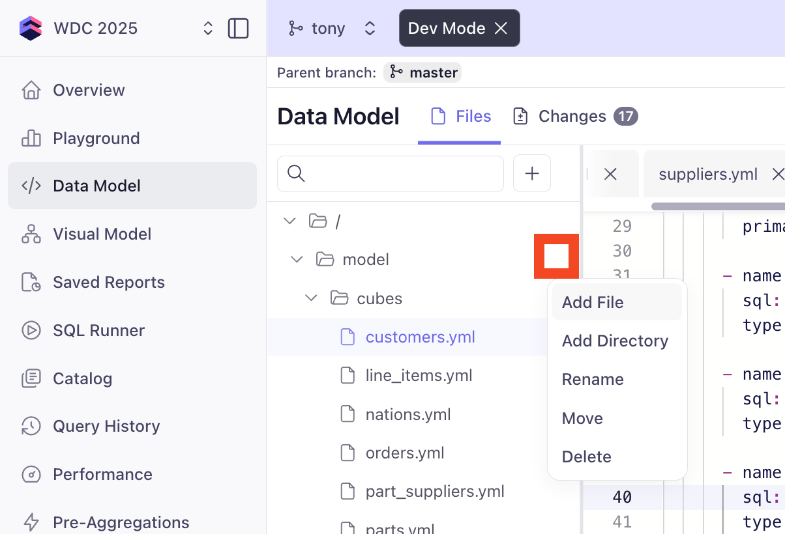
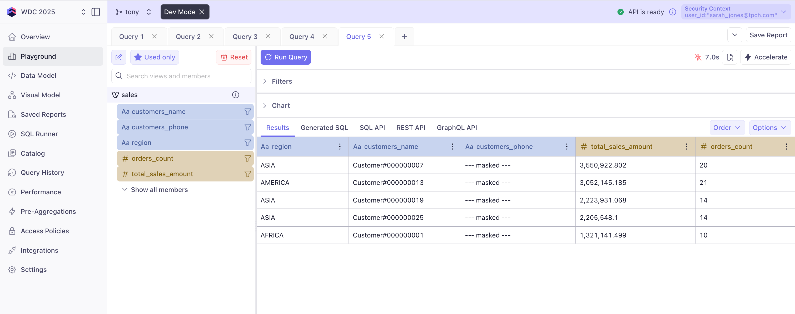
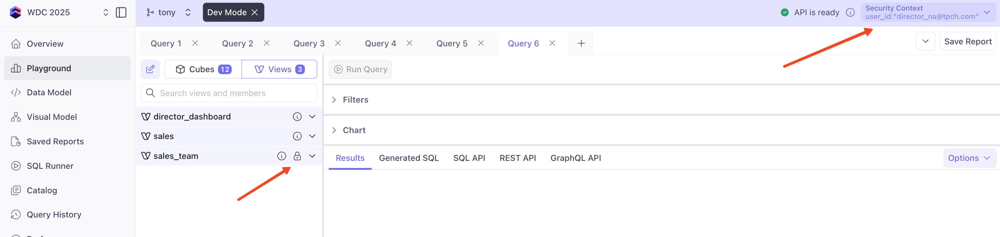

# Access Control with Cube

Cube provides comprehensive security features that go beyond simple row-level filtering. You can implement row-level security, column-level masking, control cube and view visibility, and build multi-tenant architectures - all applied automatically across every query, regardless of the API used.

In this section, we'll cover some basic implementations of Cube's access control features so you can get a feel for how they work and how they could be extended for your own applications.

## Why Access Control Matters

In a B2B environment like TPCH, different users need different data access:

- **Sales reps** should only see their assigned customers' orders
- **Regional directors** need data for their specific regions  
- **Global admins** require full visibility across all data
- **External partners** might access only their relevant supply data

## Types of Access Control in Cube

### 1. Row-Level Security (RLS)
Filter which rows users can see based on their context

### 2. Column-Level Masking
Hide or mask sensitive fields like PII data

### 3. Object Visibility
Control which cubes and views users can access

### 4. Multi-Tenancy
Completely isolate data between different organizations

## Security Context

Cube's security context is set with each request and can be augmented with lookups to your systems of record. The complete context then flows through to all queries:

```javascript
// Example security context passed from your application
{
  user_id: "sarah_jones"
}

// After enhancing with lookups
{
  user_id: "sarah_jones",
  role: "sales_rep",
  customer_ids: [101, 105, 112, 118, 125],
  region: null
}
```

## Implementing Row-Level Security with query_rewrite

Instead of modifying cube definitions directly, we'll use Cube's powerful `query_rewrite` feature to apply security rules dynamically. This keeps our data model clean and security logic centralized.

:::tip Development Mode Reminder
Before making any changes to your data model, ensure you're in **Development Mode**:
1. Navigate to the **Data Model** page
2. Click **"Dev Mode"** (top of the interface)
3. Create a new branch or continue with your existing development branch

This ensures your security changes won't affect production until you're ready to deploy them.
:::

### Step 1: Define User Mappings

First, let's create our hardcoded user mappings in `cube.py`.  In practice, these would come from your authentication system, directory, or entitlements table, but for simplicity in this workshop, we'll define them directly in code.  We'll also add our `@example.com` account as a global admin so we can use D3 with it later.

:::warning
Make sure to update your user email in the first entry of the `USER_SECURITY_MAPPINGS` dictionary below with your workshop email address.  This will ensure you have full access to the data when logged in to D3 in the final workshop module.
:::

```python title="cube.py" {3-43}
from cube import config 

USER_SECURITY_MAPPINGS = {
    # YOUR USER - UPDATE WITH YOUR WORKSHOP EMAIL
    "wdc-2025-999@example.com": {
        "role": "global_admin",
        "filter_type": "none"
    },
    
    # Global admin - sees everything
    "admin@tpch.com": {
        "role": "global_admin",
        "filter_type": "none"
    },

    # Regional director - North America (Region 1)
    "director_na@tpch.com": {
        "role": "regional_director", 
        "filter_type": "region",
        "region_key": 1  # AMERICA
    },
    
    # Regional director - Europe (Region 3)
    "director_eu@tpch.com": {
        "role": "regional_director",
        "filter_type": "region", 
        "region_key": 3  # EUROPE
    },
    
    # Sales rep - specific customers
    "sarah_jones@tpch.com": {
        "role": "sales_rep",
        "filter_type": "customers",
        "customer_keys": [1, 7, 13, 19, 25]  # 5 customers
    },
    
    # Sales rep - different customers
    "mike_chen@tpch.com": {
        "role": "sales_rep",
        "filter_type": "customers",
        "customer_keys": [2, 8, 14, 20, 26, 27, 28]  # 7 customers
    }
}
```

### Step 2: Implement query_rewrite

Add the security filtering logic to the end of `cube.py`:

```python title="cube.py" 
@config('query_rewrite')
def query_rewrite(query: dict, ctx: dict) -> dict:
    # Get user from security context
    user_id = ctx.get('securityContext', {}).get('user_id')
    
    # Look up user's security settings
    user_security = USER_SECURITY_MAPPINGS.get(user_id, {})
    
    # Default to no access if user not found
    if not user_security:
        # Add impossible filter to return no data
        query['filters'].append({
            'member': 'sales.c_custkey',
            'operator': 'equals',
            'values': ['-1']  # Non-existent customer
        })
        return query
    
    # Apply filters based on user type
    filter_type = user_security.get('filter_type')
    
    if filter_type == 'none':
        # Global admin - no filters needed
        pass
        
    elif filter_type == 'region':
        # Regional director - filter by region
        query['filters'].append({
            'member': 'customer_regions.region_key',
            'operator': 'equals',
            'values': [str(user_security['region_key'])]
        })
        
    elif filter_type == 'customers':
        # Sales rep - filter by customer list
        query['filters'].append({
            'member': 'customers.customer_key',
            'operator': 'in',
            'values': [str(ck) for ck in user_security['customer_keys']]
        })
    
    return query
```

We also need to include the fields in our view that we'll be filtering on. Update your `sales` cube definition to include the necessary dimensions:

```yaml title="/model/views/sales.yml" {10,26}
...

      # Customer information via orders
      - join_path: line_items.orders.customers
        prefix: true
        includes:
          - name
          - segment
          - account_balance
          - customer_key
        excludes:
          - phone 
          - address
          - comment
          
      # Geographic data
      - join_path: line_items.orders.customers.customer_nations
        includes:
          - name: name
            alias: nation
            
      - join_path: line_items.orders.customers.customer_nations.customer_regions
        includes:
          - name: name
            alias: region
          - region_key
```

**Save your changes**.


### Step 3: Test Security in Playground

In the Cube Playground, you can test different security contexts:

1. **Click the Security Context button -> Edit** (top-right corner) 
2. **Test Global Admin**:
   ```json
   {
     "user_id": "admin@tpch.com"
   }
   ```
3. **Test Regional Director (North America)**:
   ```json
   {
     "user_id": "director_na@tpch.com"
   }
   ```
4. **Test Sales Rep**:
   ```json
   {
     "user_id": "sarah_jones@tpch.com"
   }
   ```

## Column-Level Masking

Beyond row-level security, you can mask sensitive columns based on user roles using masking functions in your cube definitions. This is useful for hiding personally identifiable information (PII) like phone numbers or social security numbers for most users, while allowing a specific class of user to see the full data. 

In this example, we'll mask phone numbers for sales reps and regional directors, but allow global admins to see them.  We'll make 5 changes to our data model to make this work:

1. Update the phone dimension in the `customers` cube to use a masking function
2. Add the phone dimension to the `sales` view so it can be queried
3. Add a `globals.py` file to define the masking function
4. Extend the security context to lookup the user's PII access
5. Add the `context_to_app_id` function to cache our model both with PII access and without PII access

### Step 1: Update the Phone Dimension

Update the existing phone dimension in your `customers` cube to include PII masking:

```yaml title="/model/cubes/customers.yml" {4}
...

      - name: phone
        sql: {{ masked('c_phone', COMPILE_CONTEXT.securityContext) }}
        type: string
        title: Phone Number

...
```

**Key Points:**
- Use `COMPILE_CONTEXT.securityContext` to access the security context and send it to the `masked()` function
- The `masked()` function will return the phone number as `--- masked ---` for users without PII access
- The `masked()` function will return the actual phone number `c_phone` for users with PII access

### Step 2: Add Phone to Sales View

We also need to include the phone field in our sales view. Update your `sales` view definition to move the phone dimension from `excludes` to `includes`:

```yaml  title="/model/views/sales.yml" {11}
...

      # Customer information via orders
      - join_path: line_items.orders.customers
        prefix: true
        includes:
          - name
          - segment
          - account_balance
          - customer_key
          - phone 
        excludes:
          - address
          - comment

...
```

### Step 3: Create globals.py for Masking Function
Create a new file `globals.py` in your Cube project directory in the `model` folder by hovering over the `model` folder and clicking the `...` icon, then **Add File***. 



Add the following code to the new `globals.py` file to define the masking function:

```python   title="/model/globals.py" 
from cube import config, TemplateContext
 
template = TemplateContext()
 
@template.function('masked')
def masked(sql, security_context):
  
  # Check if security_context is None or empty
  if not security_context:
    return "'--- masked ---'"
  
  # Safely get the show_pii value
  show_pii = security_context.get('show_pii', 'false')
  
  # Use explicit string comparison and handle case sensitivity
  if show_pii.lower() == 'true':
    return sql
  else:
    return "'--- masked ---'"
```
This function checks the `show_pii` flag in the security context and returns either the actual SQL column or a masked value.

### Step 4 (and 5): Extend the Security Context

In ***cube.py***, we need to extend our security context to include the `show_pii` flag based on the user's role.  We also want to cache multiple versions of our data model - one with PII and one without - so users with different permissions don't see the other's cache.  Add the following code to the end of your `cube.py` file:

```python  title="/cube.py" {3-32}
...

@config('extend_context')
def extend_context(req: dict) -> dict:
    # Check if securityContext exists, skip extending context if not
    if 'securityContext' not in req:
        return req
    
    # Get user from security context - handle both React app and D3 formats
    security_context = req.get('securityContext', {})
    # If D3 format (has cubeCloud key), extract username from cubeCloud.username
    if 'cubeCloud' in security_context:
        user_id = security_context.get('cubeCloud', {}).get('username')
        # Update the user_id in the security context
        req['securityContext']['user_id'] = user_id
    else:
        # For React app format, use existing user_id
        user_id = security_context.get('user_id', 'anonymous')
    
    # Look up user security settings
    user_security = USER_SECURITY_MAPPINGS.get(user_id, {})
    
    # Set the show_pii flag in security context for template function
    req['securityContext']['show_pii'] = user_security.get('show_pii', 'false')

    return req

@config('context_to_app_id')
def context_to_app_id(ctx: dict) -> str:
    # Only use the show_pii value for caching
    show_pii = ctx.get('securityContext', {}).get('show_pii', 'false')
    return f"CUBE_APP_PII_{show_pii}"

```

### Exercise: Test PII Masking

1. **Navigate to Playground** and open the `sales` view
2. **Add measures**: `total_sales_amount` and `orders_count`
3. **Add dimensions**: `region`, `customers_name`, and `customers_phone`
4. **Test with different security contexts**:
   - **Admin (should see real phone numbers)**:
     ```json
     { "user_id": "admin@tpch.com" }
     ```
   - **Sales Rep (should see masked phone numbers)**:
     ```json
     { "user_id": "sarah_jones@tpch.com" }
     ```
5. **Observe the results**:
   - **Admin**: Sees actual phone numbers from the data
   - **Sales Rep**: Sees "--- masked ---" for all phone numbers, and still only her customers



## Object Visibility Control

Beyond row-level security and column masking, you can control which entire views (and cubes) are visible to different users. This is powerful for creating role-specific dashboards and analytics experiences.

In this section, we'll create two new views:
1. **Director Dashboard** - A high-level view with sensitive metrics only for directors and admins
2. **Sales Team View** - A simplified view for sales reps with just their relevant metrics

### Step 1: Update Security Context with Roles

First, we need to ensure user roles are available in the security context. Update your `extend_context` function in `cube.py` to include the user's role.  We'll also make our function more robust to handle both the React app and D3 formats of the security context:

```python title="/cube.py" {9-19,26}
...

@config('extend_context')
def extend_context(req: dict) -> dict:
    # Check if securityContext exists, skip extending context if not
    if 'securityContext' not in req:
        return req
    
    # Get user from security context - handle both React app and D3 formats
    security_context = req.get('securityContext', {})

    # If D3 format (has cubeCloud key), extract username from cubeCloud.username
    if 'cubeCloud' in security_context:
        user_id = security_context.get('cubeCloud', {}).get('username')
        # Update the user_id in the security context
        req['securityContext']['user_id'] = user_id
    else:
        # For React app format, use existing user_id
        user_id = security_context.get('user_id', 'anonymous')
    
    # Look up user security settings
    user_security = USER_SECURITY_MAPPINGS.get(user_id, {})
    
    # Set both show_pii and role in security context
    req['securityContext']['show_pii'] = user_security.get('show_pii', 'false')
    req['securityContext']['role'] = user_security.get('role', 'viewer')  # Add role

    return req

...
```

Since we're now using dynamic view visibility based on roles, we should update our cache keys to include the role. This ensures that users with different roles get separate cached versions of the data model (which may have different visible views):

```python title="/cube.py" {5-12}
...

@config('context_to_app_id')
def context_to_app_id(ctx: dict) -> str:
    security_context = ctx.get('securityContext', {})
    show_pii = security_context.get('show_pii', 'false')
    role = security_context.get('role', 'viewer')
    
    # Create a cache key that includes both role and PII access
    # This ensures users with different roles get separate cached data models
    return f"CUBE_APP_{role}_{show_pii}"
```

**Why include role in cache keys?**
- Different roles see different views (dynamic visibility)
- Cube needs separate compiled data models for each role
- Prevents one role from seeing cached views meant for another role

### Step 2: Create the Director Dashboard View

Create a new file `director_dashboard.yml` in your `model/views` folder:

```yaml  title="/model/views/director_dashboard.yml" 
views:
  - name: director_dashboard
    description: "High-level metrics for directors and admins only"
    # Dynamic visibility - only directors and admins can see this view
    public: "{{ COMPILE_CONTEXT.securityContext.role in ['global_admin', 'regional_director'] }}"
    
    cubes:
      # Revenue metrics from line items
      - join_path: line_items
        includes:
          - total_sales_amount
          - total_discount
          
      # Order-level metrics
      - join_path: line_items.orders
        prefix: true
        includes:
          - count
          - total_revenue
          - average_order_value
          
      # Customer insights
      - join_path: line_items.orders.customers
        prefix: true
        includes:
          - count
          - average_customer_value
          - segment
          
      # Regional breakdown
      - join_path: line_items.orders.customers.customer_nations.customer_regions
        includes:
          - name: name
            alias: region
          - region_key
            
      # Time dimensions for trending
      - join_path: line_items.orders
        includes:
          - order_date
```

### Step 3: Create the Sales Team View

Create another file `sales_team.yml` in your `model/views` folder:

```yaml title="/model/views/sales_team.yml"
views:
  - name: sales_team
    description: "Simplified view for sales representatives"
    # Visible to sales reps, directors, and admins
    public: "{{ COMPILE_CONTEXT.securityContext.role in ['sales_rep', 'global_admin'] }}"
    
    cubes:
      # Basic sales metrics
      - join_path: line_items
        includes:
          - quantity
          - extended_price
          
      # Order information
      - join_path: line_items.orders
        prefix: true
        includes:
          - count
          - order_date
          - status
          - priority
          
      # Customer details (with masked PII)
      - join_path: line_items.orders.customers
        prefix: true
        includes:
          - name
          - segment
          - phone  # Will be masked based on PII access
          
      # Product information
      - join_path: line_items.parts
        prefix: true
        includes:
          - name
          - brand
          - type
```

### Exercise: Test View Visibility

1. **Navigate to Playground**
2. **Test each user type and observe available views**:

   **Admin User**:
   ```json
   { "user_id": "admin@tpch.com" }
   ```
   - Should see: `sales`, `director_dashboard`, `sales_team`

   **Regional Director**:
   ```json
   { "user_id": "director_na@tpch.com" }
   ```
   - Should see: `sales`, `director_dashboard`
   - Data filtered to AMERICA region only

   **Sales Rep**:
   ```json
   { "user_id": "sarah_jones@tpch.com" }
   ```
   - Should see: `sales`, `sales_team`
   - Should NOT see: `director_dashboard`

3. **Verify data access**:
   - Director sees only their region with masked phone numbers
   - Sarah sees only her customers with masked phone numbers
   - Admin sees everything including real phone numbers


The padlock icon means this view (or cube or field) is not visible to the current user based on their security context through the APIs.

### Advanced: Combining View Visibility with Row-Level Security

The beauty of Cube's security model is that all security layers work together:

1. **View Visibility** - Controls which views appear in the schema
2. **Row-Level Security** - Filters data within visible views
3. **Column Masking** - Hides sensitive data in visible columns

For example, when Sarah accesses the `sales_team` view:
- She can see the view (visibility control)
- She only sees her 5 customers' data (row-level security)
- Phone numbers appear as "--- masked ---" (column masking)

## Pre-Aggregations and Security

A critical aspect of Cube's security model is that access control is applied consistently to both:
- **Live queries** to your underlying database
- **Cached queries** served from pre-aggregations

When you define pre-aggregations such as:

```yaml
pre_aggregations:
  - name: revenue_daily
    measures: [total_sales_amount]
    dimensions: [region, customers_name]
    time_dimension: [order_date]
    granularity: day
    refresh_key:
      every: 1 hour
```

Cube can automatically:
1. **Apply the same filters** from query_rewrite (like row-level security) to the pre-aggregated data - one cache to serve all users
2. **Maintain separate caches** for different compiled data models (like with and without PII access, and by role) using the `context_to_app_id` function

This means:
- Regional directors only see pre-aggregated data for their region
- Sales reps only see cached data for their customers
- No risk of data leakage through shared caches
- Multiple data sources or a mix of pre-aggregate and live queries still respect security rules
- High performance with security intact


## Security Best Practices

1. **Default to restrictive** - Unknown users get no data access
2. **Centralize security logic** - Use query_rewrite to keep it in one place
3. **Test all user types** - Verify each role in the Playground
4. **Document access rules** - Keep USER_SECURITY_MAPPINGS well-documented
5. **Use meaningful test data** - Our hardcoded users represent real scenarios
6. **Layer your security** - Combine RLS, column masking, and visibility controls


### Access Control Summary

| User | Role | Views Available | Data Access | PII Access |
|------|------|----------------|-------------|------------|
| YOUR_USER@example.com | Global Admin | All views | All ~60K line items, all regions | Yes |
| admin@tpch.com | Global Admin | All views | All ~60K line items, all regions | Yes |
| director_na@tpch.com | Regional Director | sales, director_dashboard | Only AMERICA region (~12K line items) | No |
| director_eu@tpch.com | Regional Director | sales, director_dashboard | Only EUROPE region (~12K line items) | No |
| sarah_jones@tpch.com | Sales Rep | sales, sales_team | Only her 5 customers' orders | No |
| mike_chen@tpch.com | Sales Rep | sales, sales_team | Only his 5 customers' orders | No |

## Key Takeaways

✅ **Comprehensive security** - Row-level, column-level, and object visibility in one platform  
✅ **Clean data model** - Security logic separated from business logic via query_rewrite  
✅ **Consistent enforcement** - Same rules for live queries and cached pre-aggregations  
✅ **API agnostic** - REST, GraphQL, SQL, MDX, DAX all respect the same security rules  

## Commit Your Security Configuration

Now that you've implemented comprehensive access control, let's save your work:

**Step 1: Review Your Changes**
1. **Ensure you're in Development Mode** - Look for the "Dev Mode" indicator
2. **Test your security setup** one final time:
   - Verify admin user sees all data with real phone numbers
   - Confirm regional directors see only their region with masked PII
   - Check that sales reps see only their customers with masked PII
   - Verify view visibility works correctly for each user type

**Step 2: Commit Your Changes**
1. **Navigate to the Data Model page**
2. **Review all your changes** - You should see modified files: `cube.py`, `globals.py`, `sales.yml`, `director_dashboard.yml`, `sales_team.yml`
3. **Click "Commit & Sync"**
4. **Add a descriptive commit message**:
   ```
   Implement comprehensive access control
   
   - Add row-level security with query_rewrite for users and regions
   - Implement column masking for PII data (phone numbers)
   - Create role-based view visibility (director_dashboard, sales_team)
   - Configure security context extension and cache isolation
   ```
5. **Click "Commit & Sync"** to save your security configuration

Your access control implementation is now committed and ready for the next module!

---

**Next**: [Caching →](../caching/) - Learn how pre-aggregations accelerate queries while maintaining security.