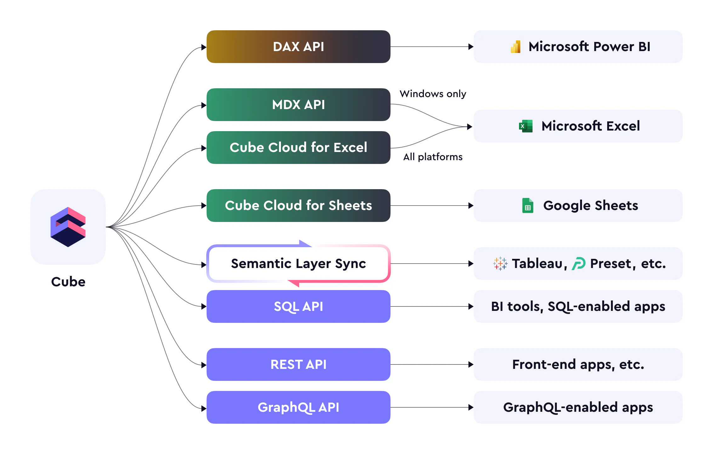
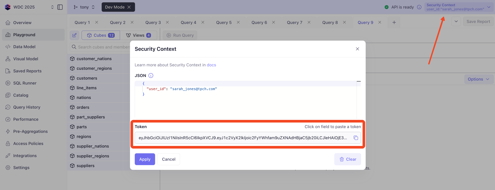
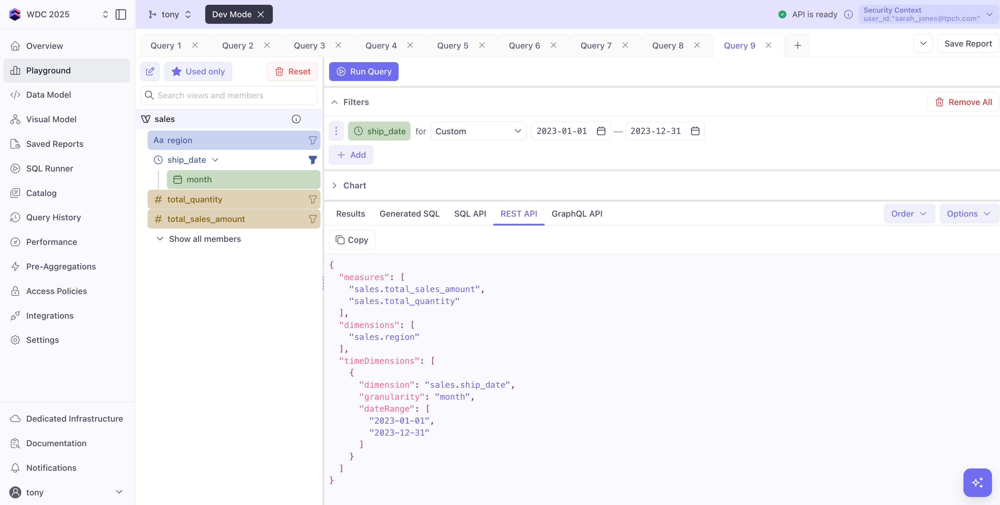
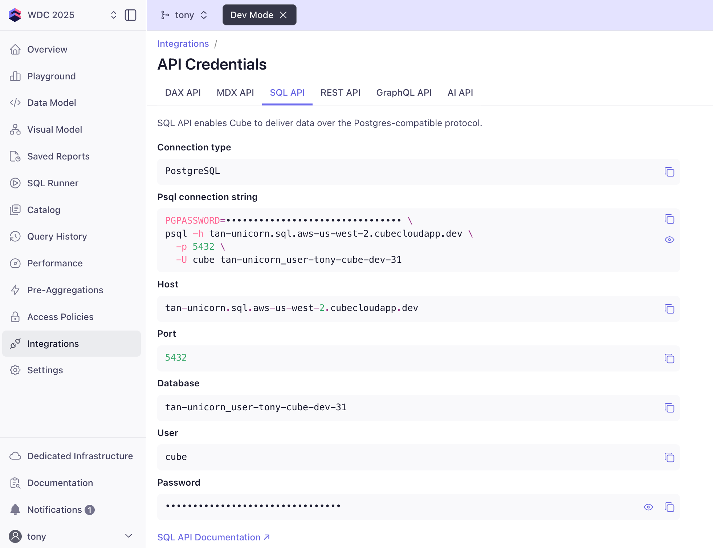

# APIs: Multiple Ways to Access Data

Cube provides multiple APIs to access your data, making it easy to integrate with any application, tool, or workflow. Every API uses the same underlying data model and security rules.



## The API Ecosystem

Cube features these data APIs:

- 🔗 **REST API** - Standard HTTP/JSON for web applications
- 📊 **GraphQL** - Flexible queries with strong typing  
- 🧮 **SQL API** - Connect BI tools like Tableau, Quicksight, Thoughtspot
- 📈 **MDX** - Native OLAP queries for Excel and analysis tools
- 🤖 **DAX** - Native PowerBI queries
- ✨ **Cube D3 AI/MCP/A2A (beta)** - Agentic and Natural language querying

## API Security First

Before we dive into the APIs, let's understand how Cube secures data access. Every API request requires authentication, and all APIs enforce the same security rules we defined earlier (row-level security, column masking, and view visibility).

**Authentication Methods:**
- **REST & GraphQL**: Bearer token (we'll use this in the workshop)
- **SQL**: Username/password (OAuth for some drivers)
- **MDX & DAX**: LDAP/Kerberos for enterprise tools


## REST API: Running our first query

The REST API is perfect for web applications and will power our React dashboard in the next exercise.  Let's see how it works

### Basic Query Structure

```json
{
  "measures": ["sales.total_sales_amount", "sales.total_quantity"],
  "dimensions": ["sales.region"],
  "timeDimensions": [
    {
      "dimension": "sales.ship_date", 
      "granularity": "month",
      "dateRange": ["2023-01-01", "2023-12-31"]
    }
  ]
}
```
### Getting Your Bearer Token

To make REST API calls, you'll need your Bearer token from Cube Cloud.  This JWT is an encoded string that is commonly used for authentication in web applications.  Libraries for JavaScript, Python, and other languages can easily create and read this token, given the secret key.  Cube Cloud also provides a simple way to get your Bearer token for a given security context:

1. Open the **Playground** in your Cube workspace
2. Click the **Security Context** button (top-right corner) and **Edit**
3. Modify the JSON as needed, e.g.:
```json
{
  "user_id": "sarah_jones@tpch.com"
}
```
4. Copy the **Token** 



:::tip
Keep your Bearer token secure! It grants access to your data based on the security context you provide.
:::

:::tip Production vs Development API Endpoints
Now that you've deployed your complete data model to production, you have access to different API endpoints:

**Production Endpoint** (recommended for this section):
```
https://your-workspace.cubecloud.dev/cubejs-api/v1
```
- Stable, deployed version of your data model
- Full performance with production-scale resources (NOTE: just for this workshop, our prod environment is still scaled down to use dev-scale resources)
- What real applications should use

**Development Endpoint** (only when in Dev Mode):
```
https://your-workspace.cubecloud.dev/dev-branch-name/cubejs-api/v1
```
- Development-scale resources (smaller, slower)
- For testing changes before deployment
- Only available during active development sessions

**For all exercises in this section, we'll use the production endpoint for simplicity**.
:::

### Exercise: Your First API Call

Now that you have your Bearer token, let's query TPCH's monthly revenue using the REST API. We'll use the GET method with URL-encoded query parameters - this is simpler for testing in the terminal.

Head to the **Integrations** page and click the **API Credentials** button, then the **REST API** tab. This will show you your endpoint URL and how to construct a query using curl.

import Tabs from '@theme/Tabs';
import TabItem from '@theme/TabItem';

<Tabs groupId="operating-systems">
<TabItem value="mac" label="macOS">
Open your terminal and run the following command, replacing `<your-endpoint>` and `<your-token>` with your actual values:
```bash
# Query monthly shipment value (replace your token and endpoint)
curl \
  -H "Authorization: <your-token>" \
  -G \
  --data-urlencode 'query={"measures":["sales.total_sales_amount"],"timeDimensions":[{"dimension":"sales.ship_date","granularity":"month","dateRange":"last 6 months"}]}' \
  <your-endpoint>/load
```

</TabItem>
<TabItem value="windows" label="Windows">
Open PowerShell and run the following command, replacing `<your-endpoint>` and `<your-token>` with your actual values:

```powershell
# Query monthly shipment value (replace your token endpoint)
$headers = @{
  "Authorization" = "<your-token>"
}

$query = '{"measures":["sales.total_sales_amount"],"timeDimensions":[{"dimension":"sales.ship_date","granularity":"month","dateRange":"last 6 months"}]}'
$encodedQuery = [System.Web.HttpUtility]::UrlEncode($query)

$url = "<your-endpoint>/load?query=$encodedQuery"

Invoke-RestMethod -Uri $url -Method GET -Headers $headers
```

</TabItem>
</Tabs>

### Response Format

```json
{
  "query": {
    "measures": ["sales.total_sales_amount"],
    "timeDimensions": [...]
  },
  "data": [
    {
      "sales.ship_date": "2025-01-01T00:00:00.000",
      "sales.ship_date.month": "2025-01-01T00:00:00.000",
      "sales.total_sales_amount": "151278.3958"
    },
    {
      "sales.total_sales_amount": "11624.5493",
      "sales.ship_date": "2025-02-01T00:00:00.000",
      "sales.ship_date.month": "2025-02-01T00:00:00.000"
    },
    ...
  ],
  "annotation": {
    "measures": {
      "sales.total_sales_amount": {
        "title": "Total Sales Amount",
        "shortTitle": "Revenue", 
        "type": "number",
        "format": "currency"
      }
    }
  }
}
```

### What's in an endpoint?
The endpoint URL is structured like this:

```
https://<your-workspace-animal>.cubecloudapp.dev/<branch?>/cubejs-api/v1/load
```
The `<branch>` part is optional and allows you to query a specific branch of your Cube model. If you don't specify a branch, it defaults to the main/production branch.  What this means is that you can have different versions of your Cube model and query them independently, which is useful for testing changes before deploying to production. "Dev Mode" puts you in a special branch that is only available during your development session, which allows you to test changes without committing changes back to a branch or your production model.

Keep in mind that every branch (and dev mode) endpoint runs on a development-sized instance, so it may not perform as well as your production instance.  For production workloads and performance testing, you should always use the main branch endpoint or a dedicated staging environment running on production scale resources. 

## Generating the Query - Easy Mode 
One neat feature of the Playground is that it can generate the query for you.  Just click the **REST API** tab (near the **Generated SQL** tab we're familiar with from previous exercises), and it will show you the exact query based on your selected measures/dimensions, filters, orders and options.



## Enhancing your REST Queries
A few examples of more complex REST API queries are below.  In addition, your security context is always applied, so you don't need to worry about adding filters for row-level security when making these requests.

### Filtering Data
Orders in status `completed` and `processing`:

```bash
curl -X POST "$CUBE_API_URL/load" \
  -H "Authorization: $CUBE_API_TOKEN" \
  -H "Content-Type: application/json" \
  -d '{
    "measures": ["sales.total_sales_amount"],
    "dimensions": ["sales.orders_status"],
    "filters": [
      {
        "member": "sales.orders_status",
        "operator": "equals",
        "values": ["COMPLETED", "PROCESSING"]
      }
    ]
  }'
```

### Ordering Results
Top 10 customer segments by revenue

```bash
curl -X POST "$CUBE_API_URL/load" \
  -H "Authorization: $CUBE_API_TOKEN" \
  -H "Content-Type: application/json" \
  -d '{
    "measures": ["sales.total_sales_amount"],
    "dimensions": ["sales.customers_segment"],
    "order": [
      ["sales.total_sales_amount", "desc"]
    ],
    "limit": 10
  }'
```

### Multi-Cube Queries
Reference fields from multiple cubes, if not using a view

```bash
curl -X POST "$CUBE_API_URL/load" \
  -H "Authorization: $CUBE_API_TOKEN" \
  -H "Content-Type: application/json" \
  -d '{
    "measures": [
      "orders.total_sales_amount", 
      "line_items.total_quantity"
    ],
    "dimensions": [
      "customers.segment",
      "parts.category"
    ],
    "timeDimensions": [
      {
        "dimension": "orders.order_date",
        "granularity": "quarter",
        "dateRange": "This year"
      }
    ]
  }'
```

## Common REST API Patterns

Here are some practical patterns you'll use when building applications:

### Getting Unique Values (for Filters)

Perfect for populating dropdown filters in your UI:

```javascript
// Get all unique customer segments
{
  "dimensions": ["sales.customers_segment"],
  "order": [["sales.customers_segment", "asc"]]
}
```

### Pagination for Large Results

Handle large datasets efficiently:

```javascript
{
  "measures": ["sales.total_sales_amount"],
  "dimensions": ["sales.customers_name"],
  "limit": 50,
  "offset": 100  // Skip first 100 rows
}
```

### Real-Time Data with Subscribe

Get live updates using WebSockets:

```javascript
// Subscribe to real-time updates
const subscription = cubejs.subscribe({
  measures: ['sales.orders_count'],
  timeDimensions: [{
    dimension: 'sales.order_date',
    dateRange: 'today'
  }]
}, (error, result) => {
  // Handle updates as data changes
});
```

### Numeric Type Handling

Cube returns large numbers as strings to prevent JavaScript precision issues:

```javascript
// Response with numeric strings
{
  "sales.total_sales_amount": "123456789.12"  // String to preserve precision
}

// Cast to number if needed (be aware of precision limits)
const revenue = parseFloat(data["sales.total_sales_amount"]);
```

## SQL API: Connect Your BI Tools

The SQL API lets you connect existing BI tools directly to Cube and use Postgres-compatible SQL to query your data model. This is useful for apps like Tableau, Quicksight, Thoughtspot, and Sigma as well as notebooks that expect a SQL interface.  

Cube's SQL API accepts "Semantic SQL" queries, which can be dramatically simplified compared to direct queries against your data warehouse.  There's no need to re-calculate metrics or remember join paths which you've already defined in your Cube model.  The SQL API automatically applies your security context, so you don't need to worry about row-level security or column masking either.  

```sql
SELECT 
  DATE_TRUNC('month', orders_order_date) as month,
  MEASURE(total_sales_amount) as revenue,
  MEASURE(orders_count) as order_count
FROM sales 
WHERE orders_order_date >= '2023-01-01'
GROUP BY 1
ORDER BY 1;
```

### Connection Details

For BI tools like Tableau, use the connection settings from the **Integrations** page.  You can also use individual usernames/passwords for each user, or the shared service account.  



## Many APIs, One Data Model
Cube's APIs are designed to work seamlessly together, allowing you to choose the best interface for your application or workflow. Whether you prefer REST, GraphQL, SQL, or another API, you can access the same data model and caching layer, secured by the same access control rules, and receive a consistent response.

## Key Takeaways

✅ **Multiple API Options** - REST, GraphQL, SQL, MDX, DAX, and more for any use case  
✅ **Consistent Security** - All APIs enforce the same access control rules automatically  
✅ **Production Performance** - APIs leverage your pre-aggregations for sub-second responses  
✅ **Easy Integration** - Simple authentication and query patterns for any application  
✅ **Tool Compatibility** - Connect existing BI tools, notebooks, and applications seamlessly  

Your production Cube deployment now provides a comprehensive API ecosystem that can power any analytics application, from custom dashboards to enterprise BI tools.

---

**Next**: [React App →](/docs/react-app) - Build a dashboard that consumes your production Cube REST API.