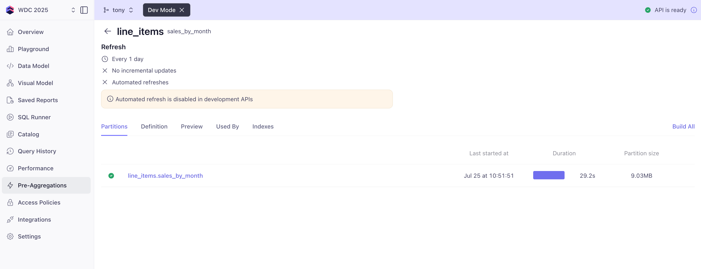
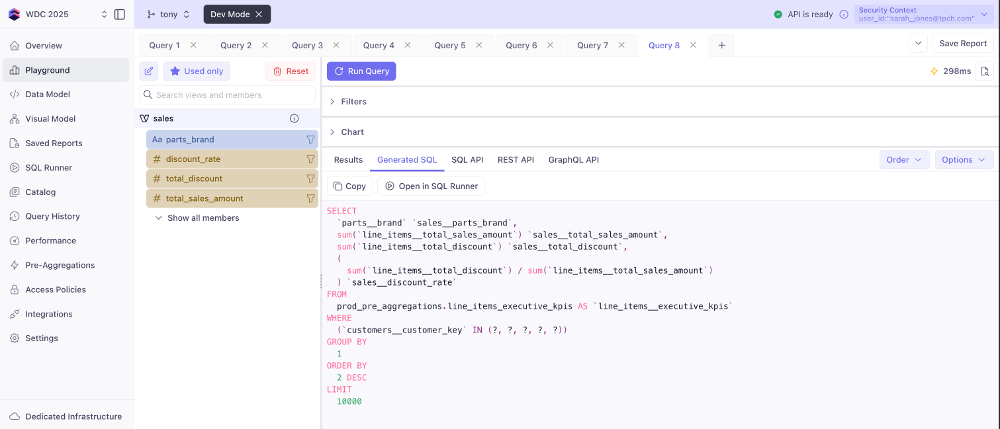
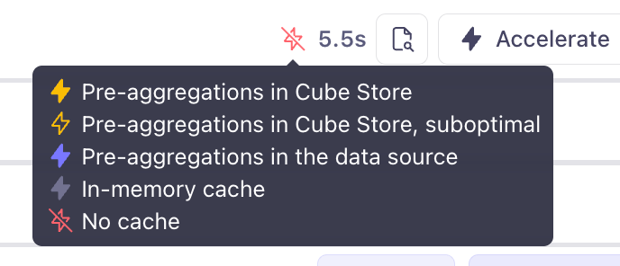
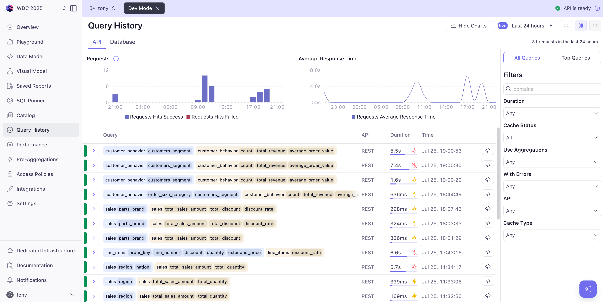
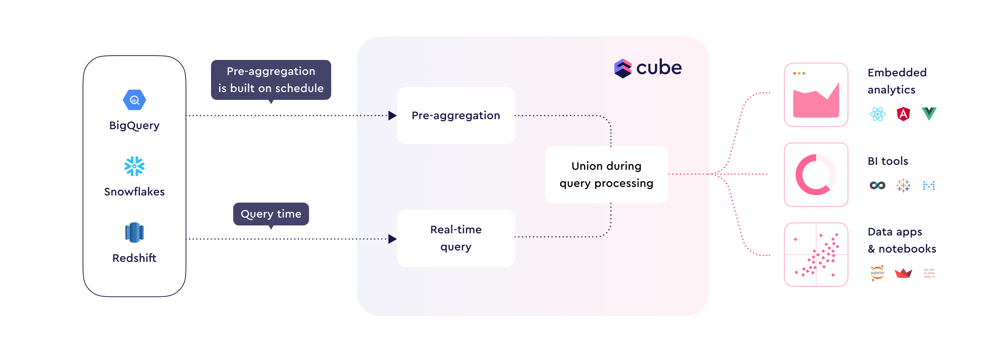

# Caching with Cube

One of Cube's most powerful features is its sophisticated caching system that can **dramatically improve query performance** and provide **higher concurrency** for analytical workloads. Instead of hitting your database every time, Cube can serve results from optimized caches that are orders of magnitude faster.

## Why Caching Matters

In analytics, you often face the challenge of querying large datasets repeatedly. Without caching:

- **Slow queries** - Complex aggregations across millions or billions of rows take time
- **Database load** - Multiple users running similar queries strain your data warehouse  
- **Poor user experience** - Dashboard users wait seconds or minutes for results
- **High costs** - Cloud data warehouses charge for compute time

Cube's caching solves these problems by creating **pre-computed, aggregated data** that can answer queries in milliseconds rather than seconds.

## Cube's Two-Level Caching System

### 1. In-Memory Cache (Automatic)

Cube automatically caches query results in memory using the generated SQL as the cache key. This happens transparently - no configuration required.

- ✅ **Automatic** - Works out of the box
- ✅ **Fast** - Serves repeated queries instantly
- ✅ **Smart invalidation** - Uses refresh keys to detect when data changes

### 2. Pre-Aggregations (Configurable)

Pre-aggregations are **condensed, optimized data versions** that you configure in your data model. They can reduce dataset size by **several orders of magnitude**.

- 🎯 **Targeted** - You choose what to cache
- 🚀 **Extreme performance** - Millisecond response times
- 🔄 **Background refresh** - Updates happen behind the scenes
- 🛡️ **Security-aware** - Respects all access control rules

## Understanding Additive vs Non-Additive Measures

Before diving into pre-aggregations, it's crucial to understand which measures work well for caching:

### ✅ Additive Measures (Cache-Friendly)

These measures can be safely aggregated and combined:

```yaml
measures:
  # Perfect for pre-aggregations
  - name: total_sales
    sql: revenue
    type: sum
    
  - name: order_count
    type: count
    
  - name: active_users
    sql: user_id
    type: count_distinct_approx
```

**Why they work:** You can sum sums, add counts, and roll up totals across time periods and dimensions.

### ❌ Non-Additive Measures (Cache-Challenging)

These measures don't combine well in pre-aggregations.  They can still be pre-aggregated, but the aggregate will only be used if the query matches the exact grain of the pre-aggregation (includes exactly the same dimensions):

```yaml
measures:
  # Problematic for basic pre-aggregations
  # averages
  - name: average_order_value
    sql: "{order_value}"
    type: average
  
  # distinct counts
  - name: distinct_customers
    sql: customer_id
    type: count_distinct
    
  # ratios
  - name: conversion_rate
    sql: "{orders} / {visitors} * 100"
    type: number
```

**Why they're tricky:** You can't average averages, ratios don't sum correctly, and distinct counts need special handling.

### 💡 Making Non-Additive Measures Cache-Friendly

The solution? Store the **building blocks** instead:

```yaml
# Instead of storing average_order_value directly,
# store the components and calculate on-the-fly
measures:
  - name: total_sales
    sql: revenue
    type: sum
    
  - name: order_count
    type: count
    
  - name: average_order_value
    sql: "{CUBE.total_sales} / {CUBE.order_count}"
    type: number
    # This calculates correctly from cached components!
```

## Pre-Aggregations in Action

Let's add some pre-aggregations to our TPC-H model to see the performance benefits.

### What Are Pre-Aggregations?

Think of pre-aggregations as **pre-computed summary tables** that Cube creates and maintains for you, generally:

- **Without pre-aggregations**: Every query runs against your data warehouse
- **With pre-aggregations**: Queries hit much smaller, pre-computed roll-ups 

**Key Components of a Pre-Aggregation:**
- **Measures**: The aggregates you want to calculate (revenue, count, etc.)
- **Dimensions**: How you want to group or filter the measures (by region, product type, etc.)  
- **Time dimension**: The date/time field for time-based grouping
- **Granularity**: The time bucket size (hour, day, week, month) - trunctates the time dimension to this level
- **Refresh key**: How often to rebuild the pre-aggregation with fresh data

Pre-aggregations are aggregate-aware, meaning they can be used to answer queries that match their defined measures and dimensions **or any subset of fields or higher date rollup**. If a query includes additional dimensions not in the pre-aggregation, it will fall back to a live query against the data warehouse.

:::tip Development Mode Reminder
Before adding pre-aggregations to your data model, ensure you're in **Development Mode**:
1. Navigate to the **Data Model** page
2. Click **"Dev Mode"** (top of the interface)
3. Continue with your existing development branch from the access control module

This ensures your caching optimizations won't affect production until you're ready to deploy them.
:::

### Exercise 1: Basic Sales Pre-Aggregation

Add this pre-aggregation to your `line_items.yml` cube:

```yaml title="/model/cubes/line_items.yml" {16-30}
... 

    joins:
      - name: orders
        relationship: many_to_one
        sql: "{CUBE}.l_orderkey = {orders}.o_orderkey"

      - name: parts
        relationship: many_to_one
        sql: "{CUBE}.l_partkey = {parts}.p_partkey"

      - name: suppliers
        relationship: many_to_one
        sql: "{CUBE}.l_suppkey = {suppliers}.s_suppkey"

    pre_aggregations:
      - name: sales_by_month
        measures:
          - total_sales_amount
          - total_quantity
          - count
        dimensions:
          - customer_regions.name
          - customer_regions.region_key
          - customers.name
          - customers.customer_key
        time_dimension: ship_date
        granularity: month
        refresh_key:
          every: "1 day"
```

**What this does:**
- Pre-calculates monthly sales totals
- Updates every day to keep data fresh
- Dramatically speeds up queries grouped by month
- Contains the dimensions needed for regional and customer row-level security (so our directors and sales reps can hit the cache)

Now let's head over to the Pre-Aggregations tab in Cube Cloud and compile our changes.  This will create the pre-aggregation table in Cube Store.

1. Click the **Pre-Aggregations** tab in Cube Cloud
2. Click **line_items sales_by_month** text to open the pre-aggregation details
3. Click **Build All** to create the pre-aggregation 
4. Wait for the build to complete (should take less than a minute)



When that's done, you can test the performance improvement:
1. Go to the **Playground** tab
2. Run a query on the **sales** view with:
   - Measures: `total_sales_amount`, `total_quantity`
   - Time: `ship_date` by `month`
3. Run with each of our 3 test user types (admin, director, sales rep) in the security context
```json
{ "user_id": "admin@tpch.com" }

{ "user_id": "director_na@tpch.com" }

{ "user_id": "sarah_jones@tpch.com" }
```

4. Note the execution time (in the top-right) after adding the pre-aggregation has dropped to sub-second!  You can also see the **cache indicator**  showing that the query hit the pre-aggregation cache (yellow lightning bolt).  Check the **Generated SQL** tab to see the SQL that was run against the pre-aggregation table. 

:::tip 
If you ever want to see if a query will hit a pre-aggregation, you can set up your query (fields, filters, sort, etc) in the playground and just click **Generated SQL** - if the source looks like `SELECT ... FROM prod_pre_aggregations... ` you're hitting a pre-agg - no need to hit the **Run Query** button to find out.
:::

5. **Test dimension coverage**: 
   - Add `region` to the query → Check **Generated SQL** → Should still hit pre-aggregation (because we included `customer_regions.name`)
   - Add `nation` to the query → Check **Generated SQL** → No longer hits pre-aggregation (because we didn't include nation)

**Key Learning**: Pre-aggregations only accelerate queries that use **measures and dimensions you defined, or a subset**. If a query needs additional dimensions, it falls back to raw data.

**Why This Matters**: You need to carefully choose which dimensions to include based on how your dashboards will actually be used. Include too few → fewer cache hits. Include too many → larger, slower pre-aggregations.  There's a balance to strike based on your business needs.

### Exercise 2: Executive KPI Dashboard Pre-Aggregation

Now let's create a high-level pre-aggregation perfect for an executive dashboard showing key business metrics. 

**Planning Your Pre-Aggregation:**
Before writing the YAML, think about:
- **Who will use this?** → Executives need high-level trends, not detailed drill-downs
- **What questions will they ask?** → "How are sales trending by brand?" "Which regions underperform?"
- **How often do they check?** → Weekly reviews, so weekly granularity makes sense
- **What filtering do they need?** → By brand, priority, region (plus security filtering)

Add the `executive_kpis` pre-agg to your `line_items.yml` cube:

```yaml title="/model/cubes/line_items.yml" {19-32}
...

    pre_aggregations:
      - name: sales_by_month
        measures:
          - total_sales_amount
          - total_quantity
          - count
        dimensions:
          - customer_regions.name
          - customer_regions.region_key
          - customers.name
          - customers.customer_key
        time_dimension: ship_date
        granularity: month
        refresh_key:
          every: "1 day"

      - name: executive_kpis
        measures:
          - total_sales_amount
          - total_discount
        dimensions:
          - customer_regions.name
          - customer_regions.region_key
          - customers.customer_key
          - parts.brand
          - orders.priority
        time_dimension: ship_date
        granularity: week
        refresh_key:
          every: "4 hour"
```

**What this pre-aggregation enables:**
- 📊 **Weekly Revenue Trends** - Perfect for executive dashboards
- 🏷️ **Brand Performance Analysis** - Which brands drive revenue
- 🚨 **Priority Order Tracking** - Monitor urgent vs regular orders
- 💰 **Discount Impact Analysis** - Track margin erosion
- 🔒 **Security-Ready** - Includes dimensions for row-level filtering

**Testing Your Pre-Aggregation:**
1. **Save your changes** and navigate to the Pre-Aggregations tab
2. **Build the pre-aggregation** by clicking **line_items executive_kpis** then "Build All" 
3. **Test in Playground** with a query using the `sales` view like:
   - Measures: `total_sales_amount`, `discount_rate`
   - Dimensions: `parts_brand` 
4. **Check Generated SQL** - Look for `prod_pre_aggregations` in the FROM clause to confirm cache hit

:::note
  `discount_rate` is a non-additive measure, and it is not in our pre-aggregation - however, it can be calculated on-the-fly from the pre-aggregated `total_sales_amount` and `total_discount` measures.
  
  
:::


### Exercise 3: Customer Behavior Pre-Aggregation

**Notice**: This pre-aggregation goes in the `orders.yml` cube, not `line_items.yml`. 

**Why?** Because we're analyzing **order-level behavior** (how many orders, average order value), not line-item details. The grain of analysis determines which cube gets the pre-aggregation.

**Different Cube, Different Insights:**
- `line_items` cube → Product sales details, return rates, shipping analysis
- `orders` cube → Customer purchasing patterns, order frequency, order sizes

Add this to your `orders.yml` cube:

```yaml title="/model/cubes/orders.yml" {12-32}
...

    joins:
      - name: customers
        relationship: many_to_one
        sql: "{CUBE}.o_custkey = {customers}.c_custkey"

      - name: line_items
        relationship: one_to_many
        sql: "{CUBE}.o_orderkey = {line_items}.l_orderkey"

    pre_aggregations:
      - name: customer_behavior
        measures:
          - count
          - total_revenue
        dimensions:
          - customer_regions.name
          - customer_regions.region_key
          - customers.customer_key
          - customers.segment
          - status
          - order_size_category
        time_dimension: order_date
        granularity: day
        refresh_key:
          every: "8 hour"
```

**Save** your changes to the cube.

**Dashboard possibilities:**
- 📈 **Customer Segment Performance** - Compare segments over time
- 📦 **Order Size Distribution** - Understand purchase patterns
- ✅ **Order Status Monitoring** - Track fulfillment metrics
- 👥 **Customer Value Analysis** - Identify high-value customers

**Create the Customer Behavior View:**

Before testing, create a view optimized for customer behavior analysis. Create a new file `customer_behavior.yml` in your `model/views` folder:

```yaml title="/model/views/customer_behavior.yml"
views:
  - name: customer_behavior
    description: "Customer behavior analytics optimized for order-level analysis"
    public: true

    cubes:
      # Base cube - orders (order-level analysis)
      - join_path: orders
        includes:
          - count
          - total_revenue
          - average_order_value
          - order_date
          - status
          - priority
          - order_size_category
          
      # Customer information
      - join_path: orders.customers
        prefix: true
        includes:
          - name
          - segment
          - account_balance
          - customer_key
        excludes:
          - phone
          - address
          - comment
          
      # Geographic context
      - join_path: orders.customers.customer_nations
        includes:
          - name: name
            alias: nation
            
      - join_path: orders.customers.customer_nations.customer_regions
        includes:
          - name: name
            alias: region
          - region_key
```

**Testing Your Pre-Aggregation:**
1. **Save your changes** to the new view
2. Build the pre-aggregation (**Pre-Aggregations** tab, click `orders customer_behavior`, then "Build All")
3. **Test in Playground** using the `customer_behavior` view with:
   - Measures: `count`, `total_revenue`
   - Dimensions: `customers_segment`, `order_size_category`
   - Time: `order_date` by `month`
4. **Verify cache usage** by checking the Generated SQL tab.  Note that the pre-aggregation is at the `day` granularity, but the query is rolled up to `month` - Cube will automatically roll up the pre-aggregation to the requested granularity.


## Understanding Your Pre-Aggregation Strategy

You've now created **three different pre-aggregations** for different use cases:

| Pre-Aggregation | Cube | Granularity | Purpose | Users |
|----------------|------|-------------|---------|-------|
| `sales_by_month` | line_items | month | Basic sales reporting | All users |
| `executive_kpis` | line_items | week | Executive dashboards | Leadership |
| `customer_behavior` | orders | day | Customer analysis | All users |

**Key Patterns You've Learned:**

1. **Match granularity to business need**: Daily for operations, weekly for executives
2. **Choose the right cube**: Line items for product/sales details, orders for customer behavior  
3. **Include security dimensions**: All pre-aggregations work with row-level security
4. **Plan for specific dashboards**: Each pre-aggregation serves real business questions


## Performance Optimization Strategies

### 1. Granularity Matters
Choose the granularity based on how your data will be queried.  You can create multiple pre-aggregations at different granularities to serve different use cases, understanding that the higher the granularity (e.g., month vs. day, category vs. item), the smaller and more performant the pre-aggregation will be.

### 2. Dimension Selection
Include only dimensions that:
- Are used in dashboard filters or grouping
- Are needed for row-level security
- Provide business value

**Avoid:** Including all possible dimensions "just in case" - that's what the fall back to a live query is for.  Pre-aggregations are generally focused on the most common queries.  Occasionally, you may need to create a pre-aggregation that includes low-level or even primary key-level grain for specific use cases, but this should be the exception, not the rule.

### 3. Measure Additivity
Structure your measures for maximum reusability:

```yaml
# ✅ Good - Additive components
measures:
  - name: gross_revenue
    type: sum
    sql: "{CUBE}.extended_price"
    
  - name: discount_amount
    type: sum
    sql: "{CUBE}.extended_price * {CUBE}.discount"
    
  - name: net_revenue
    type: number
    sql: "{CUBE.gross_revenue} - {CUBE.discount_amount}"

# ❌ Avoid - Non-additive in pre-aggregation
measures where possible:
  - name: avg_discount_pct
    type: avg
    sql: discount
```

### 4. Refresh Strategy Based on Business Needs

```yaml
# "Real-time" operational metrics
refresh_key:
  every: "10 minute"

# Intra-day business metrics
refresh_key:
  every: "1 hour"

# Historical analysis
refresh_key:
  every: "1 day"
```

### Visual Performance Indicator

In Cube Cloud's Playground, you'll see a **cache indicator** showing whether your query hit:



You can also see these indicators if you review the **Query History** tab where you can see all the queries against your data model from all APIs.  The playground queryies show up as REST. Clicking on a query will show you the details, including the **Generated SQL**, **Security Context**, and **Performance Graphs**.



## Building and Monitoring Pre-Aggregations

### Build Strategy

When adding pre-aggregations to your data model:

1. **Start Small** - Add one pre-aggregation at a time
2. **Monitor Build Times** - Check the Pre-Aggregations tab
3. **Verify Usage** - Ensure queries are hitting the cache
4. **Iterate** - Adjust dimensions and granularity based on usage, add indexes and partitions as needed

### Common Pitfalls to Avoid

❌ **Too Many Dimensions**
```yaml
# Bad - Creates massive pre-aggregation that's slow to build and query
dimensions: [customer_key, product_id, order_id, line_number, sku, ...]
# Result: Millions of combinations, slow builds, little cache benefit
```

✅ **Strategic Dimensions**
```yaml
# Good - Focused on actual dashboard filtering and grouping needs
dimensions: [region, segment, product_type, priority]
# Result: Manageable size, fast builds, excellent cache hit rates - especially for your initial dashboard page loads
```

❌ **Too Fine Granularity**
```yaml
# Bad for long-term historical data
granularity: minute  # 2 years = 1,051,200 time periods per dimension combo
# Result: Enormous pre-aggregations
```

✅ **Appropriate Granularity**
```yaml
# Good - Match your dashboard's actual time grouping needs
granularity: day    # For operational dashboards (730 periods/2 years)
granularity: week   # For executive trending (104 periods/2 years)  
granularity: month  # For historical analysis (24 periods/2 years)
```

❌ **Missing Security Dimensions**
```yaml
# Bad - Pre-aggregation can't be used with row-level security
dimensions: [product_type, order_status]
# Result: Security filters force queries to hit raw data
```

✅ **Include Security Dimensions**
```yaml
# Good - Include dimensions used in query_rewrite filters
dimensions: [
  product_type, 
  order_status,
  customer_regions.name,        # For regional filtering
  customer_regions.region_key,  # For regional security  
  customers.customer_key        # For sales rep security
]
# Result: All user types can hit the pre-aggregation cache
```

❌ **Non-Additive Measures Only**
```yaml
# Bad - These don't aggregate well across different granularities
measures: [average_order_value, conversion_rate, distinct_customers]
# Result: Pre-aggregation only useful for exact grain matches
```

✅ **Additive Building Blocks**
```yaml
# Good - Store components that can be aggregated and combined
measures: [
  total_sales_amount,    # Can sum across any dimension
  order_count,           # Can sum across any dimension  
  customer_count         # Use count from customers cube instead of count_distinct
]
# Result: Pre-aggregation useful for many different queries
```

## Advanced Caching Concepts

While we won't implement these in the workshop, Cube offers powerful advanced caching features:

### Rollup-Only Mode
Force all queries to use pre-aggregations only:
```bash
CUBEJS_ROLLUP_ONLY=true
```
Perfect for keeping your data warehouse "asleep" except during scheduled refreshes.

### Custom Indexes
Optimize cache storage with strategic indexing:
```yaml
pre_aggregations:
  - name: optimized_sales
    indexes:
      - dimensions: [region, customer_segment]
      - dimensions: [ship_date]
```

### Rollup Lambdas

Lambda pre-aggregations implement the **Lambda architecture pattern**, combining batch-processed historical data with real-time streaming data to provide a complete, up-to-date view of your metrics.

**The Concept:**
Think of Lambda pre-aggregations as a smart union that combines:
- **Batch Layer**: Pre-computed historical data (fast, complete)
- **Speed Layer**: Live streaming data (fresh, recent)
- **Serving Layer**: Cube seamlessly merges both for queries

**Why Use Lambda Pre-Aggregations?**
- **Complete Data Coverage**: Historical analysis + real-time insights
- **Performance**: Avoid expensive queries on massive historical datasets
- **Freshness**: Get the latest data without waiting for batch processing
- **Scalability**: Handle high-volume streaming data efficiently

**Types Available:**

1. **Batch + Source Data**: Combines pre-aggregated historical data with live queries to your source database
   ```yaml
   pre_aggregations:
     - name: sales_with_live_data
       type: rollup_lambda
       union_with_source_data: true
       measures: [total_sales_amount]
   ```

2. **Batch + Streaming Data**: Merges pre-aggregated historical data with real-time streaming sources
   ```yaml
   pre_aggregations:
     - name: real_time_analytics
       type: rollup_lambda
       streaming_data_source: kafka_stream
       measures: [event_count, total_value]
   ```

**Common Use Cases:**
- **E-commerce**: Historical order data + live shopping cart events
- **IoT Analytics**: Archived sensor data + real-time device streams  
- **User Analytics**: Historical user behavior + live clickstream data
- **Financial Reporting**: Daily batch reports + real-time transaction feeds



### Partitioning
Split large pre-aggregations across multiple date partitions to improve performance and mange incremental updates:
```yaml
pre_aggregations:
  - name: partitioned_sales
    time_dimension: ship_date
    partition_granularity: month
    # Automatically creates monthly partitions for the ship_date dimension
```

### Orchestration
Cube can automatically orchestrate pre-aggregation builds using tools like Airflow, Dagster, or Prefect. This allows you to schedule and manage complex data workflows, ensuring your pre-aggregations are always up-to-date.


## Key Takeaways

✅ **Two-level caching** - Automatic in-memory + configurable pre-aggregations  
✅ **Additive measures** - Design for cache-friendly aggregations  
✅ **Security-aware** - All caching respects access control rules  
✅ **Background refresh** - Data stays fresh without user impact  
✅ **Extreme performance** - Orders of magnitude faster than direct database queries  

Caching transforms Cube from a query translator into a **high-performance analytical engine** that can handle massive datasets with millisecond response times.

## Commit Your Caching Optimizations

Now that you've implemented sophisticated caching with pre-aggregations, let's save your work:

**Step 1: Review Your Changes**
1. **Ensure you're in Development Mode** - Look for the "Dev Mode" indicator
2. **Test your pre-aggregations** one final time:
   - Verify the `sales_by_month` pre-aggregation is built and working
   - Check that the `executive_kpis` pre-aggregation serves executive queries
   - Confirm the `customer_behavior` pre-aggregation works with the new view
   - Test that cache indicators show queries hitting pre-aggregations

**Step 2: Commit Your Changes**
1. **Navigate to the Data Model page**
2. **Review all your changes** - You should see all modified files from the entire workshop: data modeling, access control, and caching changes
3. **Click "Commit & Sync"**
4. **Add a descriptive commit message**:
   ```
   Complete TPCH analytics platform implementation
   
   - Enhanced data model with business metrics and comprehensive sales view
   - Implemented comprehensive access control (RLS, column masking, view visibility)
   - Added high-performance pre-aggregations for sub-second queries
   - Production-ready semantic layer for analytics applications
   ```
5. **Click "Commit & Sync"** to save all your workshop progress

**Step 3: Deploy to Production**
1. **Click the "Merge" button** (same location as the Commit button)
2. **Enter a merge message**:
   ```
   Deploy complete TPCH analytics platform
   
   Ready for production use with React dashboard and other applications
   ```
3. **Check "Delete -dev- branch"** to clean up your development branch
4. **Click "Merge"** to deploy to production

**Step 4: Verify Production Deployment**
1. **Wait for deployment** - Check the deployment status indicator
2. **Test in Playground** (now using production):
   - Run a few queries to ensure everything works correctly
   - Verify that your security contexts still function properly
   - Check that pre-aggregations are available in production
3. **Note your production API endpoint** - You'll use this in the next section

### What You've Accomplished

🎉 **Congratulations!** You've successfully built and deployed a production-ready analytics platform:

✅ **Comprehensive Data Model** - Sales view with line item granularity and business context  
✅ **Enterprise Security** - Row-level security, column masking, and role-based access control  
✅ **High-Performance Caching** - Sub-second queries via optimized pre-aggregations  
✅ **Production Deployment** - Live, secure, and ready for real applications  

Your data model is now ready for API consumption and application development!

---

**Next**: [APIs →](../apis/) - Learn how to consume your cached, secure data through multiple API interfaces.