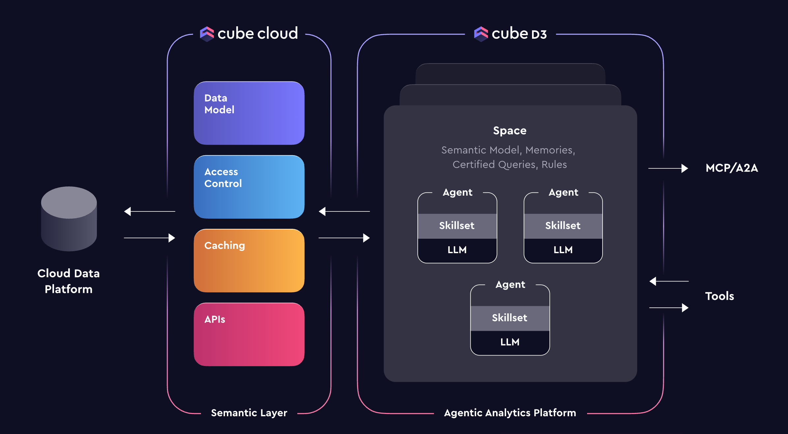
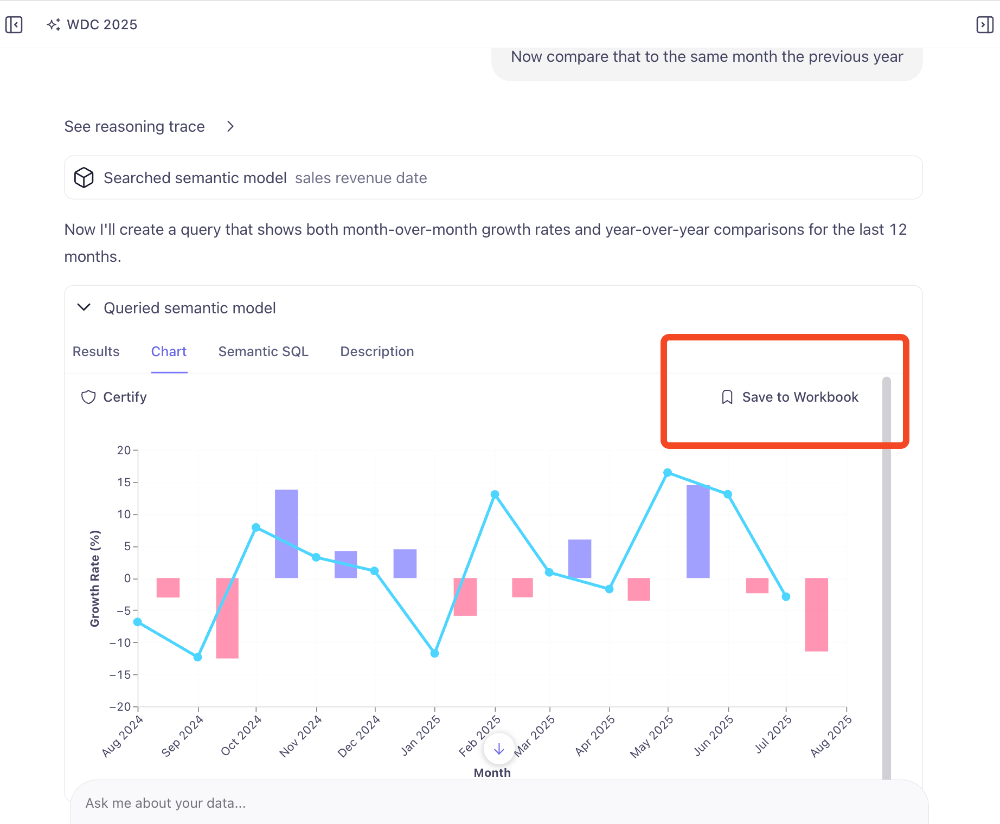
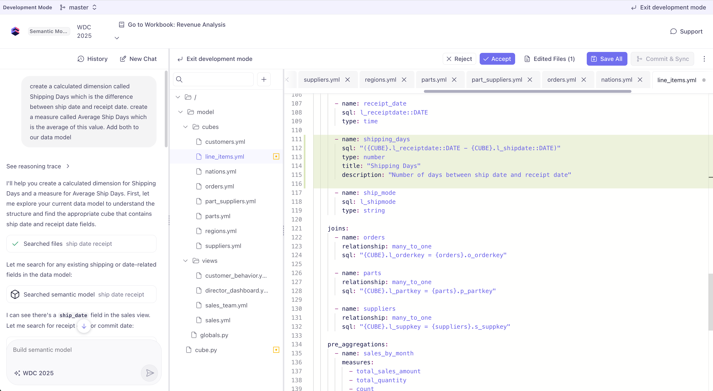
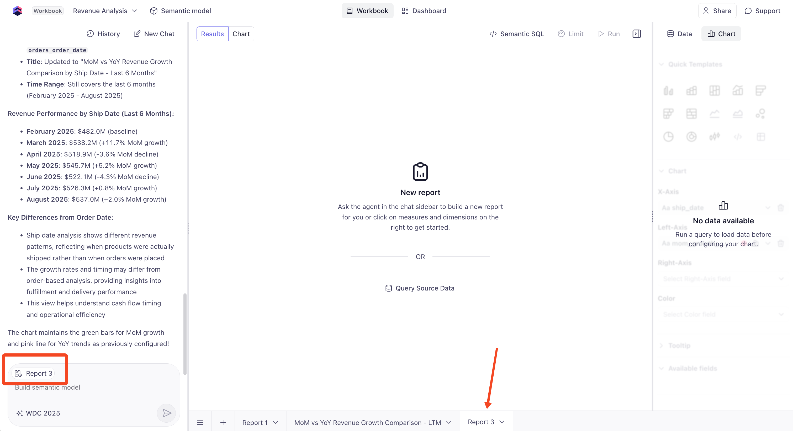
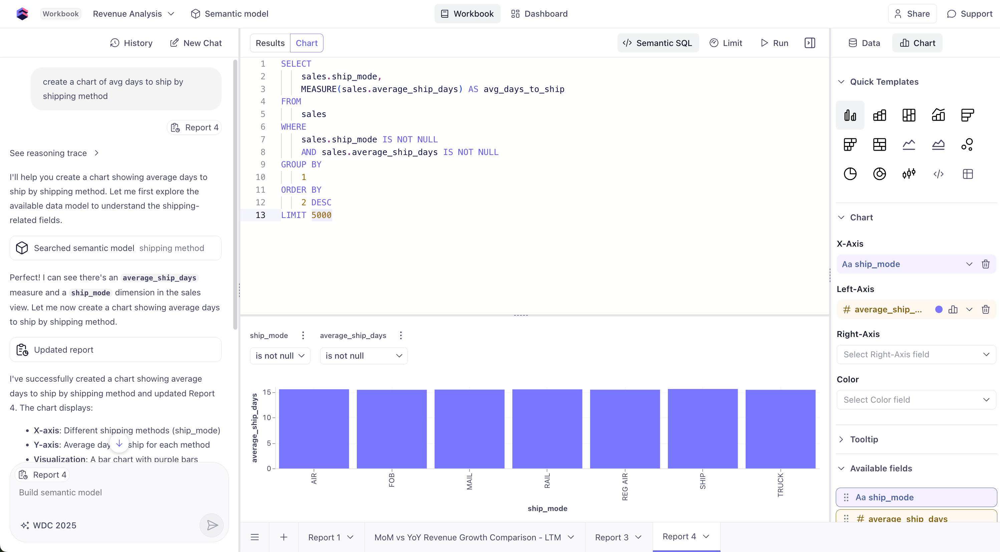

# D3 Agentic Analytics

D3 is Cube's revolutionary natural language interface for data analytics. Instead of writing complex queries or building charts manually, simply ask questions in plain English and get instant insights, charts, and analysis!  D3 leverages Cube's semantic layer to provide accurate, secure, and fast responses based on your business data model.

## Why D3 Changes Everything

Traditional analytics requires:
- ❌ SQL knowledge to query data
- ❌ Understanding complex table schemas  
- ❌ Manual chart building and configuration
- ❌ Technical expertise for ad-hoc analysis

With D3, anyone can:
- ✅ **Ask questions naturally**: "What were our top selling products last quarter?"
- ✅ **Get instant visualizations**: Charts and tables generated automatically
- ✅ **Follow up intuitively**: "How does that compare to the previous quarter?"
- ✅ **Build new metrics**: "Create a metric for customer retention rate"

## The Power of Semantic Layer

D3's accuracy comes from agent skill specialization and queries **restricted to your Cube data model**:

- 🎯 **Trustworthy responses** - No hallucination across random database tables
- 🔒 **Respects security rules** - Same access control as your dashboards  
- 📊 **Leverages pre-aggregations** - Sub-second response times
- 🔄 **Maintains consistency** - Uses your defined business metrics

Because D3 operates on Cube's semantic layer, it ensures that all insights are aligned with your business logic and definitions.  Memories, rules, certified queries, and user feedback all contribute to superior accuracy.  Multiple specialized agents handle different types of tasks including analysis, Semantic SQL query writing, and data model editing, so it really performs like your own agentic data team.



## Exercise: D3 Setup

We'll run through a quick setup to get D3 working with your Cube instance.

:::warning
Cube D3 is currently in private preview and may have some limitations or errors as we iron out the experience.  Please report any issues you encounter to the Cube team - we appreciate your feedback!
:::

In Cube Cloud:
1. **Navigate to D3** (click the Cube logo in the top left, then select "D3 AI")
2. **Click Admin** in the left sidebar
3. In **Spaces**, click **Add Space**
4. **Name your space** (e.g. "TPCH Analytics")
5. In **Agents**, click **Add Agent**
6. **Name your agent** (e.g. "TPCH Analyst")
7. Select **"WDC 2025 Workshop"** as the **Semantic Model**
8. Assign it to the **TPCH Analytics** space you just created
9. Navigate **"Back to app"** to return to the D3 interface
10. Make sure your Space is selected in the top dropdown menu.

## Exercise: Interacting with D3

### 1. Your first query
Ask D3 a simple question about your data:

```
What is our total revenue this year?
```

Notice on the right side, D3 shows you the **Semantic Views** you have access to.  If you click on them, you can see the same fields we added to the views in our prior modules.

As the agent processes your request, it will generate a response and display the results in a table or chart format. You can also see the underlying **Semantic SQL** query that was generated.  Click on the **Semantic SQL** tab to view it.

**What is Semantic SQL?**
Semantic SQL is a simplified SQL query that Cube uses to interact with your data model. It usually targets a **Cube Semantic View** and abstracts away the complexity of traditional SQL while still allowing for powerful data manipulation and analysis. D3 uses Semantic SQL to ensure that queries are aligned with your business definitions and fully benefits from Cube's semantic layer.

You'll notice the `MEASURE()` function in the query. This is how Cube's SQL API can accept request for measures, without knowing or prescribing the aggregation type.  It defers that to what you've already defined in your data model.  

Similarly, we're keeping things simple for the agent by querying against Semantic views only.  There are no joins or knowledge of the underlying table structure required for it to generate an accurate query, since that's already defined deterministically in your data model.  This allows D3 to focus on presentation logic (selecting, grouping, filtering, post-processing) rather than trying to understand your full database schema and relationships.

Let's continue our chat with D3 to learn more about our data.

### 1. Basic Exploration

```
Show me monthly order trends for 2023
```

This response will generate a time series showing the number of orders per month in 2023. There is also now a **Chart** tab where you can see the visualization generated by D3.  You can switch between table and chart views as needed.  

```
Which customer segments generate the most revenue?
```

```
What are our top 10 selling products by quantity?
```

### 2. Follow-Up Questions

D3 maintains conversation context, so you can ask follow-ups:

```
Show me the trend over the last 6 months instead
```

```
How does that compare to last year?
```

```
Break that down by region
```

You can go down the rabbit hole of analysis, asking D3 to refine or expand on your queries. It will automatically adjust the Semantic SQL query and visualization based on your requests.  You can always correct D3 if it misunderstands your intent by providing clarifying information. You can also ask it to be more concise or verbose in its responses


## Advanced D3 Capabilities

### Comparative Analysis

D3 excels at business-relevant comparisons, where it can generate Semantic SQL queries, and leverage memory, window functions, CTEs, and post-processing to provide insights.  Let's **open a new conversation** with D3 and try some comparative analysis. ("New Chat" button in the top left)

```
Show me MOM revenue growth rate for the LTM
```

```
Now compare that to the same month the previous year
```

Check the Semantic SQL tab to see how D3 generated the query.  Then head to the **Chart** tab to see it visualized.  If this chart isn't what you expected, you can ask D3 to adjust it, but you can also bring it into a **D3 Workbook** to refine it further.  We'll need to create our workbook first, then we can proceed (NOTE: this workflow will be simplified in the future).  

1. Click the **Workbooks** tab in the left sidebar
2. Click **Create Workbook**
3. Name your workbook (e.g. "Revenue Analysis") and select our Semantic Model
4. Click the Cube logo in the top left to return to the D3 chat interface
5. In **Recent Chats** click our last conversation (top entry)
6. Scroll back down to our chart and click **Save and Open in Workbook**
7. Select the workbook we just created and click **Save** (NOTE: if the workbook doesn't appear, you may need to refresh the page)



### D3 Workbooks
D3 Workbooks allow you to create more complex analyses and visualizations. You can add multiple queries, combine results, and create custom dashboards.

The chart interface should feel familiar if you've used other B.I. tools. You can change chart types, manage the measures and dimensions, and tooltips from the **Chart** sidebar on the right.  Furthermore, any changes you want to make can be done simply by asking D3 in the chat window. For example:

```
Change the bar color to green
```

```
Add a filter, set to show the last 3 years
```

```
Switch the order date to ship date
```

You can also modify the Semantic SQL directly if you prefer more control. Click the **Semantic SQL** button at the top to see the underlying query and make adjustments as needed.

### Metric Creation

D3 can also function as a data engineer to help you develop your semantic model, so, for example, you can create new measures right from the chat interface.  Let's try creating a new metric for our analysis. 

Click the **Semantic Model** button at the top and then enter **Dev Mode**. Now we prompt D3 with what we want to create.  D3 will generate the necessary changes to your model and await your approval before applying them.

```
Create a calculated dimension called Shipping Days which is the difference between ship date and receipt date. Create a measure called Average Ship Days which is the average of this value. Add both to our data model.
```



We can also tell it to add the new measure to our sales view:

```
Add Average Ship Days to the Sales view
```
This will add the new measure to the Sales view, making it available for use in future queries and analyses. Accept the changes, **Save and Commit**, exit Development Mode, and go back to the workbook to use this field in your analyses and visualizations.

Create a new report in your workbook and let's start a New Chat too to clear our context.  The chat interface will also show which report you're working on.



Now ask D3 to create a new chart:

```
Create a chart of avg days to ship by shipping method
```

Our TPCH demo data isn't terribly exciting, but you can see our new measure in action without needing to write any SQL or YAML!



### Share your Work with a Dashboard
D3 makes it easy to share your insights with others. You can create a dashboard that includes your D3 visualizations and share it with your team.

1. Click the **Dashboard** tab at the top
2. Click the **Charts** button to select which visuals to include
3. Drag to arrange and resize charts into the dashboard layout
4. Publish and share the dashboard link with your team, or invite them directly.

## D3 Best Practices

### Effective Query Patterns

**Good queries:**
- "Show me revenue trends by customer segment over the last 12 months"
- "Which products have the highest profit margins?"
- "Compare this quarter's performance to last quarter"

**Less effective:**
- "Show me data" (too vague)
- "What happened?" (needs more context)
- "Give me everything about customers" (too broad)

### Building Context

Start broad, then drill down:

1. **"What is our total revenue this year?"**
2. **"Break that down by month"**  
3. **"Show me the top customer segments for the highest revenue month"**
4. **"Which specific customers drove that segment's performance?"**

## Future of Analytics

D3 represents the future of business intelligence:

- 🤖 **AI-powered insights** without AI hallucination
- 🗣️ **Natural language interface** for non-technical users
- ⚡ **Instant results** powered by Cube's caching layer
- 🔄 **Iterative exploration** with conversation context
- 📊 **Automatic visualization** selection based on data types

## Bonus Exercise: Embed D3 in Your App
If you'd like to go one step further, you can embed D3 directly into your web applications using the D3 API and an iframe. This allows you to leverage D3's capabilities within your own custom interfaces and data apps.  

On the main D3 page (click the Cube logo in the top left), navigate to the **Admin** page.  See the snippets to generate a secure session and include the iframe in your app.


---

**Next**: [Resources →](../resources/) - Continue your Cube journey with additional learning materials.