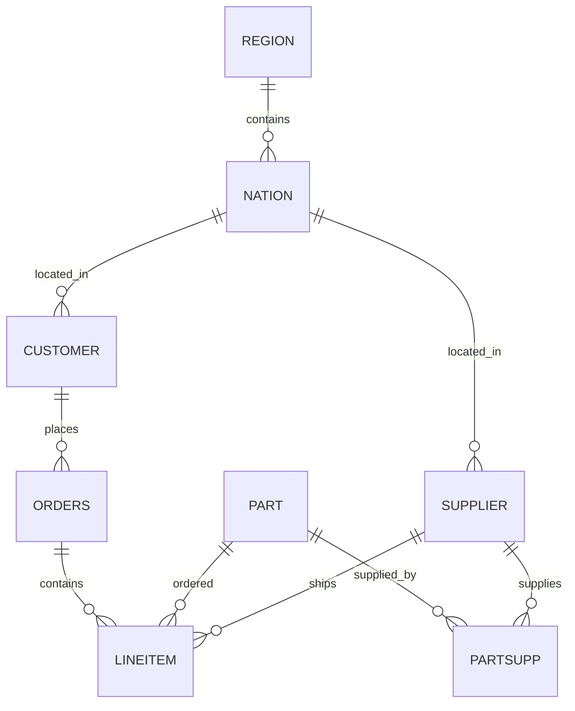
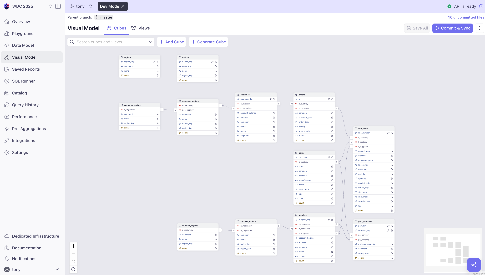
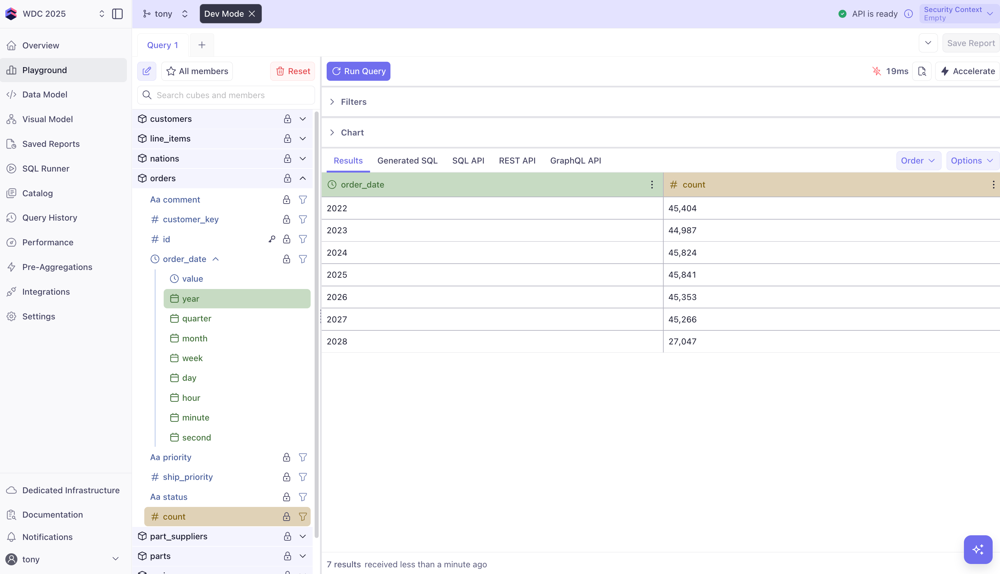
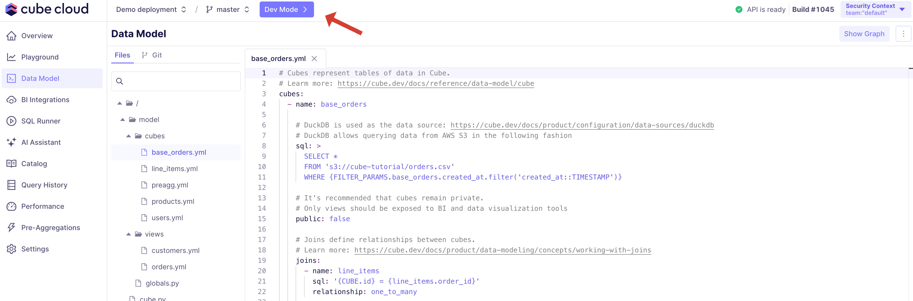
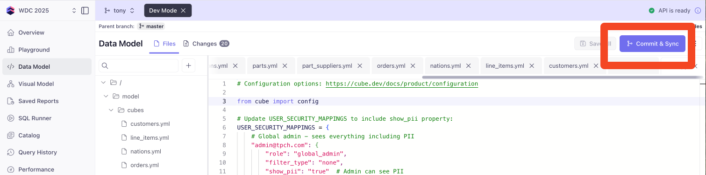
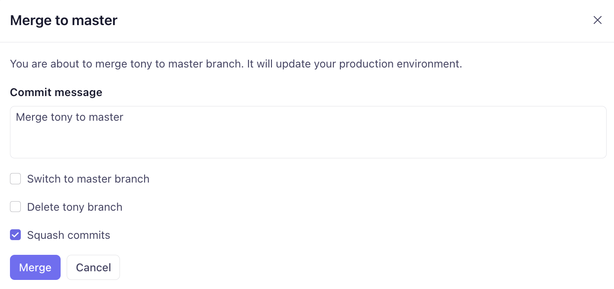
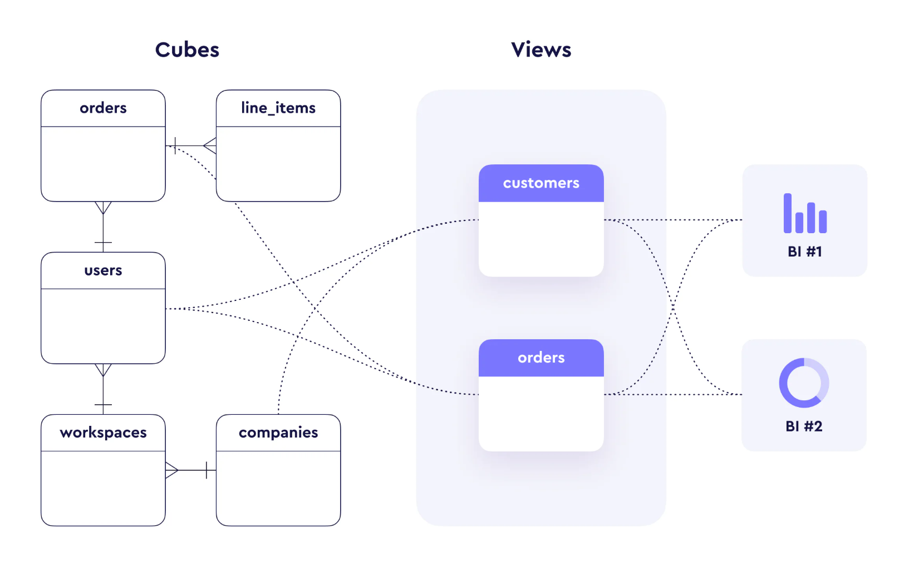

# Data Modeling with Cube

Data modeling is the foundation of any analytics application. In Cube, you define **measures** (what you want to calculate) and **dimensions** (how you want to group and filter) to create a semantic layer over your raw data.  The logic is organized into **cubes** which represent logical datasets, generally mapping one-to-one with tables in a star schema.

## Why Data Modeling Matters

Instead of writing SQL queries directly against your database, Cube's data modeling approach provides:

- **Reusable metrics** - Model once, deliver anywhere
- **Consistent definitions** - No more "which revenue number is correct?"
- **Business logic encapsulation** - Complex calculations and join logic in one place 
- **Software development best practices** - Version control (git integration), testing, and collaboration

## The TPC-H Schema

Our workshop uses the standard TPC-H schema representing a B2B e-commerce business:


## Visualizing the TPC-H Schema in Cube

Here's how it looks in Cube's visual modeler:



## Your First Query

Let's start with a query to see how Cube works. In your Cube Cloud workspace:

1. **Navigate to the Playground** (left sidebar)
2. **Expand** the `orders` cube
3. **Add a measure**: Click the field `count`
3. **Add a dimension**: Click the `order_date` field, select `year` as the granularity
4. **Click "Run Query"**



You should see a time series of order counts.  Check out the tabs for **SQL API**, **REST API**, and **GraphQL API** (middle of the screen) - these show how to issue this query to those APIs respectively.  Simple syntax, right?  

Now click on the **Generated SQL** tab - this is the query that Cube generates which goes back to our PostgreSQL database.  

Let's **add another field to the query**.  From the `regions` cube, click the `name` field.  Now check those API tabs again.  The "Semantic SQL" (what we see on the **SQL API** tab) is simple - you're just asking for fields without worrying about the join logic which we've already defined and is now part of the data model.  

On the **Generated SQL** tab, the query is now much more complex as the joins traverse a few tables to go from `orders` -> `customers` -> `nations` -> `regions` but as a semantic layer end user, we are able to simply re-use the logic that was already setup ahead of time. 

## Core Concepts

### What We Skipped: Starting From Scratch

In this workshop, we started with an existing data model to save time. When building a Cube project from scratch, you'd typically:

1. **Use the Connection Wizard** - Cube guides you through connecting to your database
2. **Select Tables** - Choose which tables to model from your database schema
3. **Generate Initial Cubes** - Cube automatically creates a cube for each selected table with:
   - Basic dimensions for each column
   - A `count` measure
   - Detected data types (string, number, time)
4. **Infer Relationships** - Cube analyzes foreign keys and suggests join relationships
5. **Refine and Customize** - Add business logic, custom measures, and meaningful descriptions

This automated process gives you a solid foundation that you can then enhance with business-specific logic - exactly where we started in this workshop!

### Cubes (Data Models)

A **Cube** represents a table or logical dataset. Cubes typically map 1-to-1 with tables in a star schema, but are also flexible.  For TPCH:

- `orders` - Purchase orders from customers
- `customers` - B2B companies buying parts  
- `line_items` - Individual products within orders
- `parts` - Industrial components catalog
- etc.

### Measures

**Measures** are aggregated values - the "what you want to calculate".  They can be simple counts or complex calculations. You can reference other measures in their definitions, allowing for powerful reusability and composability.

```yaml
measures:
  - name: count
    type: count
  
  - name: total_revenue
    sql: extended_price
    type: sum
    format: currency
  
  - name: average_order_value
    sql: "{CUBE.total_revenue} / {CUBE.count}"
    type: number
    format: currency
```

### Dimensions

**Dimensions** are attributes for grouping and filtering - the "how you want to group/filter the measures". They can be simple fields or complex derived values.:

```yaml
dimensions:
  - name: order_date
    sql: o_orderdate::DATE
    type: time
  
  - name: customer_segment
    sql: c_mktsegment
    type: string
  
  - name: order_size_bins
    sql: >
      CASE 
        WHEN {CUBE}.o_totalprice < 50000 THEN 'Small Orders'
        WHEN {CUBE}.o_totalprice < 150000 THEN 'Medium Orders'
        WHEN {CUBE}.o_totalprice < 300000 THEN 'Large Orders'
        ELSE 'Enterprise Orders'
      END
    type: string
    description: "Order value categories for business analysis"
```

## Development Mode vs Production

Before making any changes to your data model, it's important to understand Cube's development workflow. This ensures you can safely experiment and test changes without affecting your production deployment.

### Understanding the Cube Development Workflow

Cube Cloud provides two distinct environments:

- **Production Environment**: The live, deployed version of your data model that serves real users and applications
- **Development Environment**: An isolated workspace where you can make and test changes safely

### Entering Development Mode

Before modifying any data model files, you need to enter **Development Mode**:

1. **Navigate to the Data Model page** in your Cube workspace
2. **Click the "Dev Mode" button** (top of the interface)
3. **Choose your branch strategy**:
   - **Create a new branch** - Recommended for new features (`feature/sales-view`)
   - **Use existing branch** - If continuing previous work



### What Development Mode Enables

Once in development mode, you get:

- **🔒 Isolated Environment**: Changes don't affect production users
- **🔄 Hot Reload**: The development API automatically reflects your changes
- **🌿 Git Integration**: All committed changes are tracked on your development branch
- **🧪 Safe Testing**: Test queries and applications against your changes before you even commit
- **👥 Collaboration**: Multiple developers can work on different branches

### Development API Endpoint

In development mode, you'll see a separate API endpoint for testing:

```bash
# Production API (for live apps)
https://your-workspace.cubecloud.dev/cubejs-api/v1

# Development API (for testing changes)  
https://your-workspace.cubecloud.dev/dev-branch-name/cubejs-api/v1
```

### Making Changes Safely

While in development mode:

1. **Edit your data model files** - Add measures, dimensions, cubes, or views
2. **Test in Playground** - Queries automatically use your development branch
3. **Validate with applications** - Point your app to the development API endpoint
4. **Iterate quickly** - Changes appear within seconds without deployment delays

:::tip Development Best Practices
- Always work in development mode when making changes
- Use descriptive branch names like `feature/customer-metrics` or `fix/revenue-calculation`
- Test thoroughly before merging to production
- Keep development branches focused on specific features or fixes
:::

### Committing and Deploying to Production

After testing your changes and confirming they work correctly:

**Step 1: Commit Your Changes**
1. On the Data Model page, **Review your changes** in the Data Model IDE
2. **Click "Commit & Sync"** to save your changes to the development branch
3. **Add a commit message** describing what you built
4. **Click "Commit & Sync"** in the modal to proceed. 
5. The data model is now committed on your branch.  If you want to make more changes before merging, you can just continue your development, knowing your progress is saved with git.



**Step 2: Merge to Production**  
1. Still on the Data Model page, **Click the Merge button** (same spot as Commit)
2. **Enter a message** to describe the changes
3. Unless you have a reason to keep it, check the box for **Delete -dev- branch**
4. **Click Merge** to proceed
5. You're now back in main looking at your production data model.  To continue development work, click on **Dev Mode**



:::warning Git Integration Required
This workshop uses a default (but private) Cube repository for your deployment.  In practice, you would usually connect to your own git repository on GitHub/GitLab/etc.
:::

### Why This Workflow Matters

This development-to-production workflow provides:

- **🛡️ Risk Mitigation**: Never break production with experimental changes
- **🔄 Rollback Capability**: Easy to revert changes if issues arise  
- **📝 Change Tracking**: Full audit trail of who changed what and when
- **🧪 Testing Environment**: Validate changes before users see them
- **👥 Team Collaboration**: Multiple developers can work safely in parallel

## Your First Data Model

Now that you understand the development workflow, let's enhance the `orders` cube with business-relevant metrics. **Remember to enter Development Mode now!** 

### Exercise: Add Revenue Metrics

1. Navigate to the Data Model page in your Cube workspace
2. Select the `model/cubes/orders.yml` file to see the code for that cube
3. Add these two measures to the `measures:` block.  Indentation is important in yaml so make sure they align with the `count` measure:

```yaml title="model/cubes/orders.yml" {7-17}
...

    measures:
      - name: count
        type: count

      - name: total_revenue
        sql: o_totalprice
        type: sum
        format: currency
        description: "Total revenue from all orders"
      
      - name: average_order_value
        sql: "{CUBE.total_revenue} / {CUBE.count}"
        type: number
        format: currency
        description: "Average revenue per order"

    dimensions:
      - name: id
        sql: o_orderkey
        type: number
        primary_key: true
```

### Test Your Model in the Playground

1. **Save** the cube definition in your Cube IDE
2. **Navigate to Playground** (left sidebar)
3. **Build and test each query**:
   - **Revenue by month**: Add `orders.total_revenue` measure + `orders.order_date` dimension
   - **Order value by priority**: Add `orders.average_order_value` measure + `orders.priority` dimension  
   - **Order count by status**: Add `orders.count` measure + `orders.status` dimension
4. **Click "Run Query"** to execute
5. **View the chart** to visualize your results
6. **Check the SQL API and Generated SQL tabs** to see how Cube rewrites your semantic query into optimized SQL

**Key Learning**: Notice how the Generated SQL is much more complex than the simple semantic query you built in the interface. Cube lets you define the fields once and show the end users only the handles all the complexity for you!

### The Power of Reusability

Notice how `average_order_value` reuses the `total_revenue` and `count` measures? This is the DRY principle in action - change the revenue calculation once, and all dependent metrics update automatically.

## Joins and Relationships

Cube automatically handles join traversals when you query fields from different cubes. These joins in the `orders` cube create a relationship from `orders` to `customers` and from `orders` to `line_items`:

```yaml
    joins:
      - name: customers
        relationship: many_to_one
        sql: "{CUBE}.o_custkey = {customers}.c_custkey"

      - name: line_items
        relationship: one_to_many
        sql: "{CUBE}.o_orderkey = {line_items}.l_orderkey"
```

**What this enables:**
- **Cross-cube queries**: Query `orders.count` grouped by `line_items.part_key` 
- **Aggregate rollups**: Sum line item values up to the order level
- **Complex analytics**: Compare order totals vs. sum of line item prices
- **Automatic JOIN logic**: Cube handles all the SQL complexity behind the scenes

The `one_to_many` direction tells Cube that one order contains many line items, which prevents fan-out issues when aggregating order-level measures.

## Best Practices

1. **Start simple** - Begin with basic counts and sums - building blocks for your analytics
2. **Use descriptive names** - `total_revenue` not `tr` 
3. **Add descriptions** - Help users and agents understand metrics
4. **Use titles** - Provide user-friendly titles for measures and dimensions as needed
5. **Format appropriately** - Currency, percentages, etc.
6. **Think reusability** - Build metrics that are additive and compose well - minimize use of "average" or "count_distinct" unless necessary

:::tip
Use a **sum measure** and a **count measure** instead of an average. Cube can cache the additive components and compute the final average on the fly.
:::

:::tip
Instead of `count_distinct`, where possible, use the `count` measure in a joined cube where that dimension is the primary key. Cube will automatically deduplicate the results, and the additive `count` measure can be used efficiently by pre-aggregations (we'll cover this more in the caching section).
:::

## Common Cube Parameters

Beyond measures and dimensions, Cube offers several parameters to enhance your data model:

### Visibility Control

`public: false` - Hides the object from end users by not exposing it through the APIs - it's only visible in the playground.

```yaml
cubes:
  - name: base_cube
    sql_table: base_table 
    public: false  # Hide from end users
    description: "Internal cube for low-level calculations only"
```

**Use cases:**
- **Building blocks** - Hide bridge or base cubes, or intermediate calculations
- **Expose views only** - Cubes are usually used as building blocks, with only views exposed to end users
- **Dynamic Security** - Use with a dynamic function to control visibility based on user's security context
- **Gradual rollout** - Keep new objects hidden until ready

### Metadata for Discovery

```yaml
cubes:
  - name: orders
    sql_table: orders
    title: "Customer Orders"
    description: "All customer orders with order-level metrics"
    meta:
      category: "Sales"
      owner: "annie@tpch.com"
      sla: "Updated hourly"
      tags: ["core", "financial"]
```

**Business value:**
- **Discoverability** - Help users find the right data
- **Documentation** - Self-documenting data models
- **Governance** - Track ownership and update frequency
- **AI/LLM Integration** - Metadata helps AI tools understand your data

### SQL Flexibility

```yaml
cubes:
  - name: complex_metrics
    sql: >
      SELECT * FROM (
        SELECT 
          customer_id,
          order_date,
          RANK() OVER (PARTITION BY customer_id ORDER BY order_date) as order_rank
        FROM orders
      ) ranked_orders
    # Use a subquery instead of a table
```

**When to use:**
- **Window functions** - Pre-calculate rankings or running totals
- **Complex CTEs** - Embed business logic in the source query
- **Performance optimization** - Push calculations to the database

### Refresh Keys for Cache Invalidation

```yaml
cubes:
  - name: orders
    sql_table: orders
    refresh_key:
      every: 1 hour  # Check for updates hourly
```

**Benefits:**
- **Fresh data** - Control how often Cube checks for changes
- **Performance** - Balance freshness with query performance
- **Cost optimization** - Reduce unnecessary database queries

### Data Source Routing

```yaml
cubes:
  - name: historical_orders
    data_source: warehouse  # Route to different database
    sql_table: orders_archive
```

**Use cases:**
- **Multi-database setups** - Route queries to different data sources or db schemas based on the user security context - this is common in multi-tenant applications
- **Hybrid architectures** - Mix real-time and warehouse data
- **Cost optimization** - Route heavy queries to read replicas
- **Data locality** - Keep regional data in regional databases

## Exercises

### Exercise 1: Complete the Missing Join

In the starter data model, we've intentionally left out one join. Add the missing relationship between `orders` and `line_items`:

```yaml title="model/cubes/orders.yml" {8-10}
...

    joins:
      - name: customers
        relationship: many_to_one
        sql: "{CUBE}.o_custkey = {customers}.c_custkey"

      - name: line_items
        relationship: one_to_many
        sql: "{CUBE}.o_orderkey = {line_items}.l_orderkey"
```

**Understanding the relationship:**
- **Direction**: `one_to_many` means one order contains many line items
- **Business logic**: This allows you to analyze orders by their component parts and run subqueries against line items
- **Fan-out prevention**: Cube knows to handle aggregation correctly across this relationship

### Exercise 2: Add Subquery Dimensions

Now let's use that new relationship to create a subquery. Subqueries are useful for cases like aggregating measures from a lower grain to a cube at a higher grain.  Subqueries are always dimensions and they are generally used to reference a measure in a related cube. Add this dimension to your `orders` cube:

```yaml title="model/cubes/orders.yml" {7-11}
...

      - name: comment
        sql: o_comment
        type: string
      
      - name: items_in_order
        sql: "{line_items.count}"
        type: number
        description: "Number of line items in this order"
        sub_query: true

    joins:
      - name: customers
        relationship: many_to_one
        sql: "{CUBE}.o_custkey = {customers}.c_custkey"

...
```

**Test in Playground**:
1. **Save** the updated orders.yml
2. **Query**: `orders.count` grouped by `orders.items_in_order`
3. **Visualize** the distribution of order complexity (hint: use the `Order` button to change the sort fields and direction)
4. **Generated SQL tab**: See how Cube handles the subquery in the dimension

### Exercise 3: Business Logic with Binning

Create business-friendly categories by adding binning dimensions.  Instead of defining these over and over again for every BI tool and database connection, we can define them once in Cube and reuse them everywhere.  Add this dimension to your `orders` cube:

```yaml title="model/cubes/orders.yml" {9-18}
...

      - name: items_in_order
        sql: "{line_items.count}"
        type: number
        description: "Number of line items in this order"
        sub_query: true

      - name: order_size_category
        sql: >
          CASE 
            WHEN {CUBE}.o_totalprice < 50000 THEN 'Small'
            WHEN {CUBE}.o_totalprice < 100000 THEN 'Medium'
            WHEN {CUBE}.o_totalprice < 200000 THEN 'Large'
            ELSE 'Enterprise'
          END
        type: string
        description: "Order size categories for business analysis"

    joins:
      - name: customers
        relationship: many_to_one
        sql: "{CUBE}.o_custkey = {customers}.c_custkey"

...
```

**Test in Playground**:
1. **Save** and **query**: `orders.total_revenue` by `orders.order_size_category`  
2. **Use a bar chart** to visualize revenue distribution - expand the **Chart** section of the playground and click the **Bar** chart type
3. **Generated SQL**: Notice the CASE statement integration
4. **Business insight**: Which order sizes generate the most revenue?

### Exercise 4: Multi-Level Measure Dependencies

Create a business-critical metric using subqueries and measure dependencies. Let's build **Average Customer Value (ACV)** in the customers cube:

**Step 1: Add a subquery dimension to customers.yml**
```yaml title="model/cubes/customers.yml" {7-12}
...

      - name: comment
        sql: c_comment
        type: string

      - name: lifetime_value
        sql: "{orders.total_revenue}"
        type: number
        format: currency
        description: "Total revenue from all orders for this customer"
        sub_query: true

    joins:
      - name: customer_nations
        relationship: many_to_one
        sql: "{CUBE}.c_nationkey = {customer_nations}.n_nationkey"

...
```

**Step 2: Add the ACV measure to customers.yml**
```yaml title="model/cubes/customers.yml" {7-11}
...

    measures:
      - name: count
        type: count
        
      - name: average_customer_value
        sql: "{CUBE.lifetime_value}"
        type: avg
        format: currency
        description: "ACV - Average revenue per customer across all customers"

    dimensions:
      - name: customer_key
        sql: c_custkey
        type: number
        primary_key: true

...
```

**Test in Playground**:
1. **Save** the updated customers.yml
2. **Query**: `customers.average_customer_value` grouped by `customers.segment`
3. **Generated SQL tab**: Notice how Cube:
   - Creates a subquery to calculate each customer's lifetime value
   - Then averages those totals across all customers
   - Handles the complex multi-level aggregation automatically
4. **Business insight**: Which customer segments have the highest ACV?

## Understanding Relationships & Fan-Outs

### Why Relationship Direction Matters

Proper join relationships prevent **fan-outs** and **chasm traps**.  Let's use the `orders` cube as an example:

```yaml
# ✅ Correct - prevents fan-out
joins:
  - name: customers
    relationship: many_to_one  # Many orders belong to one customer
    sql: "{CUBE}.customer_key = {customers}.customer_key"

# ✅ Correct - one-to-many relationship  
joins:
  - name: line_items
    relationship: one_to_many   # One order has many line items
    sql: "{CUBE}.order_key = {line_items}.order_key"
```

### Fan-Out Prevention

Without proper relationships, queries can produce incorrect results:

```sql
-- Without proper joins, this query might double-count
SELECT 
  COUNT(*) as order_count,
  SUM(line_item_revenue) as total_revenue
FROM orders o
JOIN line_items li ON o.order_key = li.order_key
-- Result: order_count is inflated by number of line items per order!
```

Cube's relationship declarations automatically handle this by:
- Using appropriate `JOIN` vs `LEFT JOIN`
- Adding `DISTINCT` where necessary
- Optimizing subqueries to prevent multiplicative effects

## The Power of Extends

### Why Our Model Uses Extends

In the TPC-H data model, you'll notice patterns like `customer_nations` and `supplier_nations`. These use Cube's **extends** feature:

```yaml title="model/cubes/nations.yml"
cubes:
  - name: nations
    sql_table: nation
    # Base nation cube with all dimensions
    
  - name: customer_nations
    extends: nations
    # Inherits all measures and dimensions from nations
    
  - name: supplier_nations  
    extends: nations
    # Another extension of the same base cube
```

**Why is this powerful?**

1. **Avoid Ambiguous Joins** - When both customers and suppliers connect to nations, Cube needs to know which path to take. Extended cubes make this explicit.

2. **Maintain DRY Principle** - Define nation dimensions once, reuse everywhere. Change the definition in one place, all extensions update automatically.

3. **Enable Complex Analytics** - Query customers by their nation AND suppliers by their nation in the same query without confusion.

### Date Tables: A Common Use Case for Extends

Extends really shine with date dimensions. Instead of maintaining separate date logic for each timestamp:

```yaml title="model/cubes/dates.yml"
cubes:
  - name: dates
    sql_table: date_dimension
    dimensions:
      - name: date
        sql: date_key
        type: time
      - name: fiscal_quarter
        sql: fiscal_quarter
        type: string
      - name: holiday_flag
        sql: is_holiday
        type: boolean
        
  - name: order_dates
    extends: dates
    # Full date dimension capabilities for order dates
    
  - name: ship_dates
    extends: dates  
    # Same capabilities for ship dates
    
  - name: return_dates
    extends: dates
    # And return dates
```

Now each date field has the full power of your date dimension - fiscal periods, holidays, weekdays - without duplicating code!

### Custom Extensions

You can also selectively override or add to extended cubes:

```yaml
cubes:
  - name: ship_dates
    extends: dates
    dimensions:
      - name: days_to_ship
        sql: "DATEDIFF({orders.order_date}, {CUBE.date})"
        type: number
        description: "Days between order and shipment"
```

# Views

Views sit on top of the data graph of cubes and create a facade of your whole data model with which data consumers can interact. They are useful for defining metrics, managing governance and data access, and controlling ambiguous join paths.



Views do **not** define their own members.  Instead they reference cubes by specific join paths and include their members.

You simply define a view that includes all the measures and related dimensions you want to expose, and optionally a folder structure for organizing the fields in tools like Tableau, Power BI, and Excel. The end user can then query this view directly as a single data source through any Cube API.

## Creating a Sales View

To create a view, it's a best practice define it in a separate YAML file. **Important**: Generally you'll use the lowest granularity cube with the measures you want in the view - typically one tied to a fact table as your base. In our case, that's `line_items` since it contains the actual sales transactions:

Hover over the `/model/views` directory in the Cube Cloud IDE and click the **...*** menu, then the **New File** button. Name the file `sales.yml` and add the following content:

```yaml title="model/views/sales.yml"
views:
  - name: sales
    description: "Sales analytics view with line items as base grain"
    
    cubes:
      # Base cube - line items (lowest granularity)
      - join_path: line_items
        includes:
          - quantity
          - extended_price
          - discount
          - tax
          - return_flag
          - line_status
          - ship_date
          - ship_mode
          - total_quantity
          - total_sales_amount
          - total_discount
          - discount_rate
          
      # Product information
      - join_path: line_items.parts
        prefix: true
        includes:
          - name
          - brand
          - type
          - manufacturer
          - size
          - container
          - retail_price
          
      # Supplier information  
      - join_path: line_items.suppliers
        prefix: true
        includes:
          - name
          - account_balance
        excludes:
          - phone
          - address
          - comment

      # Order information
      - join_path: line_items.orders
        prefix: true
        includes:
          - order_date
          - priority
          - status
          - order_size_category
          - average_order_value
          - count
          
      # Customer information via orders
      - join_path: line_items.orders.customers
        prefix: true
        includes:
          - name
          - segment
          - account_balance
        excludes:
          - phone
          - address
          - comment
          
      # Geographic data
      - join_path: line_items.orders.customers.customer_nations
        includes:
          - name: name
            alias: nation
            
      - join_path: line_items.orders.customers.customer_nations.customer_regions
        includes:
          - name: name
            alias: region
          - region_key
```

## What This Enables

With this view, end users can:

- **Analyze at the transaction level**: Every row represents an actual line item sale
- **Access key business metrics**: Total sales amount (with discounts applied), quantity sold, discount impact
- **Access related data seamlessly**: Product, customer, supplier, and geographic data in one query
- **Use business-friendly field names**: Fields like `customer_name`, `product_brand`, `nation`, `region`
- **Calculate accurate aggregations**: Revenue, quantity, and counts roll up correctly from line item grain
- **Avoid grain mismatches**: No mixing of order-level and line-level metrics

## Key Business Metrics in the View

### Line Item Measures
- **`total_sales_amount`**: Net revenue after discounts `(extended_price * (1 - discount))`
- **`total_quantity`**: Units sold across all transactions
- **`total_discount`**: Total discount amount in dollars `(discount_rate * extended_price)`
- **`discount_rate`**: Effective discount rate as percentage of total sales `(total_discount / total_sales_amount)`
- **`count`**: Number of line items (transaction volume)

### Order Measures
- **`average_order_value`**: Average revenue per order calculated as `total_revenue / count`
- **`count`**: Number of orders

## View Design Principles

### Correct Granularity
- **Base**: `line_items` - Lowest grain (actual sales transactions)
- **Why not orders?** - Orders are aggregated line items; line items show what was actually sold.  Orders have multiple line items with differnt parts and suppliers.
- **Aggregation direction**: Generally aggregate UP from lower to higher levels, unless your lower grain has no dimensions (or joins to dimensions) in your view

### Join Path Strategy
- `line_items` - Base transaction data
- `line_items.parts` - What products were sold
- `line_items.suppliers` - Who supplied the products
- `line_items.orders.customers` - Who bought them (traverse through orders)
- `line_items.orders.customers.customer_nations` - Geographic context

### Field Control Best Practices
- **includes**: Only fields needed for analysis
- **excludes**: Remove sensitive data (phone, address, comments)
- **prefix**: Prevent naming conflicts (`customer_name` vs `product_name`)
- **alias**: Create intuitive names (`nation` instead of generic `name`)

### Benefits for End Users
1. **Correct Analysis**: Aggregations work properly at line item grain
2. **Rich Context**: Product, customer, supplier, and geography in one place
3. **Clean Schema**: Only relevant, business-friendly fields
4. **Accurate Metrics**: Revenue and quantity calculations are precise

## Complete Model Files

### 📁 Starter Files
**Location**: `static/cube-models/starter/`

Contains:
- Basic cubes with dimensions and count measures
- Most joins (missing one for exercise)
- Foundation for building upon

### 📁 Data Modeling Complete  
**Location**: `static/cube-models/data-modeling/`

Contains:
- All revenue measures
- Subquery dimensions
- Binning dimensions  
- Multi-level measure dependencies
- Complete join relationships
- **Sales View** - Denormalized cube perfect for dashboards and reporting

## Deploying Your Sales View to Production

Now that you've built a comprehensive sales view with all the business metrics, it's time to deploy your changes to production so they can be used by applications and end users.

### Final Exercise: Commit your Changes

**Step 1: Review Your Changes**
1. **Ensure you're in Development Mode** - Look for the "Dev Mode" indicator
2. **Test your sales view** one final time in the Playground:
   - Query `sales.total_sales_amount` by `sales.region`
   - Query `sales.parts_brand` with `sales.total_quantity`
   - Verify all field names and calculations are correct

**Step 2: Commit Your Development Branch**
1. **Navigate to the Data Model page**
2. **Review all your changes** - You should see modified files and changes highlighted on the **Changes** diff tab
3. **Click Commit & Sync**
4. **Add a descriptive commit message**:
   ```
   Add comprehensive sales view with line item metrics
   
   - Created sales view with line_items as base grain
   - Included product, customer, supplier, and geographic dimensions
   - Added revenue, quantity, and discount measures
   - Configured proper field prefixes and aliases for clarity
   ```
5. **Click "Commit & Sync"** to save your changes to the development branch

We'll not merge to production just yet, since there's more work to do.

### What You've Accomplished

Congratulations! You've successfully:

✅ **Learned Cube's development workflow** - Safe, isolated development with Git integration  
✅ **Enhanced the orders cube** - Added revenue metrics and business logic  
✅ **Built complex relationships** - Subqueries, joins, and measure dependencies  
✅ **Created a comprehensive sales view** - Line item grain with rich dimensional context  
✅ **Deployed to production** - Your changes are now live and ready for applications  

### Business-Friendly Data Model

Your sales view now provides:
- **🎯 Correct granularity**: Line item level for accurate transaction analysis
- **📊 Key business metrics**: Revenue, quantity, discounts with proper calculations
- **🌐 Rich context**: Product, customer, supplier, and geographic dimensions
- **🔗 Clean relationships**: Proper join paths preventing fan-out issues
- **📝 Business-friendly naming**: Intuitive field names and aliases

This data model is well on its way to power dashboards, reports, and applications with consistent, reliable business metrics.

---

**Next**: [Access Control →](../access-control/) - Learn how to secure your data with row-level security.