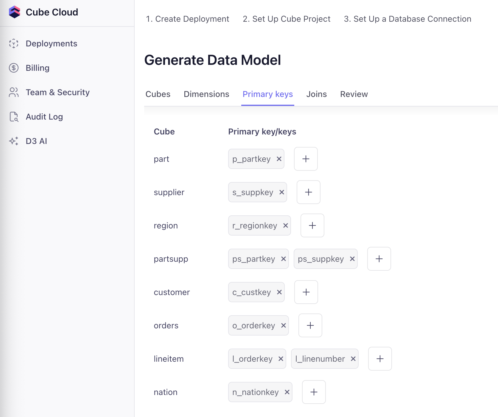
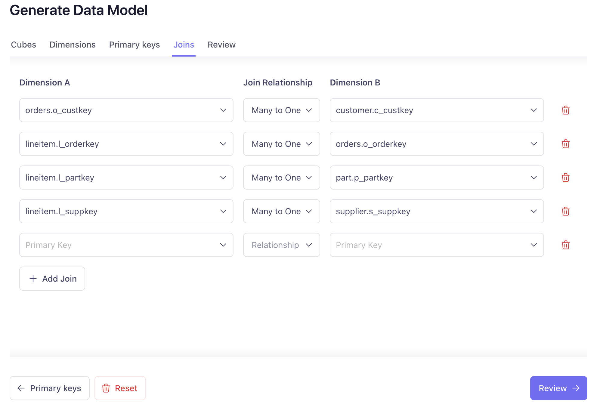
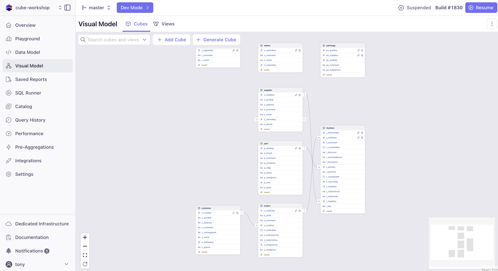
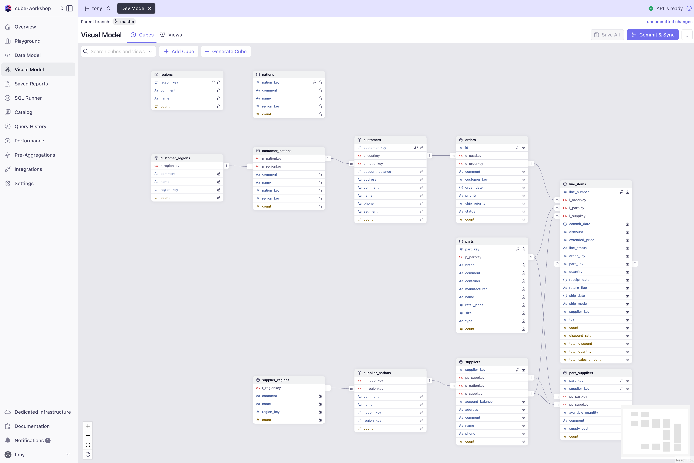

# Deployment Setup

Let's set up your Cube Cloud deployment with a free trial account and connect to the workshop database.

## Creating Your Free Cube Cloud Account

1. **Sign Up**: Navigate to [https://cubecloud.dev/auth/signup](https://cubecloud.dev/auth/signup)
2. **Create Account**: Fill in:
   - Your email address
   - A password
   - Company name
3. **Email Verification**: Check your email and click the verification link
4. **Sign In**: Return to [cubecloud.dev/auth](https://cubecloud.dev/auth) and sign in

:::tip No Credit Card Required
The free tier gives you access to basic Cube Cloud features without requiring payment information.  You're limited to 2 dev deployments and 1000 requests per day which is plenty for this workshop.
:::

## Creating Your First Deployment

Once logged in, you'll create your first Cube deployment:

### Step 1: Start New Deployment

1. Click **"Create Deployment"** or **"New Deployment"**
2. Choose **"Create from scratch"**
3. Name your deployment: `cube-workshop` (or any name you prefer)
4. Select a cloud provider (AWS or GCP - Azure is available for enterprise plans)
5. Select the cloud region closest to you 

### Step 2: Start a Fresh Deployment
1. Click **"Create"** to start from scratch

### Step 3: Connect to Data Source

For this workshop, we'll connect to a PostgreSQL database containing TPC-H sample data:

1. **Select Database Type**: Choose **PostgreSQL**
2. **Enter Connection Details**:
   ```
   Host: cube-demo-tpch.ccg9yo1fzn3w.us-west-2.rds.amazonaws.com
   Port: 5432
   Database: cube-demo-tpch
   Username: cube_workshop
   Password: workshop2025
   SSL: Enabled
   ```
3. **Apply** to connect and continue

### Step 3: Configure Data Model with Visual Modeler

The deployment wizard will now help you set up your initial data model:

1. **Select Tables**: The wizard will show available tables. Select **all** TPC-H tables and click **"Dimensions →"** to proceed 

2. Use the **Dimensions** step to de-select any unwanted dimensions, modify names, or change data typse.  We won't make any changes here, so just click **"Primary Keys →"** to continue.

3. **Primary Keys**: The wizard will let you select primary keys for each table. Verify these are correct:
   - `orders`: `o_orderkey`
   - `lineitem`: `l_orderkey` AND `l_linenumber` (composite key)
   - `part`: `p_partkey`
   - `supplier`: `s_suppkey`
   - `customer`: `c_custkey`
   - `nation`: `n_nationkey`
   - `region`: `r_regionkey`
   - `partsupp`: `ps_partkey` AND `ps_suppkey` (composite key)



   Click **"Joins →"** to continue.

4. **Define Relationships**: Each join requires a primary key on at least one side.  We'll set up a few here and the rest shortly:
   - `orders.o_custkey` → `customer.c_custkey` (many-to-one)
   - `lineitem.l_orderkey` → `orders.o_orderkey` (many-to-one)
   - `lineitem.l_partkey` → `part.p_partkey` (many-to-one)
   - `lineitem.l_suppkey` → `supplier.s_suppkey` (many-to-one)



   Click **"Review →"** to continue.

5. **Choose your Data Model Format**: Cube supports both YAML and JavaScript formats. For this workshop, we'll use **YAML**.  Leave it selected and click **"Confirm & Generate →"**.

Cube will now generate the initial data model based on your selections. This may take a couple minutes.

### Step 4: Access Your Deployment

After deployment (takes 1-2 minutes):

1. You'll be redirected to the **Overview** page and should see your deployment status change to **"Running"**
2. You should see:
   - **API Requests** The number of requests made to each Cube API and their status (green is online/healthy)
   - **Resources & Logs** The logs, especially for **Cube API Instnace** can be useful for debugging any data model or deployment issues
   - **Activity Log** view recent actions like builds, environment variable changes, and version upgrades.  You can also roll back changes from your build history in this log.
   - **Sidebar**: Navigate to various sections of Cube Cloud.  We'll use a few of these in the workshop but for info on the rest, see the [Cube Cloud workspace documentation](https://cube.dev/docs/product/workspace).

## Understanding the Visual Modeler

Before we dive into the Data Modeling section, let's understand the Data Model we just generated.  Click on the **Visual Model** tab in the sidebar to open the graphical interface.



### What is the Visual Modeler?

The Visual Modeler is Cube's graphical interface for:
- Defining relationships between tables
- Creating measures and dimensions
- Visualizing your data model
- Generating YAML configuration automatically

### Switching Between Visual and Code

In Cube Cloud, you can toggle between the **Visual Model** and the Code-based **Data Model**.  Any changes made in one will be reflected in the other.  For example, if you add a new measure in the Visual Modeler, it will update the YAML configuration automatically.  At the end of the day, the Visual Modeler is a user-friendly way to interact with your data model without needing to write YAML or JavaScript code directly.

Both approaches are valid and changes in one are reflected in the other!

## Getting Ready for Data Modeling

We need to make a few adjustments to our data model before we move on to deeper data modeling concepts.  Head over to the **Data Model** tab in the sidebar to view the YAML configuration, and we'll make updates to the model files.  We'll jump into **Dev Mode** to edit the YAML files directly, so click that button at the top of the screen and create a branch called `data-modeling` to work on your changes.

### nation.yml
We'll be updating the name of the cubes to a plural form - this is style convention in Cube to use plural names for cubes though it's still functional to use singular names if you prefer.  This also demonstrates that you don't need to follow the table names exactly in your Cube model - you can rename them to be more descriptive or follow your team's naming conventions, especially if they are indescipherable to begin with. 

We'll also bet setting all cubes to `public: false` so they are not exposed to the API by default.  This is a good practice to avoid exposing cubes to your end user and instead only showing them views.  We'll discuss this more in the next section.

Since both our customer and supplier tables have a `nation` foreign key, and we will want to distinguish between *customer* nations and *supplier* nations, we can use `extends` to create two virtual nations cubes which include all the fields from the base nations cube, but separate join paths, allowing us to semantically distinguish between them in queries without ambiguity. 

Replace the `nation.yml` file with the following code, which creates the `customer_nations` and `supplier_nations` cubes, and joins them to the `customer` and `supplier` cubes respectively.  Both extended cubes will also join to an extended version of the `region` cube.  If this isn't quite clear yet, don't worry! We'll look at the visual modeler shortly to get a clearer picture of what this is doing: 

```yaml title="/model/cubes/nation.yml" {3-4,30-60}
cubes:
  # Base nations cube - no joins to avoid circular references
  - name: nations
    public: false
    sql_table: tpch.nation

    measures:
      - name: count
        type: count

    dimensions:
      - name: nation_key
        sql: n_nationkey
        type: number
        primary_key: true

      - name: name
        sql: n_name
        type: string

      - name: region_key
        sql: n_regionkey
        type: number

      - name: comment
        sql: n_comment
        type: string

  # Extended nations cube for customer context
  - name: customer_nations
    extends: nations
    
    joins:
      - name: customer_regions
        relationship: many_to_one
        sql: "{CUBE}.n_regionkey = {customer_regions}.r_regionkey"

      - name: customers
        relationship: one_to_many
        sql: "{CUBE}.n_nationkey = {customers}.c_nationkey"

  # Extended nations cube for supplier context  
  - name: supplier_nations
    extends: nations
    
    joins:
      - name: supplier_regions
        relationship: many_to_one
        sql: "{CUBE}.n_regionkey = {supplier_regions}.r_regionkey"

      - name: suppliers
        relationship: one_to_many
        sql: "{CUBE}.n_nationkey = {suppliers}.s_nationkey"
```

If you save the model here, you'll see that Cube throws a compile error because we haven't yet defined the `customer_regions` and `supplier_regions` cubes.  We'll do that next.

### region.yml
The `region` cube is similar to the `nation` cube, but we will extend it to create two virtual cubes for customer and supplier regions.  This allows us to join the `region` cube to both the `customer` and `supplier` cubes (through our new `customer_nations` and `supplier_nations` cubes) without ambiguity.

Replace the `region.yml` file with the following code:

```yaml title="/model/cubes/region.yml" {3-4,26-60}
cubes:
  # Base regions cube - no joins to avoid circular references
  - name: regions
    public: false
    sql_table: tpch.region

    measures:
      - name: count
        type: count

    dimensions:
      - name: region_key
        sql: r_regionkey
        type: number
        primary_key: true

      - name: name
        sql: r_name
        type: string

      - name: comment
        sql: r_comment
        type: string

  # Extended regions cube for customer context
  - name: customer_regions
    extends: regions
    
    joins:
      - name: customer_nations
        relationship: one_to_many
        sql: "{CUBE}.r_regionkey = {customer_nations}.n_regionkey"

  # Extended regions cube for supplier context
  - name: supplier_regions
    extends: regions
    
    joins:
      - name: supplier_nations
        relationship: one_to_many
        sql: "{CUBE}.r_regionkey = {supplier_nations}.n_regionkey"
```

### customer.yml
The `customer` cube will now join to the `customer_nations` cube we just created as well as the orders cube.  This allows us to query customer data with nation and region context.

Replace the `customer.yml` file with the following code:

```yaml title="/model/cubes/customer.yml" {2-3,41-60}
cubes:
  - name: customers
    public: false
    sql_table: tpch.customer

    measures:
      - name: count
        type: count

    dimensions:
      - name: customer_key
        sql: c_custkey
        type: number
        primary_key: true

      - name: name
        sql: c_name
        type: string

      - name: address
        sql: c_address
        type: string

      - name: phone
        sql: c_phone
        type: string

      - name: segment
        sql: c_mktsegment
        type: string

      - name: account_balance
        sql: c_acctbal
        type: number
        format: currency

      - name: comment
        sql: c_comment
        type: string

    joins:
      - name: customer_nations
        relationship: many_to_one
        sql: "{CUBE}.c_nationkey = {customer_nations}.n_nationkey"

      - name: orders
        relationship: one_to_many
        sql: "{CUBE}.c_custkey = {orders}.o_custkey"
```

### part.yml
We'll add joins to the `part` cube to connect it to the `line_items` cube and the `part_suppliers` cube.  This allows us to query part data with line item and supplier context.  We'll also update the `name` and the `public` setting.

Replace the `part.yml` file with the following code:

```yaml title="/model/cubes/part.yml" {2-3,49-60}
cubes:
  - name: parts
    public: false
    sql_table: tpch.part

    measures:
      - name: count
        type: count

    dimensions:
      - name: part_key
        sql: p_partkey
        type: number
        primary_key: true

      - name: name
        sql: p_name
        type: string

      - name: manufacturer
        sql: p_mfgr
        type: string

      - name: brand
        sql: p_brand
        type: string

      - name: type
        sql: p_type
        type: string

      - name: size
        sql: p_size
        type: number

      - name: container
        sql: p_container
        type: string

      - name: retail_price
        sql: p_retailprice
        type: number
        format: currency

      - name: comment
        sql: p_comment
        type: string

    joins:
      - name: line_items
        relationship: one_to_many
        sql: "{CUBE}.p_partkey = {line_items}.l_partkey"

      - name: part_suppliers
        relationship: one_to_many  
        sql: "{CUBE}.p_partkey = {part_suppliers}.ps_partkey"
```

### partsupp.yml
The `partsupp` cube will join to the `parts` and `suppliers` cubes, allowing us to query part-supplier relationships.  We'll also update the `name` and the `public` setting.

Replace the `partsupp.yml` file with the following code:

```yaml title="/model/cubes/partsupp.yml" {2-3,34-60}
cubes:
  - name: part_suppliers
    public: false
    sql_table: tpch.partsupp

    measures:
      - name: count
        type: count

    dimensions:
      - name: part_key
        sql: ps_partkey
        type: number
        primary_key: true

      - name: supplier_key
        sql: ps_suppkey
        type: number
        primary_key: true

      - name: available_quantity
        sql: ps_availqty
        type: number

      - name: supply_cost
        sql: ps_supplycost
        type: number
        format: currency

      - name: comment
        sql: ps_comment
        type: string

    joins:
      - name: parts
        relationship: many_to_one
        sql: "{CUBE}.ps_partkey = {parts}.p_partkey"

      - name: suppliers
        relationship: many_to_one
        sql: "{CUBE}.ps_suppkey = {suppliers}.s_suppkey"
```

### supplier.yml
The `supplier` cube will join to the `supplier_nations` cube we created earlier, as well as the `part_suppliers` and `line_items` cubes.  This allows us to query supplier data with nation and part context.  We'll also update the `name` and the `public` setting.

Replace the `supplier.yml` file with the following code:

```yaml title="/model/cubes/supplier.yml" {2-3,37-60}
cubes:
  - name: suppliers
    public: false
    sql_table: tpch.supplier

    measures:
      - name: count
        type: count

    dimensions:
      - name: supplier_key
        sql: s_suppkey
        type: number
        primary_key: true

      - name: name
        sql: s_name
        type: string

      - name: address
        sql: s_address
        type: string

      - name: phone
        sql: s_phone
        type: string

      - name: account_balance
        sql: s_acctbal
        type: number
        format: currency

      - name: comment
        sql: s_comment
        type: string

    joins:
      - name: supplier_nations
        relationship: many_to_one
        sql: "{CUBE}.s_nationkey = {supplier_nations}.n_nationkey"

      - name: line_items
        relationship: one_to_many
        sql: "{CUBE}.s_suppkey = {line_items}.l_suppkey"

      - name: part_suppliers
        relationship: one_to_many
        sql: "{CUBE}.s_suppkey = {part_suppliers}.ps_suppkey"
```

### orders.yml
The `orders` cube will join to the `customers` cube, allowing us to query order data with customer context.  We'll also update the `public` setting.

Replace the `orders.yml` file with the following code:

```yaml title="/model/cubes/orders.yml" {3,40-60}
cubes:
  - name: orders
    public: false
    sql_table: tpch.orders

    measures:
      - name: count
        type: count

    dimensions:
      - name: id
        sql: o_orderkey
        type: number
        primary_key: true

      - name: order_date
        sql: o_orderdate::DATE
        type: time

      - name: status
        sql: o_orderstatus
        type: string

      - name: priority
        sql: o_orderpriority
        type: string

      - name: ship_priority
        sql: o_shippriority
        type: number

      - name: customer_key
        sql: o_custkey
        type: number

      - name: comment
        sql: o_comment
        type: string

    joins:
      - name: customers
        relationship: many_to_one
        sql: "{CUBE}.o_custkey = {customers}.c_custkey"

      # - name: line_items
      #   relationship: one_to_many
      #   sql: "{CUBE}.o_orderkey = {line_items}.l_orderkey"
```

### lineitem.yml
The `lineitem` cube will join to the `orders`, `parts`, and `suppliers` cubes, allowing us to query line item data with order, part, and supplier context.  We'll also update the `name` and `public` parameters. We'll also add some starting measures to dive into in the next section.

Replace the `lineitem.yml` file with the following code:

```yaml title="/model/cubes/lineitem.yml" {2-3,10-24,87-120}
cubes:
  - name: line_items
    public: false
    sql_table: tpch.lineitem

    measures:
      - name: count
        type: count

      - name: total_quantity
        type: sum
        sql: l_quantity

      - name: total_sales_amount
        type: sum
        sql: "({CUBE}.l_extendedprice * (1 - {CUBE}.l_discount))"

      - name: total_discount
        type: sum
        sql: "({CUBE}.l_discount * {CUBE}.l_extendedprice)"

      - name: discount_rate
        type: number
        sql: "({CUBE.total_discount} / {CUBE.total_sales_amount})"

    dimensions:
      - name: order_key
        sql: l_orderkey
        type: number

      - name: part_key
        sql: l_partkey
        type: number

      - name: supplier_key
        sql: l_suppkey
        type: number

      - name: line_number
        sql: l_linenumber
        type: number
        primary_key: true

      - name: quantity
        sql: l_quantity
        type: number

      - name: extended_price
        sql: l_extendedprice
        type: number
        format: currency

      - name: discount
        sql: l_discount
        type: number
        format: percent

      - name: tax
        sql: l_tax
        type: number
        format: percent

      - name: return_flag
        sql: l_returnflag
        type: string

      - name: line_status
        sql: l_linestatus
        type: string

      - name: ship_date
        sql: l_shipdate::DATE
        type: time

      - name: commit_date
        sql: l_commitdate::DATE
        type: time

      - name: receipt_date
        sql: l_receiptdate::DATE
        type: time

      - name: ship_mode
        sql: l_shipmode
        type: string

    joins:
      - name: orders
        relationship: many_to_one
        sql: "{CUBE}.l_orderkey = {orders}.o_orderkey"

      - name: parts
        relationship: many_to_one
        sql: "{CUBE}.l_partkey = {parts}.p_partkey"

      - name: suppliers
        relationship: many_to_one
        sql: "{CUBE}.l_suppkey = {suppliers}.s_suppkey"
```

If you successfully updated all the model files, and clicked **Save**, you should be rewarded with an **API is ready** and a green check mark in the top right corner. Now check out the Visual Modeler - you should see more connectivity between the cubes (all the joins we added) as well as the 4 new cubes (customer/supplier nations/regions) included in the graph.  If you see any errors, double check your YAML indentation and syntax matches the examples.  YAML is very sensitive to these!



## Commit Your Changes
Now that we've updated the model files, let's commit our changes to the `data-modeling` branch and merge it back to master.  This will allow us to keep our model up to date as we continue building out the data model in the next sections.

1. Click the **Commit & Sync** button in the top right
2. Enter a commit message like `Update data model with nations, regions, and joins` and **Submit** the changes
3. Click **Merge** (button in the top right) to push your changes into the master branch.  
4. Check the box for **Delete data-modeling branch** and click **Merge**.

Now your model is up to date and ready to dive into our data modeling section for the next steps!

## Complete Model Files
If you want to reference our ideal model state, here is the link to the files:

### 📁 Starter Files
**Location**: [1-starter](https://github.com/cube-js/cube-workshop/tree/main/static/cube-models/1-starter)

**Next**: Data Modeling to keep building your data model with Cube!