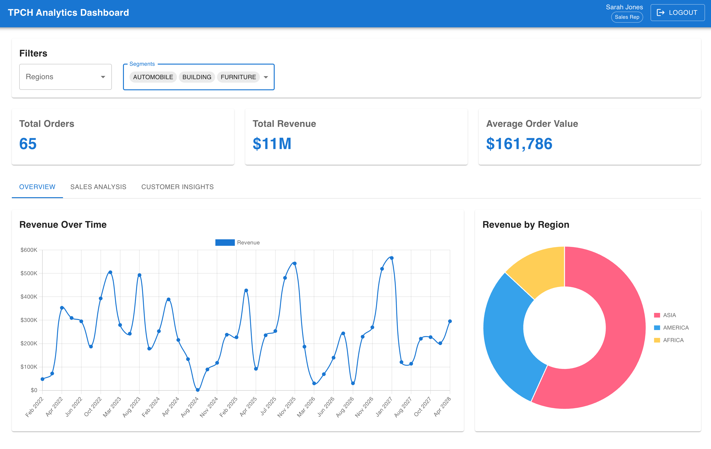
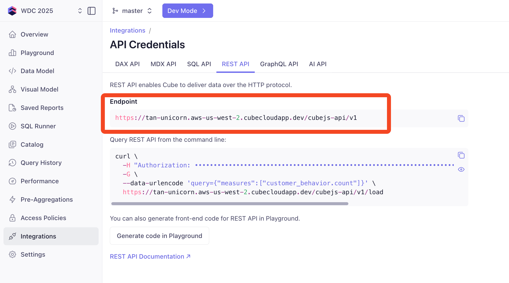
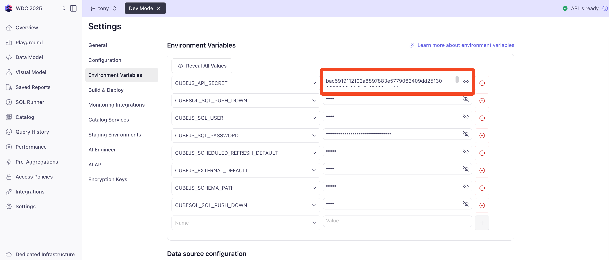
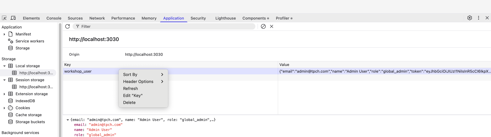
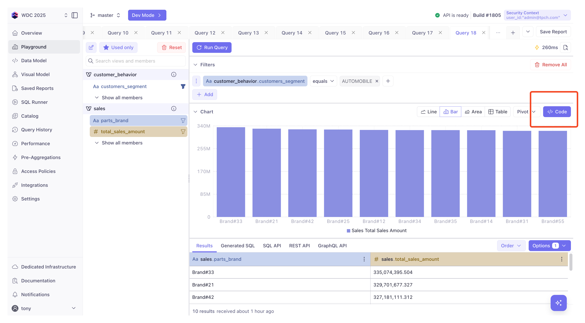
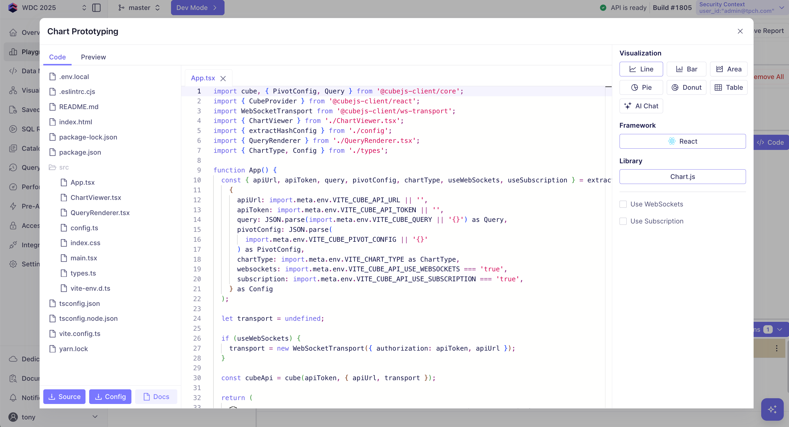

# Building a React Dashboard

In this comprehensive workshop, we'll build a professional analytics dashboard for TPC-H data from the ground up. You'll learn how to create a modern React application that connects to Cube's semantic layer, implements secure authentication, and displays interactive charts with role-based access control.

## Workshop Overview

This workshop is structured in 8 progressive parts, with each part building on the previous one. By the end, you'll have a production-ready dashboard that demonstrates all the key concepts of modern React development with Cube integration.

### What We'll Build



**Features you'll implement:**
- 🔐 **Server-side JWT authentication** with role-based access control
- 📊 **Interactive charts** showing revenue trends, customer segments, and regional performance
- 🎯 **Global filtering** that affects all dashboard components
- 📱 **Responsive design** using Material-UI components
- 🚀 **Sub-second performance** leveraging Cube's semantic layer
- 🔄 **Three dashboard views** with tabbed navigation

## Prerequisites

import Tabs from '@theme/Tabs';
import TabItem from '@theme/TabItem';

Before we begin, ensure you have:
- Node.js 20+ installed
- Your Cube data model progress committed and merged to your Cube main branch
- CLI Open - Terminal (for Mac) or Command Prompt (for Windows)
- A code editor like VS Code (recommended but not required)

<Tabs groupId="operating-systems">
<TabItem value="mac" label="macOS">

```bash
# Verify Node.js installation
node --version  # Should show v20.x or higher

# Create a new directory for our project
mkdir tpch-dashboard
cd tpch-dashboard
```

</TabItem>
<TabItem value="windows" label="Windows">

```cmd
# Verify Node.js installation
node --version  # Should show v20.x or higher

# Create a new directory for our project
mkdir tpch-dashboard
cd tpch-dashboard
```

</TabItem>
</Tabs>

---

## Part 1: Project Setup & Authentication
*Goal: Get the basic app shell running with authentication*

### Step 1: Create React App with Dependencies

Let's start by creating a new React application with TypeScript and installing all the dependencies we'll need throughout the workshop.

<Tabs groupId="operating-systems">
<TabItem value="mac" label="macOS">

```bash
# Create React app with TypeScript template
npx create-react-app . --template typescript

# Install Material UI for professional components
npm install @mui/material@^5.14.20 @emotion/react @emotion/styled
npm install @mui/icons-material@^5.14.19

# Install Chart.js for data visualization
npm install chart.js react-chartjs-2

# Install axios for API calls
npm install axios

# Install server dependencies for authentication
npm install --save-dev express cors jsonwebtoken dotenv concurrently
```

</TabItem>
<TabItem value="windows" label="Windows">

```cmd
# Create React app with TypeScript template
npx create-react-app . --template typescript

# Install Material UI for professional components
npm install @mui/material@^5.14.20 @emotion/react @emotion/styled
npm install @mui/icons-material@^5.14.19

# Install Chart.js for data visualization
npm install chart.js react-chartjs-2

# Install axios for API calls
npm install axios

# Install server dependencies for authentication
npm install --save-dev express cors jsonwebtoken dotenv concurrently
```

</TabItem>
</Tabs>

### Step 2: Set Up Express Authentication Server

Create a simple Express server that generates JWT tokens using your Cube API secret. This demonstrates server-side JWT generation for secure authentication.

Create a `server.js` file in your project root:

```javascript title="server.js"
const express = require('express');
const jwt = require('jsonwebtoken');
const cors = require('cors');
require('dotenv').config();

const app = express();
const PORT = process.env.SERVER_PORT || 3031;

// Enable CORS for development
app.use(cors());
app.use(express.json());

// Workshop users with different roles for access control demo
const WORKSHOP_USERS = [
  {
    email: 'admin@tpch.com',
    name: 'Admin User',
    role: 'global_admin',
    password: 'password'
  },
  {
    email: 'director_na@tpch.com',
    name: 'North America Director',
    role: 'regional_director',
    password: 'password'
  },
  {
    email: 'director_eu@tpch.com',
    name: 'Europe Director',
    role: 'regional_director',
    password: 'password'
  },
  {
    email: 'sarah_jones@tpch.com',
    name: 'Sarah Jones',
    role: 'sales_rep',
    password: 'password'
  },
  {
    email: 'mike_chen@tpch.com',
    name: 'Mike Chen',
    role: 'sales_rep',
    password: 'password'
  }
];

// Login endpoint
app.post('/api/login', (req, res) => {
  const { username, password } = req.body;

  // Find user
  const user = WORKSHOP_USERS.find(u => u.email === username);
  
  if (!user || user.password !== password) {
    return res.status(401).json({ error: 'Invalid credentials' });
  }

  // Generate JWT token using Cube API secret with user_id field
  const token = jwt.sign(
    { user_id: user.email },
    process.env.CUBEJS_API_SECRET,
    { expiresIn: '30d' }
  );

  // Return user info and token
  res.json({
    user: {
      email: user.email,
      name: user.name,
      role: user.role
    },
    token
  });
});

app.listen(PORT, () => {
  console.log(`Auth server running on http://localhost:${PORT}`);
});
```

:::info **Production Authentication Patterns**
The authentication server above is designed for workshop learning. In a **real-world production environment**, you would integrate with enterprise authentication systems instead of hardcoded users:

**OAuth 2.0 / OpenID Connect Integration:**
```javascript
// Example: Auth0, Okta, Azure AD, Google OAuth
app.get('/auth/callback', async (req, res) => {
  const { code } = req.query;
  
  // Exchange code for user info with your OAuth provider
  const userInfo = await exchangeCodeForUserInfo(code);
  
  // Generate Cube JWT with user context
  const cubeToken = jwt.sign(
    { 
      user_id: userInfo.sub,
      email: userInfo.email,
      department: userInfo.department,
      role: userInfo.app_role 
    },
    process.env.CUBEJS_API_SECRET,
    { expiresIn: '1h' }
  );
  
  res.json({ token: cubeToken, user: userInfo });
});
```

**SAML/LDAP Integration:**
```javascript
// Example: Enterprise SAML or LDAP authentication
app.post('/auth/saml', passport.authenticate('saml'), (req, res) => {
  const user = req.user; // From SAML assertion
  
  const cubeToken = jwt.sign(
    {
      user_id: user.nameID,
      department: user.department,
      cost_center: user.costCenter,
      manager: user.manager
    },
    process.env.CUBEJS_API_SECRET,
    { expiresIn: '8h' }
  );
  
  res.json({ token: cubeToken });
});
```

**Key Production Security Practices:**
- **Never hardcode passwords** - Use identity providers (Auth0, Okta, Azure AD)
- **Short token expiration** - Use 1-8 hour expiry with refresh tokens
- **Rich user context** - Include department, role, region, etc. in JWT for Cube's row-level security if Cube is expecting to be handed these attributes.  If Cube will look them up from the `user_id`, there's no need to include them in the JWT from this app.
- **Token refresh** - Implement refresh token rotation for long-lived sessions
- **Environment separation** - Different `CUBEJS_API_SECRET` per environment
- **Audit logging** - Track all authentication attempts and token usage

**Cube Security Context Example:**
The JWT payload becomes the initial Cube security context which can drive row-level filtering:
```javascript
// This JWT payload...
{
  user_id: "sarah.jones@company.com",
  department: "sales", 
  region: "north_america",
  role: "regional_director"
}

// ...enables Cube security filters like:
// WHERE region = {{ SECURITY_CONTEXT.region }}
// WHERE department = {{ SECURITY_CONTEXT.department }}
```
:::

### Step 3: Create Environment Configuration

Create a `.env` file in your project root with your Cube credentials:

```bash title=".env"
# Your Cube API endpoint
REACT_APP_CUBE_API_URL=https://your-workspace.cubecloud.dev/cubejs-api/v1

# Your Cube API Secret (from Settings -> Environment Variables)
CUBEJS_API_SECRET=your-api-secret-here

# Development ports
PORT=3000
SERVER_PORT=3031
```

:::warning
Never commit `.env` files with real credentials! Add `.env` to your `.gitignore`.
:::

**Get Your Cube Credentials:**

1. Log into your Cube workspace
2. Navigate to **Integrations** → **API Credentials** → **REST API**
3. Copy your REST API endpoint and replace `REACT_APP_CUBE_API_URL`



4. Navigate to **Settings** → **Environment Variables** and click **Reveal All Values** under **Environment Variables**
5. Show and copy the value for `CUBEJS_API_SECRET` to your .env file
6. Save and close your .env file



### Step 4: Create Authentication Context

This manages user authentication state across the entire app. We'll integrate it with the Cube API service in Part 2.

Create `src/contexts/AuthContext.tsx`:

```typescript title="src/contexts/AuthContext.tsx"
import React, { createContext, useContext, useState, useEffect, ReactNode } from 'react';

interface User {
  email: string;
  name: string;
  role: string;
  token: string;
}

interface AuthContextType {
  user: User | null;
  isAuthenticated: boolean;
  login: (email: string, name: string, role: string, token: string) => void;
  logout: () => void;
}

const AuthContext = createContext<AuthContextType | undefined>(undefined);

export const useAuth = () => {
  const context = useContext(AuthContext);
  if (context === undefined) {
    throw new Error('useAuth must be used within an AuthProvider');
  }
  return context;
};

interface AuthProviderProps {
  children: ReactNode;
}

export const AuthProvider: React.FC<AuthProviderProps> = ({ children }) => {
  const [user, setUser] = useState<User | null>(null);

  // Check for existing session on mount
  useEffect(() => {
    const savedUser = localStorage.getItem('workshop_user');
    if (savedUser) {
      try {
        const userData = JSON.parse(savedUser);
        setUser(userData);
        // TODO: Will update Cube API service in Part 2
      } catch (error) {
        // Clear invalid session data
        localStorage.removeItem('workshop_user');
      }
    }
  }, []);

  const login = (email: string, name: string, role: string, token: string) => {
    const userData = { email, name, role, token };
    setUser(userData);
    localStorage.setItem('workshop_user', JSON.stringify(userData));
    
    // TODO: Will update Cube API service in Part 2
    
    console.log('🔐 User logged in:', { email, name, role });
    console.log('🎫 JWT token generated and set');
  };

  const logout = () => {
    setUser(null);
    localStorage.removeItem('workshop_user');
    
    // TODO: Will reset Cube API service in Part 2
    
    console.log('🚪 User logged out');
  };

  return (
    <AuthContext.Provider value={{ user, isAuthenticated: !!user, login, logout }}>
      {children}
    </AuthContext.Provider>
  );
};

export default AuthContext;
```

### Step 5: Create Login Form Component

This provides a clean login interface for workshop participants to authenticate with different user accounts.

Create `src/components/LoginForm.tsx`:

```typescript title="src/components/LoginForm.tsx"
import React, { useState } from 'react';
import {
  Container,
  Paper,
  TextField,
  Button,
  Typography,
  Box,
  Alert,
} from '@mui/material';
import axios from 'axios';

interface LoginFormProps {
  onLogin: (email: string, name: string, role: string, token: string) => void;
}


const LoginForm: React.FC<LoginFormProps> = ({ onLogin }) => {
  const [username, setUsername] = useState('');
  const [password, setPassword] = useState('');
  const [error, setError] = useState('');

  const handleSubmit = async (e: React.FormEvent) => {
    e.preventDefault();
    setError('');
    
    try {
      const response = await axios.post('http://localhost:3031/api/login', {
        username,
        password
      });
      
      const { user, token } = response.data;
      onLogin(user.email, user.name, user.role, token);
    } catch (error: any) {
      if (error.response?.status === 401) {
        setError('Invalid username or password');
      } else {
        setError('Login failed. Please try again.');
      }
    }
  };

  return (
    <Container maxWidth="sm" sx={{ mt: 8 }}>
      <Paper elevation={3} sx={{ p: 4 }}>
        <Box textAlign="center" mb={3}>
          <Typography variant="h4" component="h1" gutterBottom>
            TPC-H Analytics Login
          </Typography>
          <Typography variant="body2" color="text.secondary">
            Workshop Authentication Demo
          </Typography>
        </Box>

        <form onSubmit={handleSubmit}>
          <TextField
            fullWidth
            label="Username"
            value={username}
            onChange={(e) => setUsername(e.target.value)}
            margin="normal"
            placeholder="e.g., admin@tpch.com"
            autoComplete="username"
          />

          <TextField
            fullWidth
            type="password"
            label="Password"
            value={password}
            onChange={(e) => setPassword(e.target.value)}
            margin="normal"
            placeholder="password"
            autoComplete="current-password"
          />

          {error && (
            <Alert severity="error" sx={{ mt: 2 }}>
              {error}
            </Alert>
          )}

          <Button
            type="submit"
            fullWidth
            variant="contained"
            sx={{ mt: 3, mb: 2 }}
            disabled={!username || !password}
          >
            Login
          </Button>
        </form>
      </Paper>
    </Container>
  );
};

export default LoginForm;
```

### Step 6: Create Basic App Structure

Update your main App.tsx to integrate authentication and create the basic app shell:

```typescript title="src/App.tsx"
import React from 'react';
import { ThemeProvider, createTheme } from '@mui/material/styles';
import CssBaseline from '@mui/material/CssBaseline';
import { 
  Box,
  Container,
  IconButton,
  Link
} from '@mui/material';
import { GitHub, Description } from '@mui/icons-material';
import { AuthProvider, useAuth } from './contexts/AuthContext';
import LoginForm from './components/LoginForm';

// Create Material-UI theme
const theme = createTheme({
  palette: {
    mode: 'light',
    primary: {
      main: '#1976d2',
    },
    secondary: {
      main: '#dc004e',
    },
    background: {
      default: '#f5f5f5',
    },
  },
  typography: {
    h4: {
      fontWeight: 600,
    },
    h6: {
      fontWeight: 500,
    },
  },
  components: {
    MuiCard: {
      styleOverrides: {
        root: {
          boxShadow: '0 2px 8px rgba(0,0,0,0.1)',
          borderRadius: 12,
        },
      },
    },
    MuiButton: {
      styleOverrides: {
        root: {
          borderRadius: 8,
        },
      },
    },
  },
});

// Main app component that handles authentication state
const AppContent: React.FC = () => {
  const { isAuthenticated, login } = useAuth();

  if (!isAuthenticated) {
    return <LoginForm onLogin={login} />;
  }

  return (
    <Box sx={{ flexGrow: 1 }}>
      <main>
        <Container maxWidth="lg" sx={{ mt: 4, mb: 4 }}>
          <Box textAlign="center" py={8}>
            <h1>🎉 Authentication Successful!</h1>
            <p>You're now logged in. We'll add the dashboard components in the next parts.</p>
          </Box>
        </Container>
      </main>

      <Box 
        component="footer" 
        sx={{ 
          bgcolor: 'background.paper', 
          py: 3, 
          mt: 6,
          borderTop: 1,
          borderColor: 'divider'
        }}
      >
        <Container maxWidth="lg">
          <Box sx={{ display: 'flex', alignItems: 'center', justifyContent: 'center', gap: 1, mb: 1 }}>
            <IconButton 
              color="primary" 
              href="https://cube.dev/docs" 
              target="_blank"
              title="Cube Documentation"
              size="small"
            >
              <Description />
            </IconButton>
            <IconButton 
              color="primary" 
              href="https://github.com/cube-js/cube" 
              target="_blank"
              title="Cube on GitHub"
              size="small"
            >
              <GitHub />
            </IconButton>
          </Box>
          <Box sx={{ textAlign: 'center' }}>
            <Link href="https://cube.dev" target="_blank" color="primary" sx={{ mr: 1 }}>
              Cube
            </Link>
            •
            <Link href="https://react.dev" target="_blank" color="primary" sx={{ mx: 1 }}>
              React
            </Link>
            •
            <Link href="https://mui.com" target="_blank" color="primary" sx={{ mx: 1 }}>
              Material-UI
            </Link>
            •
            <Link href="https://chartjs.org" target="_blank" color="primary" sx={{ ml: 1 }}>
              Chart.js
            </Link>
          </Box>
        </Container>
      </Box>
    </Box>
  );
};

function App() {
  return (
    <ThemeProvider theme={theme}>
      <CssBaseline />
      <AuthProvider>
        <AppContent />
      </AuthProvider>
    </ThemeProvider>
  );
}

export default App;
```

### Step 7: Update Package Scripts

Update the `scripts` section of your package.json to run both the React app and authentication server:

```json title="package.json"

  "scripts": {
    "start": "concurrently \"npm run server\" \"npm run client\"",
    "client": "react-scripts start",
    "server": "node server.js",
    "build": "react-scripts build",
    "test": "react-scripts test",
    "eject": "react-scripts eject"
  }

```

### Step 8: Test Authentication

Now test your authentication setup:

<Tabs groupId="operating-systems">
<TabItem value="mac" label="macOS">

```bash
npm start
```

</TabItem>
<TabItem value="windows" label="Windows">

```cmd
npm start
```

</TabItem>
</Tabs>

You should see:
- Auth server starting on port 3031
- React app starting on port 3000
- Login form at `http://localhost:3000`

**Test with one of these accounts:**
- `admin@tpch.com` / `password` (global admin)
- `director_na@tpch.com` / `password` (regional director)
- `sarah_jones@tpch.com` / `password` (sales rep)

After successful login, you should see a success message. The foundation is now set!

:::tip
We haven't created the logout button yet, so if you want to log out right now, open up **Developer tools** in the browser, open the **Application** tab, and navigate to **Storage -> Local Storage -> http://localhost:3000**.  Right click the `workshop_user` key and click **Delete**.  Then refresh the page.


:::


---

## Part 2: API Layer & Types
*Goal: Connect to Cube and establish data contracts*

### Step 1: Create TypeScript Interfaces

Create the data contracts for our Cube API integration.

Create `src/types/cube.ts`:

```typescript title="src/types/cube.ts"
// Cube API response types
export interface CubeQueryResponse {
  query: CubeQuery;
  data: CubeDataRow[];
  annotation: {
    measures: Record<string, CubeMeasureAnnotation>;
    dimensions: Record<string, CubeDimensionAnnotation>;
    timeDimensions: Record<string, CubeTimeDimensionAnnotation>;
  };
}

export interface CubeQuery {
  measures?: string[];
  dimensions?: string[];
  timeDimensions?: CubeTimeDimension[];
  filters?: CubeFilter[];
  order?: CubeOrder;
  limit?: number;
  offset?: number;
}

export interface CubeTimeDimension {
  dimension: string;
  granularity?: string;
  dateRange?: string | string[];
}

export interface CubeFilter {
  member: string;
  operator: string;
  values: string[];
}

export interface CubeOrder {
  [key: string]: 'asc' | 'desc';
}

export interface CubeDataRow {
  [key: string]: string | number | null;
}

export interface CubeMeasureAnnotation {
  title: string;
  shortTitle: string;
  type: string;
  format?: string;
}

export interface CubeDimensionAnnotation {
  title: string;
  shortTitle: string;
  type: string;
}

export interface CubeTimeDimensionAnnotation {
  title: string;
  shortTitle: string;
  type: string;
}

// Dashboard-specific types
export interface MetricCardData {
  title: string;
  value: string | number;
  format?: string;
  change?: number;
  isLoading?: boolean;
}

export interface ChartData {
  labels: string[];
  datasets: {
    label: string;
    data: number[];
    backgroundColor?: string | string[];
    borderColor?: string;
    borderWidth?: number;
  }[];
}
```

### Step 2: Create Cube API Service

This service handles all Cube API communications with proper error handling and caching.

Create `src/services/cubeApi.ts`:

```typescript title="src/services/cubeApi.ts"
import axios from 'axios';
import { CubeQuery, CubeQueryResponse } from '../types/cube';

// Configuration - replace these with your actual values
const CUBE_API_URL = process.env.REACT_APP_CUBE_API_URL || 'YOUR_CUBE_ENDPOINT_HERE';
const CUBE_API_TOKEN = process.env.REACT_APP_CUBE_API_TOKEN || 'YOUR_BEARER_TOKEN_HERE';

class CubeApiService {
  private apiUrl: string;
  private token: string;

  constructor() {
    this.apiUrl = CUBE_API_URL;
    this.token = CUBE_API_TOKEN;
  }

  // Update configuration
  updateConfig(apiUrl: string, token: string) {
    this.apiUrl = apiUrl;
    this.token = token;
    console.log('🔧 Cube API configuration updated with new JWT token');
  }

  // Set token (convenience method)
  setToken(token: string) {
    this.token = token;
    console.log('🔧 Cube API token updated');
  }

  // Check if configuration is valid
  isConfigured(): boolean {
    const configured = this.apiUrl !== 'YOUR_CUBE_ENDPOINT_HERE' && 
           this.token !== 'YOUR_BEARER_TOKEN_HERE' &&
           this.apiUrl.length > 0 && 
           this.token.length > 0;
    
    // Debug logging
    console.log('🐛 Cube API Configuration:', {
      apiUrl: this.apiUrl,
      tokenPrefix: this.token.substring(0, 20) + '...',
      configured
    });
    
    return configured;
  }

  // Main query method
  async query(query: CubeQuery): Promise<CubeQueryResponse> {
    if (!this.isConfigured()) {
      throw new Error('Cube API not configured. Please set your endpoint and token.');
    }

    try {
      console.log('🚀 Making Cube API request:', {
        url: `${this.apiUrl}/load`,
        query: JSON.stringify(query, null, 2),
        tokenPrefix: this.token.substring(0, 20) + '...'
      });

      // Use GET with URL-encoded query parameter (like in the docs)
      const queryParam = encodeURIComponent(JSON.stringify(query));
      const response = await axios.get(
        `${this.apiUrl}/load?query=${queryParam}`,
        {
          headers: {
            'Authorization': this.token,
          },
        }
      );

      console.log('✅ Cube API response received:', response.status);
      return response.data;
    } catch (error) {
      console.error('❌ Cube API Error:', error);
      if (axios.isAxiosError(error)) {
        console.error('📋 Error details:', {
          status: error.response?.status,
          statusText: error.response?.statusText,
          data: error.response?.data,
          url: error.config?.url
        });
        
        if (error.response?.status === 401) {
          throw new Error('Authentication failed. Please check your Bearer token.');
        }
        if (error.response?.status === 403) {
          throw new Error('Access denied. Please check your permissions.');
        }
        if (error.response?.status === 400) {
          throw new Error(`Bad Request: ${JSON.stringify(error.response?.data) || error.response?.statusText || error.message}`);
        }
        if (error.response?.status === 500) {
          throw new Error(`Server Error: ${JSON.stringify(error.response?.data) || error.response?.statusText || error.message}`);
        }
        throw new Error(`API Error: ${error.response?.statusText || error.message}`);
      }
      throw error;
    }
  }

  // Simple test query to verify API connection
  async testConnection(): Promise<CubeQueryResponse> {
    return this.query({
      measures: ['customer_behavior.count']
    });
  }
}

// Export singleton instance
export const cubeApi = new CubeApiService();
export default cubeApi;
```

### Step 3: Update AuthContext for Cube Integration

Now that we have our Cube API service, let's update the AuthContext to integrate with it.

Update `src/contexts/AuthContext.tsx`:

```typescript title="src/contexts/AuthContext.tsx" {2,42-44,58-59}
import React, { createContext, useContext, useState, useEffect, ReactNode } from 'react';
import cubeApi from '../services/cubeApi';

interface User {
  email: string;
  name: string;
  role: string;
  token: string;
}

interface AuthContextType {
  user: User | null;
  isAuthenticated: boolean;
  login: (email: string, name: string, role: string, token: string) => void;
  logout: () => void;
}

const AuthContext = createContext<AuthContextType | undefined>(undefined);

export const useAuth = () => {
  const context = useContext(AuthContext);
  if (!context) {
    throw new Error('useAuth must be used within an AuthProvider');
  }
  return context;
};

interface AuthProviderProps {
  children: ReactNode;
}

export const AuthProvider: React.FC<AuthProviderProps> = ({ children }) => {
  const [user, setUser] = useState<User | null>(null);

  // Check for existing session on mount
  useEffect(() => {
    const savedUser = localStorage.getItem('workshop_user');
    if (savedUser) {
      try {
        const userData = JSON.parse(savedUser);
        setUser(userData);
        // Update Cube API service with JWT token
        if (userData.token) {
          cubeApi.setToken(userData.token);
        }
      } catch (error) {
        // Clear invalid session data
        localStorage.removeItem('workshop_user');
      }
    }
  }, []);

  const login = (email: string, name: string, role: string, token: string) => {
    const userData = { email, name, role, token };
    setUser(userData);
    localStorage.setItem('workshop_user', JSON.stringify(userData));
    
    // Update Cube API service with JWT token
    cubeApi.setToken(token);
    
    console.log('🔐 User logged in:', { email, name, role });
    console.log('🎫 JWT token generated and set');
  };

  const logout = () => {
    setUser(null);
    localStorage.removeItem('workshop_user');
    
    console.log('🚪 User logged out');
  };

  return (
    <AuthContext.Provider value={{ user, isAuthenticated: !!user, login, logout }}>
      {children}
    </AuthContext.Provider>
  );
};
```

---

## Part 3: App Layout & Header
*Goal: Create the main app structure*

### Step 1: Create Header Component

This creates a navigation bar showing the user's information and role.

Create `src/components/Header.tsx`:

```typescript title="src/components/Header.tsx"
import React from 'react';
import {
  AppBar,
  Toolbar,
  Typography,
  Button,
  Box,
  Chip,
} from '@mui/material';
import { LogoutOutlined, PersonOutlined } from '@mui/icons-material';
import { useAuth } from '../contexts/AuthContext';

const Header: React.FC = () => {
  const { user, logout } = useAuth();

  const getRoleColor = (role: string) => {
    switch (role) {
      case 'global_admin':
        return 'error';
      case 'regional_director':
        return 'warning';
      case 'sales_rep':
        return 'info';
      default:
        return 'default';
    }
  };

  const getRoleLabel = (role: string) => {
    switch (role) {
      case 'global_admin':
        return 'Admin';
      case 'regional_director':
        return 'Director';
      case 'sales_rep':
        return 'Sales Rep';
      default:
        return role;
    }
  };

  return (
    <AppBar position="static" elevation={1}>
      <Toolbar>
        <Box display="flex" alignItems="center" gap={2} flexGrow={1}>
          <Typography variant="h6" component="div">
            TPC-H Analytics
          </Typography>
        </Box>
        
        {user && (
          <Box display="flex" alignItems="center" gap={2}>
            <Box display="flex" alignItems="center" gap={1}>
              <PersonOutlined fontSize="small" />
              <Typography variant="body2">
                {user.name}
              </Typography>
              <Chip 
                label={getRoleLabel(user.role)}
                size="small"
                color={getRoleColor(user.role)}
                variant="outlined"
                sx={{ color: 'white', borderColor: 'rgba(255,255,255,0.5)' }}
              />
            </Box>
            
            <Button
              color="inherit"
              onClick={logout}
              startIcon={<LogoutOutlined />}
              size="small"
            >
              Logout
            </Button>
          </Box>
        )}
      </Toolbar>
    </AppBar>
  );
};

export default Header;
```

### Step 2: Create Main Dashboard Layout

Create a placeholder dashboard component that we'll fill with real components.

Create `src/components/Dashboard.tsx`:

```typescript title="src/components/Dashboard.tsx"
import React from 'react';
import {
  Container,
  Grid,
  Typography,
  Paper,
  Box,
} from '@mui/material';

const Dashboard: React.FC = () => {
  return (
    <Container maxWidth="lg" sx={{ mt: 4, mb: 4 }}>
      <Typography variant="h4" component="h1" gutterBottom>
        TPC-H Analytics Dashboard
      </Typography>
      <Typography variant="subtitle1" color="text.secondary" paragraph>
        Real-time insights into B2B e-commerce performance
      </Typography>

      <Grid container spacing={3}>
        {/* KPI Cards Row */}
        <Grid item xs={12}>
          <Paper sx={{ p: 3, textAlign: 'center', minHeight: 120 }}>
            <Typography variant="h6" gutterBottom>Key Performance Indicators</Typography>
            <Typography color="text.secondary">
              KPI cards will be added in Part 5
            </Typography>
          </Paper>
        </Grid>

        {/* Charts Row */}
        <Grid item xs={12} md={8}>
          <Paper sx={{ p: 3, height: 400 }}>
            <Typography variant="h6" gutterBottom>Revenue Trend</Typography>
            <Box 
              display="flex" 
              alignItems="center" 
              justifyContent="center" 
              height="90%"
            >
              <Typography color="text.secondary">
                Revenue chart will be added in Part 6
              </Typography>
            </Box>
          </Paper>
        </Grid>
        
        <Grid item xs={12} md={4}>
          <Paper sx={{ p: 3, height: 400 }}>
            <Typography variant="h6" gutterBottom>Customer Segments</Typography>
            <Box 
              display="flex" 
              alignItems="center" 
              justifyContent="center" 
              height="90%"
            >
              <Typography color="text.secondary">
                Pie chart will be added in Part 6
              </Typography>
            </Box>
          </Paper>
        </Grid>
      </Grid>
    </Container>
  );
};

export default Dashboard;
```

### Step 3: Update App.tsx with Header and Dashboard

```typescript title="src/App.tsx" {12,14,67-71}
import React from 'react';
import { ThemeProvider, createTheme } from '@mui/material/styles';
import CssBaseline from '@mui/material/CssBaseline';
import { 
  Box,
  Container,
  IconButton,
  Link
} from '@mui/material';
import { GitHub, Description } from '@mui/icons-material';
import { AuthProvider, useAuth } from './contexts/AuthContext';
import Dashboard from './components/Dashboard';
import LoginForm from './components/LoginForm';
import Header from './components/Header';

// Create Material-UI theme
const theme = createTheme({
  palette: {
    mode: 'light',
    primary: {
      main: '#1976d2',
    },
    secondary: {
      main: '#dc004e',
    },
    background: {
      default: '#f5f5f5',
    },
  },
  typography: {
    h4: {
      fontWeight: 600,
    },
    h6: {
      fontWeight: 500,
    },
  },
  components: {
    MuiCard: {
      styleOverrides: {
        root: {
          boxShadow: '0 2px 8px rgba(0,0,0,0.1)',
          borderRadius: 12,
        },
      },
    },
    MuiButton: {
      styleOverrides: {
        root: {
          borderRadius: 8,
        },
      },
    },
  },
});

// Main app component that handles authentication state
const AppContent: React.FC = () => {
  const { isAuthenticated, login } = useAuth();

  if (!isAuthenticated) {
    return <LoginForm onLogin={login} />;
  }

  return (
    <Box sx={{ flexGrow: 1 }}>
      <Header />

      <main>
        <Dashboard />
      </main>

      <Box 
        component="footer" 
        sx={{ 
          bgcolor: 'background.paper', 
          py: 3, 
          mt: 6,
          borderTop: 1,
          borderColor: 'divider'
        }}
      >
        <Container maxWidth="lg">
          <Box sx={{ display: 'flex', alignItems: 'center', justifyContent: 'center', gap: 1, mb: 1 }}>
            <IconButton 
              color="primary" 
              href="https://cube.dev/docs" 
              target="_blank"
              title="Cube Documentation"
              size="small"
            >
              <Description />
            </IconButton>
            <IconButton 
              color="primary" 
              href="https://github.com/cube-js/cube" 
              target="_blank"
              title="Cube on GitHub"
              size="small"
            >
              <GitHub />
            </IconButton>
          </Box>
          <Box sx={{ textAlign: 'center' }}>
            <Link href="https://cube.dev" target="_blank" color="primary" sx={{ mr: 1 }}>
              Cube
            </Link>
            •
            <Link href="https://react.dev" target="_blank" color="primary" sx={{ mx: 1 }}>
              React
            </Link>
            •
            <Link href="https://mui.com" target="_blank" color="primary" sx={{ mx: 1 }}>
              Material-UI
            </Link>
            •
            <Link href="https://chartjs.org" target="_blank" color="primary" sx={{ ml: 1 }}>
              Chart.js
            </Link>
          </Box>
        </Container>
      </Box>
    </Box>
  );
};

function App() {
  return (
    <ThemeProvider theme={theme}>
      <CssBaseline />
      <AuthProvider>
        <AppContent />
      </AuthProvider>
    </ThemeProvider>
  );
}

export default App;
```

Now when you login, you should see:
- Header with user info and role badge
- Main dashboard layout with placeholders
- Footer with tech stack links

The app structure is now complete and ready for data components!

---

## Part 4: Global Filters
*Goal: Build reusable filter system*

### Step 1: Add API Methods for Filter Data

First, update your Cube API service to include methods for loading filter options.  This adds 3 methods near the end of the file:

```typescript title="src/services/cubeApi.ts" {10-38}
// ... existing code ...

  // Simple test query to verify API connection
  async testConnection(): Promise<CubeQueryResponse> {
    return this.query({
      measures: ['customer_behavior.count']
    });
  }

  // Get all regions for filter dropdown
  async getRegions(): Promise<CubeQueryResponse> {
    return this.query({
      dimensions: ['sales.region']
    });
  }

  // Get customer segments for filter dropdown  
  async getCustomerSegments(): Promise<CubeQueryResponse> {
    return this.query({
      dimensions: ['customer_behavior.customers_segment']
    });
  }

  // Main dashboard queries optimized for pre-aggregations
  async getKPIs(filters: any[] = []): Promise<CubeQueryResponse> {
    return this.query({
      measures: [
        'customer_behavior.count',
        'customer_behavior.total_revenue', 
        'customer_behavior.average_order_value'
      ],
      timeDimensions: [{
        dimension: 'customer_behavior.order_date',
        dateRange: 'last 12 months'
      }],
      filters
    });
  }
}

// Export singleton instance
export const cubeApi = new CubeApiService();
export default cubeApi;
```

### Step 2: Create Filter Bar Component

This creates a reusable filter component with region and customer segment dropdowns that affect all dashboard data.

Create `src/components/FilterBar.tsx`:

```typescript title="src/components/FilterBar.tsx"
import React, { useState, useEffect, useRef } from 'react';
import {
  Box,
  FormControl,
  InputLabel,
  Select,
  MenuItem,
  Chip,
  OutlinedInput,
  SelectChangeEvent,
  CircularProgress,
} from '@mui/material';
import { CubeFilter } from '../types/cube';
import cubeApi from '../services/cubeApi';

interface FilterBarProps {
  onFiltersChange: (filters: CubeFilter[]) => void;
  disabled?: boolean;
}

const FilterBar: React.FC<FilterBarProps> = ({ onFiltersChange, disabled = false }) => {
  const [selectedRegions, setSelectedRegions] = useState<string[]>([]);
  const [selectedSegments, setSelectedSegments] = useState<string[]>([]);
  const [availableRegions, setAvailableRegions] = useState<string[]>([]);
  const [availableSegments, setAvailableSegments] = useState<string[]>([]);
  const [loading, setLoading] = useState(true);
  
  // Track previous filters to avoid unnecessary updates
  const prevFiltersRef = useRef<string>('');

  const updateFilters = () => {
    const filters: CubeFilter[] = [];

    // Use compatible filter paths that don't create join loops
    if (selectedRegions.length > 0) {
      // For region filter, use customer_behavior view to avoid join loops
      filters.push({
        member: 'customer_behavior.region',
        operator: 'equals',
        values: selectedRegions
      });
    }

    if (selectedSegments.length > 0) {
      filters.push({
        member: 'customer_behavior.customers_segment',
        operator: 'equals',
        values: selectedSegments
      });
    }

    // Only call onFiltersChange if filters actually changed
    const filtersString = JSON.stringify(filters);
    if (filtersString !== prevFiltersRef.current) {
      console.log('🔄 FilterBar: Filters changed, updating:', filters);
      prevFiltersRef.current = filtersString;
      onFiltersChange(filters);
    } else {
      console.log('🚫 FilterBar: Filters unchanged, skipping update');
    }
  };

  const loadFilterOptions = async () => {
    try {
      setLoading(true);
      
      const [regionsResponse, segmentsResponse] = await Promise.all([
        cubeApi.getRegions(),
        cubeApi.getCustomerSegments()
      ]);

      const regions = regionsResponse.data.map(row => row['sales.region'] as string).filter(Boolean);
      const segments = segmentsResponse.data.map(row => row['customer_behavior.customers_segment'] as string).filter(Boolean);

      setAvailableRegions(Array.from(new Set(regions)).sort());
      setAvailableSegments(Array.from(new Set(segments)).sort());
    } catch (error) {
      console.error('Failed to load filter options:', error);
    } finally {
      setLoading(false);
    }
  };

  useEffect(() => {
    loadFilterOptions();
  }, []);

  useEffect(() => {
    updateFilters();
  }, [selectedRegions, selectedSegments]); // Remove updateFilters from dependencies

  const handleRegionChange = (event: SelectChangeEvent<string[]>) => {
    const value = event.target.value;
    const newValue = typeof value === 'string' ? value.split(',') : value;
    
    // If "All" (empty string) is selected, clear the selection
    if (newValue.includes('')) {
      setSelectedRegions([]);
    } else {
      setSelectedRegions(newValue);
    }
  };

  const handleSegmentChange = (event: SelectChangeEvent<string[]>) => {
    const value = event.target.value;
    const newValue = typeof value === 'string' ? value.split(',') : value;
    
    // If "All" (empty string) is selected, clear the selection
    if (newValue.includes('')) {
      setSelectedSegments([]);
    } else {
      setSelectedSegments(newValue);
    }
  };

  if (loading) {
    return (
      <Box display="flex" alignItems="center" gap={2} mb={3}>
        <CircularProgress size={20} />
        <span>Loading filters...</span>
      </Box>
    );
  }

  return (
    <Box display="flex" gap={3} mb={3} flexWrap="wrap">
      <FormControl size="small" sx={{ minWidth: 200 }}>
        <InputLabel>Region</InputLabel>
        <Select
          multiple
          value={selectedRegions}
          onChange={handleRegionChange}
          input={<OutlinedInput label="Region" />}
          disabled={disabled}
          renderValue={(selected) => 
            selected.length === 0 ? 'All Regions' : (
              <Box sx={{ display: 'flex', flexWrap: 'wrap', gap: 0.5 }}>
                {selected.map((value) => (
                  <Chip key={value} label={value} size="small" />
                ))}
              </Box>
            )
          }
        >
          <MenuItem 
            key="all-regions" 
            value=""
            sx={{ fontStyle: 'italic' }}
          >
            All Regions
          </MenuItem>
          {availableRegions.map((region) => (
            <MenuItem key={region} value={region}>
              {region}
            </MenuItem>
          ))}
        </Select>
      </FormControl>

      <FormControl size="small" sx={{ minWidth: 200 }}>
        <InputLabel>Customer Segment</InputLabel>
        <Select
          multiple
          value={selectedSegments}
          onChange={handleSegmentChange}
          input={<OutlinedInput label="Customer Segment" />}
          disabled={disabled}
          renderValue={(selected) => 
            selected.length === 0 ? 'All Segments' : (
              <Box sx={{ display: 'flex', flexWrap: 'wrap', gap: 0.5 }}>
                {selected.map((value) => (
                  <Chip key={value} label={value} size="small" />
                ))}
              </Box>
            )
          }
        >
          <MenuItem 
            key="all-segments" 
            value=""
            sx={{ fontStyle: 'italic' }}
          >
            All Segments
          </MenuItem>
          {availableSegments.map((segment) => (
            <MenuItem key={segment} value={segment}>
              {segment}
            </MenuItem>
          ))}
        </Select>
      </FormControl>
    </Box>
  );
};

export default FilterBar;
```

### Step 3: Update Dashboard to Include Filters

Update the Dashboard component to include the filter bar and pass filter state to child components:

```typescript title="src/components/Dashboard.tsx" {1,8,10-12,15-20,24-38,46}
import React, { useState } from 'react';
import {
  Container,
  Grid,
  Typography,
  Paper,
  Box,
  Button,
} from '@mui/material';
import { Refresh as RefreshIcon } from '@mui/icons-material';
import FilterBar from './FilterBar';
import { CubeFilter } from '../types/cube';

const Dashboard: React.FC = () => {
  const [filters, setFilters] = useState<CubeFilter[]>([]);
  const [loading, setLoading] = useState(false);

  const handleFiltersChange = (newFilters: CubeFilter[]) => {
    setFilters(newFilters);
  };

  return (
    <Container maxWidth="lg" sx={{ mt: 4, mb: 4 }}>
      <Box display="flex" justifyContent="space-between" alignItems="center" mb={3}>
        <Typography variant="h4" component="h1">
          TPC-H Analytics Dashboard
        </Typography>
        <Button
          variant="outlined"
          startIcon={<RefreshIcon />}
          disabled={loading}
        >
          Refresh
        </Button>
      </Box>

      {/* Global Filters */}
      <FilterBar onFiltersChange={handleFiltersChange} disabled={loading} />

      <Grid container spacing={3}>
        {/* KPI Cards Row */}
        <Grid item xs={12}>
          <Paper sx={{ p: 3, textAlign: 'center', minHeight: 120 }}>
            <Typography variant="h6" gutterBottom>Key Performance Indicators</Typography>
            <Typography color="text.secondary">
              KPI cards will be added in Part 5 (Filters active: {filters.length})
            </Typography>
          </Paper>
        </Grid>

        {/* Charts Row */}
        <Grid item xs={12} md={8}>
          <Paper sx={{ p: 3, height: 400 }}>
            <Typography variant="h6" gutterBottom>Revenue Trend</Typography>
            <Box 
              display="flex" 
              alignItems="center" 
              justifyContent="center" 
              height="90%"
            >
              <Typography color="text.secondary">
                Revenue chart will be added in Part 6
              </Typography>
            </Box>
          </Paper>
        </Grid>
        
        <Grid item xs={12} md={4}>
          <Paper sx={{ p: 3, height: 400 }}>
            <Typography variant="h6" gutterBottom>Customer Segments</Typography>
            <Box 
              display="flex" 
              alignItems="center" 
              justifyContent="center" 
              height="90%"
            >
              <Typography color="text.secondary">
                Pie chart will be added in Part 6
              </Typography>
            </Box>
          </Paper>
        </Grid>
      </Grid>
    </Container>
  );
};

export default Dashboard;
```

Now test your filters:
1. Login to the dashboard
2. You should see filter dropdowns loading with real data from Cube
3. Select some regions/segments and watch the filter count update
4. The filters are now ready to be consumed by chart components!

---

## Part 5: Dashboard Structure & KPI Cards
*Goal: Create the main dashboard with tabs and KPIs*

### Step 1: Create KPI Cards Component

This component displays three essential business metrics: Order Count, Total Revenue, and Average Order Value. It demonstrates proper data formatting and loading states.  Notice the single query pulling back 3 measures with the same filter, then using the result to populate the 3 different KPI cards.

Create `src/components/KPICards.tsx`:

```typescript title="src/components/KPICards.tsx"
import React, { useEffect, useState } from 'react';
import { Grid, Card, CardContent, Typography, Box, Skeleton } from '@mui/material';
import { 
  TrendingUp, 
  ShoppingCart, 
  AttachMoney
} from '@mui/icons-material';
import { cubeApi } from '../services/cubeApi';
import { CubeFilter } from '../types/cube';

interface KPIData {
  totalRevenue: number;
  orderCount: number;
  avgOrderValue: number;
}

interface KPICardsProps {
  filters?: CubeFilter[];
}

const KPICards: React.FC<KPICardsProps> = ({ filters = [] }) => {
  const [data, setData] = useState<KPIData | null>(null);
  const [loading, setLoading] = useState(true);
  const [error, setError] = useState<string | null>(null);

  useEffect(() => {
    fetchKPIs();
  }, [filters]);

  const fetchKPIs = async () => {
    try {
      setLoading(true);
      const response = await cubeApi.query({
        measures: [
          'customer_behavior.count',
          'customer_behavior.total_revenue',
          'customer_behavior.average_order_value'
        ],
        timeDimensions: [{
          dimension: 'customer_behavior.order_date',
          dateRange: 'last 12 months'
        }],
        filters
      });

      // Extract data from the single result row
      // Cube automatically rolls up the data when no granularity is specified
      const resultData = response.data[0] || {};
      
      setData({
        orderCount: parseInt(String(resultData['customer_behavior.count'] || '0')),
        totalRevenue: parseFloat(String(resultData['customer_behavior.total_revenue'] || '0')),
        avgOrderValue: parseFloat(String(resultData['customer_behavior.average_order_value'] || '0'))
      });
    } catch (err) {
      setError('Failed to load KPIs');
      console.error('Error fetching KPIs:', err);
    } finally {
      setLoading(false);
    }
  };

  const formatCurrency = (value: number) => {
    return new Intl.NumberFormat('en-US', {
      style: 'currency',
      currency: 'USD',
      minimumFractionDigits: 0,
      maximumFractionDigits: 0,
    }).format(value);
  };

  const formatNumber = (value: number) => {
    return new Intl.NumberFormat('en-US').format(value);
  };

  const kpiCards = [
    {
      title: 'Order Count (LTM)',
      value: data ? formatNumber(data.orderCount) : '-',
      icon: <ShoppingCart />,
      color: '#2563eb', // Blue
    },
    {
      title: 'Revenue (LTM)',
      value: data ? formatCurrency(data.totalRevenue) : '-',
      icon: <AttachMoney />,
      color: '#16a34a', // Green
    },
    {
      title: 'Avg Order Value (LTM)',
      value: data ? formatCurrency(data.avgOrderValue) : '-',
      icon: <TrendingUp />,
      color: '#9333ea', // Purple
    },
  ];

  if (error) {
    return (
      <Box sx={{ p: 3, textAlign: 'center' }}>
        <Typography color="error">{error}</Typography>
      </Box>
    );
  }

  return (
    <Grid container spacing={3}>
      {kpiCards.map((kpi, index) => (
        <Grid item xs={12} sm={6} md={4} key={index}>
          <Card elevation={2}>
            <CardContent>
              <Box display="flex" alignItems="center" mb={2}>
                <Box
                  sx={{
                    backgroundColor: `${kpi.color}20`,
                    borderRadius: 2,
                    p: 1.5,
                    display: 'flex',
                    alignItems: 'center',
                    justifyContent: 'center',
                    mr: 2,
                  }}
                >
                  <Box sx={{ color: kpi.color }}>{kpi.icon}</Box>
                </Box>
                <Typography variant="body2" color="text.secondary">
                  {kpi.title}
                </Typography>
              </Box>
              {loading ? (
                <Skeleton variant="text" width="60%" height={40} />
              ) : (
                <Typography variant="h4" component="div">
                  {kpi.value}
                </Typography>
              )}
            </CardContent>
          </Card>
        </Grid>
      ))}
    </Grid>
  );
};

export default KPICards;
```

### Step 2: Add Tabs to Dashboard

Now let's enhance our existing Dashboard component to include tabs for different views.

Update `src/components/Dashboard.tsx`:

```typescript title="src/components/Dashboard.tsx" {9-10,13-15,17-50,56,70-137}
import React, { useState } from 'react';
import { 
  Container,
  Grid,
  Typography,
  Paper,
  Box,
  Button,
  Tab,
  Tabs,
} from '@mui/material';
import { Refresh as RefreshIcon } from '@mui/icons-material';
import FilterBar from './FilterBar';
import KPICards from './KPICards';
import { CubeFilter } from '../types/cube';

interface TabPanelProps {
  children?: React.ReactNode;
  index: number;
  value: number;
}

function TabPanel(props: TabPanelProps) {
  const { children, value, index, ...other } = props;

  return (
    <div
      role="tabpanel"
      hidden={value !== index}
      id={`dashboard-tabpanel-${index}`}
      aria-labelledby={`dashboard-tab-${index}`}
      {...other}
    >
      {value === index && <Box sx={{ py: 3 }}>{children}</Box>}
    </div>
  );
}

const Dashboard: React.FC = () => {
  const [tabValue, setTabValue] = useState(0);
  const [loading, setLoading] = useState(false);
  const [filters, setFilters] = useState<CubeFilter[]>([]);

  const handleTabChange = (_event: React.SyntheticEvent, newValue: number) => {
    setTabValue(newValue);
  };

  const handleFiltersChange = (newFilters: CubeFilter[]) => {
    setFilters(newFilters);
  };

  return (
    <Container maxWidth="lg" sx={{ mt: 4, mb: 4 }}>
      <Box display="flex" justifyContent="space-between" alignItems="center" mb={3}>
        <Typography variant="h4" component="h1">
          TPC-H Analytics Dashboard (LTM)
        </Typography>
        <Button
          variant="outlined"
          startIcon={<RefreshIcon />}
          disabled={loading}
        >
          Refresh
        </Button>
      </Box>

      {/* Global Filters */}
      <FilterBar onFiltersChange={handleFiltersChange} disabled={loading} />

      <Paper sx={{ width: '100%', mb: 3 }}>
        <Tabs value={tabValue} onChange={handleTabChange} sx={{ borderBottom: 1, borderColor: 'divider' }}>
          <Tab label="Overview" />
          <Tab label="Sales Analysis" />
          <Tab label="Customer Insights" />
        </Tabs>

        <TabPanel value={tabValue} index={0}>
          {/* KPI Cards */}
          <Grid container spacing={3} sx={{ mb: 3 }}>
            <Grid item xs={12}>
              <KPICards filters={filters} />
            </Grid>
          </Grid>

          {/* Main Charts */}
          <Grid container spacing={3}>
            <Grid item xs={12} md={8}>
              <Paper sx={{ p: 3, height: 400 }}>
                <Typography variant="h6" gutterBottom>Revenue Over Time</Typography>
                <Box 
                  display="flex" 
                  alignItems="center" 
                  justifyContent="center" 
                  height="90%"
                >
                  <Typography color="text.secondary">
                    Revenue chart will be added in Part 6
                  </Typography>
                </Box>
              </Paper>
            </Grid>
            <Grid item xs={12} md={4}>
              <Paper sx={{ p: 3, height: 400 }}>
                <Typography variant="h6" gutterBottom>Revenue by Region (LTM)</Typography>
                <Box 
                  display="flex" 
                  alignItems="center " 
                  justifyContent="center" 
                  height="90%"
                >
                  <Typography color="text.secondary">
                    Region chart will be added in Part 6
                  </Typography>
                </Box>
              </Paper>
            </Grid>
          </Grid>
        </TabPanel>

        <TabPanel value={tabValue} index={1}>
          <Box textAlign="center" py={8}>
            <Typography variant="h6" gutterBottom>Sales Analysis Dashboard</Typography>
            <Typography color="text.secondary">
              Sales analysis charts will be added in Part 7
            </Typography>
          </Box>
        </TabPanel>

        <TabPanel value={tabValue} index={2}>
          <Box textAlign="center" py={8}>
            <Typography variant="h6" gutterBottom>Customer Insights Dashboard</Typography>
            <Typography color="text.secondary">
              Customer insight charts will be added in Part 7
            </Typography>
          </Box>
        </TabPanel>
      </Paper>
    </Container>
  );
};

export default Dashboard;
```

### Step 3: Test the Enhanced Dashboard

Now test your progress:
1. Login and you should see the tabbed dashboard
2. KPI cards showing real data from Cube
3. Filter by regions/segments and watch KPIs update instantly
4. Switch between tabs (other tabs show placeholders for now)

The dashboard structure is complete with working KPIs and filters!

---

## Part 6: Chart Components
*Goal: Build reusable chart components*

### Step 1: Add More API Methods

First, extend your Cube API service with methods for chart data:

```typescript title="src/services/cubeApi.ts" {24-57}
  // Get customer segments for filter dropdown  
  async getCustomerSegments(): Promise<CubeQueryResponse> {
    return this.query({
      dimensions: ['customer_behavior.customers_segment']
    });
  }

  // Main dashboard queries optimized for pre-aggregations
  async getKPIs(filters: any[] = []): Promise<CubeQueryResponse> {
    return this.query({
      measures: [
        'customer_behavior.count',
        'customer_behavior.total_revenue', 
        'customer_behavior.average_order_value'
      ],
      timeDimensions: [{
        dimension: 'customer_behavior.order_date',
        dateRange: 'last 12 months'
      }],
      filters
    });
  }

  async getSalesOverTime(filters: any[] = [], dateRange = 'last 12 months'): Promise<CubeQueryResponse> {
    // Use customer_behavior view for consistency with filters
    return this.query({
      measures: ['customer_behavior.total_revenue'],
      timeDimensions: [{
        dimension: 'customer_behavior.order_date',
        granularity: 'month',
        dateRange
      }],
      filters
    });
  }

  async getSalesByRegion(filters: any[] = []): Promise<CubeQueryResponse> {
    // Use customer_behavior view to avoid join loops when filters are applied
    return this.query({
      measures: ['customer_behavior.total_revenue'],
      dimensions: ['customer_behavior.region'],
      timeDimensions: [{
        dimension: 'customer_behavior.order_date',
        granularity: 'month',
        dateRange: 'last 12 months'
      }],
      filters
    });
  }

  async getCustomerSegmentRevenue(filters: any[] = []): Promise<CubeQueryResponse> {
    return this.query({
      measures: ['customer_behavior.total_revenue'],
      dimensions: ['customer_behavior.customers_segment'],
      filters
    });
  }
}

// Export singleton instance
export const cubeApi = new CubeApiService();
export default cubeApi;
```

### Step 2: Create Reusable Chart Components

Create a flexible SalesChart component that can render both line and bar charts:

Create `src/components/SalesChart.tsx`:

```typescript title="src/components/SalesChart.tsx"
import React from 'react';
import {
  Chart as ChartJS,
  CategoryScale,
  LinearScale,
  PointElement,
  LineElement,
  Title,
  Tooltip,
  Legend,
  BarElement,
} from 'chart.js';
import { Line, Bar } from 'react-chartjs-2';
import { Card, CardContent, Typography, Box, Skeleton } from '@mui/material';
import { ChartData } from '../types/cube';

// Register Chart.js components
ChartJS.register(
  CategoryScale,
  LinearScale,
  PointElement,
  LineElement,
  BarElement,
  Title,
  Tooltip,
  Legend
);

interface SalesChartProps {
  title: string;
  data: ChartData | null;
  type?: 'line' | 'bar';
  height?: number;
  isLoading?: boolean;
}

const SalesChart: React.FC<SalesChartProps> = ({ 
  title, 
  data, 
  type = 'line', 
  height = 400,
  isLoading = false 
}) => {
  const options = {
    responsive: true,
    maintainAspectRatio: false,
    plugins: {
      legend: {
        position: 'top' as const,
      },
      title: {
        display: false,
      },
      tooltip: {
        callbacks: {
          label: (context: any) => {
            const value = context.parsed.y;
            
            // Format currency values
            if (context.dataset.label?.toLowerCase().includes('sales') || 
                context.dataset.label?.toLowerCase().includes('revenue')) {
              return `${context.dataset.label}: ${new Intl.NumberFormat('en-US', {
                style: 'currency',
                currency: 'USD',
                minimumFractionDigits: 0,
                maximumFractionDigits: 0
              }).format(value)}`;
            }
            
            // Format percentage values
            if (context.dataset.label?.toLowerCase().includes('rate') || 
                context.dataset.label?.toLowerCase().includes('percent')) {
              return `${context.dataset.label}: ${(value * 100).toFixed(1)}%`;
            }
            
            // Default number formatting
            return `${context.dataset.label}: ${new Intl.NumberFormat('en-US').format(value)}`;
          }
        }
      }
    },
    scales: {
      y: {
        beginAtZero: true,
        ticks: {
          callback: function(value: any) {
            // Format Y-axis labels for currency
            if (title.toLowerCase().includes('sales') || 
                title.toLowerCase().includes('revenue')) {
              return new Intl.NumberFormat('en-US', {
                style: 'currency',
                currency: 'USD',
                notation: 'compact',
                maximumFractionDigits: 1
              }).format(value);
            }
            
            // Format Y-axis labels for large numbers
            return new Intl.NumberFormat('en-US', {
              notation: 'compact',
              maximumFractionDigits: 1
            }).format(value);
          }
        }
      }
    }
  };

  const chartColors = {
    primary: '#1976d2',
    secondary: '#dc004e',
    success: '#388e3c',
    warning: '#f57c00',
    info: '#0288d1',
    gradient: 'rgba(25, 118, 210, 0.1)'
  };

  const enhancedData = data ? {
    ...data,
    datasets: data.datasets.map((dataset, index) => ({
      ...dataset,
      backgroundColor: dataset.backgroundColor || 
        (type === 'line' ? chartColors.gradient : 
         Array.isArray(dataset.data) 
           ? dataset.data.map((_, i) => 
               Object.values(chartColors)[i % Object.values(chartColors).length])
           : chartColors.primary),
      borderColor: dataset.borderColor || chartColors.primary,
      borderWidth: dataset.borderWidth || (type === 'line' ? 2 : 1),
      fill: type === 'line' ? true : false,
      tension: type === 'line' ? 0.4 : undefined,
    }))
  } : null;

  if (isLoading) {
    return (
      <Card sx={{ height: '100%' }}>
        <CardContent>
          <Typography variant="h6" gutterBottom>
            {title}
          </Typography>
          <Box height={height}>
            <Skeleton variant="rectangular" width="100%" height="100%" />
          </Box>
        </CardContent>
      </Card>
    );
  }

  if (!data || !data.datasets.length) {
    return (
      <Card sx={{ height: '100%' }}>
        <CardContent>
          <Typography variant="h6" gutterBottom>
            {title}
          </Typography>
          <Box 
            height={height} 
            display="flex" 
            alignItems="center" 
            justifyContent="center"
            bgcolor="grey.50"
            borderRadius={1}
          >
            <Typography variant="body2" color="text.secondary">
              No data available
            </Typography>
          </Box>
        </CardContent>
      </Card>
    );
  }

  return (
    <Card sx={{ height: '100%' }}>
      <CardContent>
        <Typography variant="h6" gutterBottom>
          {title}
        </Typography>
        <Box height={height}>
          {type === 'line' ? (
            <Line data={enhancedData!} options={options} />
          ) : (
            <Bar data={enhancedData!} options={options} />
          )}
        </Box>
      </CardContent>
    </Card>
  );
};

export default SalesChart;
```

### Step 3: Create Region Chart Component (Doughnut)

Create a specialized chart for regional data visualization:

Create `src/components/RegionChart.tsx`:

```typescript title="src/components/RegionChart.tsx"
import React from 'react';
import {
  Chart as ChartJS,
  CategoryScale,
  LinearScale,
  ArcElement,
  Title,
  Tooltip,
  Legend,
} from 'chart.js';
import { Doughnut } from 'react-chartjs-2';
import { Card, CardContent, Typography, Box, Skeleton } from '@mui/material';
import { ChartData } from '../types/cube';

// Register Chart.js components
ChartJS.register(
  CategoryScale,
  LinearScale,
  ArcElement,
  Title,
  Tooltip,
  Legend
);

interface RegionChartProps {
  title: string;
  data: ChartData | null;
  height?: number;
  isLoading?: boolean;
}

const RegionChart: React.FC<RegionChartProps> = ({ 
  title, 
  data, 
  height = 400,
  isLoading = false 
}) => {
  const options = {
    responsive: true,
    maintainAspectRatio: false,
    plugins: {
      legend: {
        position: 'right' as const,
        labels: {
          boxWidth: 15,
          padding: 15,
        }
      },
      tooltip: {
        callbacks: {
          label: (context: any) => {
            const value = context.parsed;
            const total = context.dataset.data.reduce((sum: number, val: number) => sum + val, 0);
            const percentage = ((value / total) * 100).toFixed(1);
            
            // Format currency values
            const formattedValue = new Intl.NumberFormat('en-US', {
              style: 'currency',
              currency: 'USD',
              minimumFractionDigits: 0,
              maximumFractionDigits: 0
            }).format(value);
            
            return `${context.label}: ${formattedValue} (${percentage}%)`;
          }
        }
      }
    },
    cutout: '50%',
  };

  const regionColors = [
    '#FF6384', // Pink/Red
    '#36A2EB', // Blue
    '#FFCE56', // Yellow
    '#4BC0C0', // Teal
    '#9966FF', // Purple
    '#FF9F40', // Orange
    '#FF6B6B', // Light Red
    '#4ECDC4', // Light Teal
  ];

  const enhancedData = data ? {
    ...data,
    datasets: data.datasets.map(dataset => ({
      ...dataset,
      backgroundColor: regionColors.slice(0, data.labels.length),
      borderColor: '#ffffff',
      borderWidth: 2,
      hoverBorderWidth: 3,
    }))
  } : null;

  if (isLoading) {
    return (
      <Card sx={{ height: '100%' }}>
        <CardContent>
          <Typography variant="h6" gutterBottom>
            {title}
          </Typography>
          <Box height={height}>
            <Skeleton variant="circular" width="60%" height="60%" sx={{ mx: 'auto' }} />
          </Box>
        </CardContent>
      </Card>
    );
  }

  if (!data || !data.datasets.length) {
    return (
      <Card sx={{ height: '100%' }}>
        <CardContent>
          <Typography variant="h6" gutterBottom>
            {title}
          </Typography>
          <Box 
            height={height} 
            display="flex" 
            alignItems="center" 
            justifyContent="center"
            bgcolor="grey.50"
            borderRadius={1}
          >
            <Typography variant="body2" color="text.secondary">
              No data available
            </Typography>
          </Box>
        </CardContent>
      </Card>
    );
  }

  return (
    <Card sx={{ height: '100%' }}>
      <CardContent>
        <Typography variant="h6" gutterBottom>
          {title}
        </Typography>
        <Box height={height} display="flex" alignItems="center" justifyContent="center">
          <Doughnut data={enhancedData!} options={options} />
        </Box>
      </CardContent>
    </Card>
  );
};

export default RegionChart;
```

### Step 4: Update Dashboard with Real Charts

Now we'll create a comprehensive dashboard component that loads all data and renders the charts.  Update your Dashboard.tsx file with these sweeping changes:

```typescript title="src/components/Dashboard.tsx" 
import React, { useState, useEffect, useRef } from 'react';
import {
  Container,
  Grid,
  Typography,
  Alert,
  Box,
  Paper,
  Tab,
  Tabs,
  Button,
} from '@mui/material';
import { Refresh as RefreshIcon } from '@mui/icons-material';
import cubeApi from '../services/cubeApi';
import FilterBar from './FilterBar';
import KPICards from './KPICards';
import SalesChart from './SalesChart';
import RegionChart from './RegionChart';
import { CubeQueryResponse, CubeFilter, ChartData } from '../types/cube';

interface TabPanelProps {
  children?: React.ReactNode;
  index: number;
  value: number;
}

function TabPanel(props: TabPanelProps) {
  const { children, value, index, ...other } = props;

  return (
    <div
      role="tabpanel"
      hidden={value !== index}
      id={`dashboard-tabpanel-${index}`}
      aria-labelledby={`dashboard-tab-${index}`}
      {...other}
    >
      {value === index && <Box sx={{ py: 3 }}>{children}</Box>}
    </div>
  );
}

const Dashboard: React.FC = () => {
  const [tabValue, setTabValue] = useState(0);
  const [loading, setLoading] = useState(true);
  const [error, setError] = useState<string | null>(null);
  const [filters, setFilters] = useState<CubeFilter[]>([]);
  
  // State for different data sets
  const [salesOverTime, setSalesOverTime] = useState<ChartData | null>(null);
  const [salesByRegion, setSalesByRegion] = useState<ChartData | null>(null);
  const [customerSegments, setCustomerSegments] = useState<ChartData | null>(null);
  
  // Track if we're already loading to prevent duplicate requests
  const loadingRef = useRef(false);

  const loadDashboardData = async () => {
    // Prevent multiple simultaneous requests
    if (loadingRef.current) {
      console.log('🚫 Skipping duplicate request - already loading');
      return;
    }
    if (!cubeApi.isConfigured()) {
      setError('Please configure your Cube API endpoint and token in the .env file.');
      setLoading(false);
      return;
    }

    loadingRef.current = true;
    setLoading(true);
    setError(null);

    try {
      console.log('📊 Loading dashboard data with filters:', filters);

      // Load all data in parallel
      const [
        salesOverTimeResponse,
        salesByRegionResponse,
        customerSegmentsResponse,
      ] = await Promise.all([
        cubeApi.getSalesOverTime(filters),
        cubeApi.getSalesByRegion(filters),
        cubeApi.getCustomerSegmentRevenue(filters),
      ]);

      console.log('✅ All queries successful!');

      // Process all data
      setSalesOverTime(processSalesOverTimeData(salesOverTimeResponse));
      setSalesByRegion(processSalesByRegionData(salesByRegionResponse));
      setCustomerSegments(processCustomerSegmentsData(customerSegmentsResponse));

    } catch (err) {
      console.error('Dashboard load error:', err);
      setError(err instanceof Error ? err.message : 'Failed to load dashboard data');
    } finally {
      loadingRef.current = false;
      setLoading(false);
    }
  };

  const processSalesOverTimeData = (response: CubeQueryResponse): ChartData => {
    if (!response.data || !response.data.length) {
      return {
        labels: [],
        datasets: [{
          label: 'Revenue',
          data: [],
          borderColor: '#1976d2',
          backgroundColor: 'rgba(25, 118, 210, 0.1)',
          borderWidth: 2,
        }]
      };
    }

    const labels = response.data.map(row => {
      const dateStr = row['customer_behavior.order_date.month'] as string;
      return new Date(dateStr).toLocaleDateString('en-US', { month: 'short', year: 'numeric' });
    });
    
    const data = response.data.map(row => 
      parseFloat(String(row['customer_behavior.total_revenue'])) || 0
    );

    return {
      labels,
      datasets: [{
        label: 'Revenue',
        data,
        borderColor: '#1976d2',
        backgroundColor: 'rgba(25, 118, 210, 0.1)',
        borderWidth: 2,
      }]
    };
  };

  const processSalesByRegionData = (response: CubeQueryResponse): ChartData => {
    if (!response.data || !response.data.length) {
      return {
        labels: [],
        datasets: [{
          label: 'Revenue by Region (LTM)',
          data: [],
          backgroundColor: ['#FF6384', '#36A2EB', '#FFCE56', '#4BC0C0', '#9966FF'],
        }]
      };
    }

    // Group by region and sum up LTM data
    const regionTotals: { [key: string]: number } = {};
    
    response.data.forEach(row => {
      const region = row['customer_behavior.region'] as string;
      const amount = parseFloat(String(row['customer_behavior.total_revenue'])) || 0;
      
      if (regionTotals[region]) {
        regionTotals[region] += amount;
      } else {
        regionTotals[region] = amount;
      }
    });

    const labels = Object.keys(regionTotals);
    const data = Object.values(regionTotals);

    return {
      labels,
      datasets: [{
        label: 'Revenue by Region (LTM)',
        data,
        backgroundColor: ['#FF6384', '#36A2EB', '#FFCE56', '#4BC0C0', '#9966FF'],
      }]
    };
  };

  const processCustomerSegmentsData = (response: CubeQueryResponse): ChartData => {
    if (!response.data || !response.data.length) {
      return {
        labels: [],
        datasets: [{
          label: 'Revenue by Segment',
          data: [],
          backgroundColor: ['#FF6384', '#36A2EB', '#FFCE56', '#4BC0C0', '#9966FF'],
        }]
      };
    }

    const labels = response.data.map(row => row['customer_behavior.customers_segment'] as string);
    const data = response.data.map(row => 
      parseFloat(String(row['customer_behavior.total_revenue'])) || 0
    );

    return {
      labels,
      datasets: [{
        label: 'Revenue by Segment',
        data,
        backgroundColor: ['#FF6384', '#36A2EB', '#FFCE56', '#4BC0C0', '#9966FF'],
      }]
    };
  };

  useEffect(() => {
    console.log('🔄 useEffect triggered, filters:', filters);
    loadDashboardData();
  }, [filters]); // Only depend on filters, not the function itself

  const handleTabChange = (_event: React.SyntheticEvent, newValue: number) => {
    setTabValue(newValue);
  };

  const handleFiltersChange = (newFilters: CubeFilter[]) => {
    setFilters(newFilters);
  };

  if (error) {
    return (
      <Container maxWidth="lg" sx={{ mt: 4, mb: 4 }}>
        <Alert severity="error" sx={{ mb: 2 }}>
          <Typography variant="h6" gutterBottom>
            Dashboard Error
          </Typography>
          {error}
          <br /><br />
          <Typography variant="body2">
            To configure the dashboard:
            <br />
            1. Check your .env file in the project root
            <br />
            2. Ensure REACT_APP_CUBE_API_URL and REACT_APP_CUBE_API_TOKEN are set
            <br />
            3. Restart the development server: npm start
          </Typography>
        </Alert>
      </Container>
    );
  }

  return (
    <Container maxWidth="lg" sx={{ mt: 4, mb: 4 }}>
      <Box display="flex" justifyContent="space-between" alignItems="center" mb={3}>
        <Typography variant="h4" component="h1">
          TPC-H Analytics Dashboard (LTM)
        </Typography>
        <Button
          variant="outlined"
          startIcon={<RefreshIcon />}
          onClick={loadDashboardData}
          disabled={loading}
        >
          Refresh
        </Button>
      </Box>

      {/* Global Filters */}
      <FilterBar onFiltersChange={handleFiltersChange} disabled={loading} />

      <Paper sx={{ width: '100%', mb: 3 }}>
        <Tabs value={tabValue} onChange={handleTabChange} sx={{ borderBottom: 1, borderColor: 'divider' }}>
          <Tab label="Overview" />
          <Tab label="Sales Analysis" />
          <Tab label="Customer Insights" />
        </Tabs>

        <TabPanel value={tabValue} index={0}>
          {/* KPI Cards */}
          <Grid container spacing={3} sx={{ mb: 3 }}>
            <Grid item xs={12}>
              <KPICards filters={filters} />
            </Grid>
          </Grid>

          {/* Main Charts */}
          <Grid container spacing={3}>
            <Grid item xs={12} md={8}>
              <SalesChart
                title="Revenue Over Time"
                data={salesOverTime}
                type="line"
                isLoading={loading}
              />
            </Grid>
            <Grid item xs={12} md={4}>
              <RegionChart
                title="Revenue by Region (LTM)"
                data={salesByRegion}
                isLoading={loading}
              />
            </Grid>
          </Grid>
        </TabPanel>

        <TabPanel value={tabValue} index={1}>
          <Box textAlign="center" py={8}>
            <Typography variant="h6" gutterBottom>Sales Analysis Dashboard</Typography>
            <Typography color="text.secondary">
              Sales analysis charts will be added in Part 7
            </Typography>
          </Box>
        </TabPanel>

        <TabPanel value={tabValue} index={2}>
          <Grid container spacing={3}>
            <Grid item xs={12}>
              <RegionChart
                title="Customer Segments"
                data={customerSegments}
                isLoading={loading}
              />
            </Grid>
          </Grid>
        </TabPanel>
      </Paper>
    </Container>
  );
};

export default Dashboard;
```

Now test your charts:
1. Login and navigate to the Overview tab
2. You should see real charts with Cube data
3. Apply filters and watch all charts update
4. Try the Customer Insights tab to see the segment chart

You now have working, interactive charts powered by Cube data!

---

## Part 7: Complete Dashboard Views
*Goal: Finish all three dashboard tabs*

### Step 1: Add Remaining API Methods

Add the final API methods needed for the complete dashboard:

```typescript title="src/services/cubeApi.ts" {9-32}
  async getCustomerSegmentRevenue(filters: any[] = []): Promise<CubeQueryResponse> {
    return this.query({
      measures: ['customer_behavior.total_revenue'],
      dimensions: ['customer_behavior.customers_segment'],
      filters
    });
  }

  async getOrderSizeDistribution(filters: any[] = []): Promise<CubeQueryResponse> {
    return this.query({
      measures: ['customer_behavior.count', 'customer_behavior.total_revenue'],
      dimensions: ['customer_behavior.order_size_category'],
      filters
    });
  }

  async getTopBrands(filters: any[] = [], limit = 10): Promise<CubeQueryResponse> {
    return this.query({
      measures: ['sales.total_sales_amount'],
      dimensions: ['sales.parts_brand'],
      filters,
      limit
    });
  }

  async getOrderStatusBreakdown(filters: any[] = []): Promise<CubeQueryResponse> {
    return this.query({
      measures: ['customer_behavior.count', 'customer_behavior.total_revenue'],
      dimensions: ['customer_behavior.status'],
      filters
    });
  }
}

// Export singleton instance
export const cubeApi = new CubeApiService();
export default cubeApi;
```

### Step 2: Create Complete Dashboard with All Three Tabs

Now let's create the complete dashboard with all three views populated:

```typescript title="src/components/Dashboard.tsx" {53-56,84-86,91-93,102-104,216-295,388-414,419,426-432}
import React, { useState, useEffect, useRef } from 'react';
import {
  Container,
  Grid,
  Typography,
  Alert,
  Box,
  Paper,
  Tab,
  Tabs,
  Button,
} from '@mui/material';
import { Refresh as RefreshIcon } from '@mui/icons-material';
import cubeApi from '../services/cubeApi';
import FilterBar from './FilterBar';
import KPICards from './KPICards';
import SalesChart from './SalesChart';
import RegionChart from './RegionChart';
import { CubeQueryResponse, CubeFilter, ChartData } from '../types/cube';

interface TabPanelProps {
  children?: React.ReactNode;
  index: number;
  value: number;
}

function TabPanel(props: TabPanelProps) {
  const { children, value, index, ...other } = props;

  return (
    <div
      role="tabpanel"
      hidden={value !== index}
      id={`dashboard-tabpanel-${index}`}
      aria-labelledby={`dashboard-tab-${index}`}
      {...other}
    >
      {value === index && <Box sx={{ py: 3 }}>{children}</Box>}
    </div>
  );
}

const Dashboard: React.FC = () => {
  const [tabValue, setTabValue] = useState(0);
  const [loading, setLoading] = useState(true);
  const [error, setError] = useState<string | null>(null);
  const [filters, setFilters] = useState<CubeFilter[]>([]);
  
  // State for different data sets
  const [salesOverTime, setSalesOverTime] = useState<ChartData | null>(null);
  const [salesByRegion, setSalesByRegion] = useState<ChartData | null>(null);
  const [customerSegments, setCustomerSegments] = useState<ChartData | null>(null);
  const [orderSizeDistribution, setOrderSizeDistribution] = useState<ChartData | null>(null);
  const [topBrands, setTopBrands] = useState<ChartData | null>(null);
  const [orderStatus, setOrderStatus] = useState<ChartData | null>(null);
  
  // Track if we're already loading to prevent duplicate requests
  const loadingRef = useRef(false);

  const loadDashboardData = async () => {
    // Prevent multiple simultaneous requests
    if (loadingRef.current) {
      console.log('🚫 Skipping duplicate request - already loading');
      return;
    }
    if (!cubeApi.isConfigured()) {
      setError('Please configure your Cube API endpoint and token in the .env file.');
      setLoading(false);
      return;
    }

    loadingRef.current = true;
    setLoading(true);
    setError(null);

    try {
      console.log('📊 Loading dashboard data with filters:', filters);

      // Load all data in parallel
      const [
        salesOverTimeResponse,
        salesByRegionResponse,
        customerSegmentsResponse,
        orderSizeResponse,
        topBrandsResponse,
        orderStatusResponse,
      ] = await Promise.all([
        cubeApi.getSalesOverTime(filters),
        cubeApi.getSalesByRegion(filters),
        cubeApi.getCustomerSegmentRevenue(filters),
        cubeApi.getOrderSizeDistribution(filters),
        cubeApi.getTopBrands(filters, 10),
        cubeApi.getOrderStatusBreakdown(filters),
      ]);

      console.log('✅ All queries successful!');

      // Process all data
      setSalesOverTime(processSalesOverTimeData(salesOverTimeResponse));
      setSalesByRegion(processSalesByRegionData(salesByRegionResponse));
      setCustomerSegments(processCustomerSegmentsData(customerSegmentsResponse));
      setOrderSizeDistribution(processOrderSizeData(orderSizeResponse));
      setTopBrands(processTopBrandsData(topBrandsResponse));
      setOrderStatus(processOrderStatusData(orderStatusResponse));

    } catch (err) {
      console.error('Dashboard load error:', err);
      setError(err instanceof Error ? err.message : 'Failed to load dashboard data');
    } finally {
      loadingRef.current = false;
      setLoading(false);
    }
  };

  const processSalesOverTimeData = (response: CubeQueryResponse): ChartData => {
    if (!response.data || !response.data.length) {
      return {
        labels: [],
        datasets: [{
          label: 'Revenue',
          data: [],
          borderColor: '#1976d2',
          backgroundColor: 'rgba(25, 118, 210, 0.1)',
          borderWidth: 2,
        }]
      };
    }

    const labels = response.data.map(row => {
      const dateStr = row['customer_behavior.order_date.month'] as string;
      return new Date(dateStr).toLocaleDateString('en-US', { month: 'short', year: 'numeric' });
    });
    
    const data = response.data.map(row => 
      parseFloat(String(row['customer_behavior.total_revenue'])) || 0
    );

    return {
      labels,
      datasets: [{
        label: 'Revenue',
        data,
        borderColor: '#1976d2',
        backgroundColor: 'rgba(25, 118, 210, 0.1)',
        borderWidth: 2,
      }]
    };
  };

  const processSalesByRegionData = (response: CubeQueryResponse): ChartData => {
    if (!response.data || !response.data.length) {
      return {
        labels: [],
        datasets: [{
          label: 'Revenue by Region (LTM)',
          data: [],
          backgroundColor: ['#FF6384', '#36A2EB', '#FFCE56', '#4BC0C0', '#9966FF'],
        }]
      };
    }

    // Group by region and sum up LTM data
    const regionTotals: { [key: string]: number } = {};
    
    response.data.forEach(row => {
      const region = row['customer_behavior.region'] as string;
      const amount = parseFloat(String(row['customer_behavior.total_revenue'])) || 0;
      
      if (regionTotals[region]) {
        regionTotals[region] += amount;
      } else {
        regionTotals[region] = amount;
      }
    });

    const labels = Object.keys(regionTotals);
    const data = Object.values(regionTotals);

    return {
      labels,
      datasets: [{
        label: 'Revenue by Region (LTM)',
        data,
        backgroundColor: ['#FF6384', '#36A2EB', '#FFCE56', '#4BC0C0', '#9966FF'],
      }]
    };
  };

  const processCustomerSegmentsData = (response: CubeQueryResponse): ChartData => {
    if (!response.data || !response.data.length) {
      return {
        labels: [],
        datasets: [{
          label: 'Revenue by Segment',
          data: [],
          backgroundColor: ['#FF6384', '#36A2EB', '#FFCE56', '#4BC0C0', '#9966FF'],
        }]
      };
    }

    const labels = response.data.map(row => row['customer_behavior.customers_segment'] as string);
    const data = response.data.map(row => 
      parseFloat(String(row['customer_behavior.total_revenue'])) || 0
    );

    return {
      labels,
      datasets: [{
        label: 'Revenue by Segment',
        data,
        backgroundColor: ['#FF6384', '#36A2EB', '#FFCE56', '#4BC0C0', '#9966FF'],
      }]
    };
  };

  const processOrderSizeData = (response: CubeQueryResponse): ChartData => {
    if (!response.data || !response.data.length) {
      return {
        labels: [],
        datasets: [{
          label: 'Order Count',
          data: [],
          backgroundColor: '#36A2EB',
        }]
      };
    }

    const labels = response.data.map(row => row['customer_behavior.order_size_category'] as string);
    const orderData = response.data.map(row => 
      parseFloat(String(row['customer_behavior.count'])) || 0
    );

    return {
      labels,
      datasets: [{
        label: 'Order Count',
        data: orderData,
        backgroundColor: '#36A2EB',
      }]
    };
  };

  const processTopBrandsData = (response: CubeQueryResponse): ChartData => {
    if (!response.data || !response.data.length) {
      return {
        labels: [],
        datasets: [{
          label: 'Revenue by Brand',
          data: [],
          backgroundColor: '#4BC0C0',
        }]
      };
    }

    const labels = response.data.map(row => row['sales.parts_brand'] as string);
    const data = response.data.map(row => 
      parseFloat(row['sales.total_sales_amount'] as string) || 0
    );

    return {
      labels,
      datasets: [{
        label: 'Revenue by Brand',
        data,
        backgroundColor: '#4BC0C0',
      }]
    };
  };

  const processOrderStatusData = (response: CubeQueryResponse): ChartData => {
    if (!response.data || !response.data.length) {
      return {
        labels: [],
        datasets: [{
          label: 'Orders by Status',
          data: [],
          backgroundColor: ['#FF6384', '#36A2EB', '#FFCE56'],
        }]
      };
    }

    const labels = response.data.map(row => row['customer_behavior.status'] as string);
    const data = response.data.map(row => 
      parseFloat(String(row['customer_behavior.count'])) || 0
    );

    return {
      labels,
      datasets: [{
        label: 'Orders by Status',
        data,
        backgroundColor: ['#FF6384', '#36A2EB', '#FFCE56'],
      }]
    };
  };

  useEffect(() => {
    console.log('🔄 useEffect triggered, filters:', filters);
    loadDashboardData();
  }, [filters]); // Only depend on filters, not the function itself

  const handleTabChange = (_event: React.SyntheticEvent, newValue: number) => {
    setTabValue(newValue);
  };

  const handleFiltersChange = (newFilters: CubeFilter[]) => {
    setFilters(newFilters);
  };

  if (error) {
    return (
      <Container maxWidth="lg" sx={{ mt: 4, mb: 4 }}>
        <Alert severity="error" sx={{ mb: 2 }}>
          <Typography variant="h6" gutterBottom>
            Dashboard Error
          </Typography>
          {error}
          <br /><br />
          <Typography variant="body2">
            To configure the dashboard:
            <br />
            1. Check your .env file in the project root
            <br />
            2. Ensure REACT_APP_CUBE_API_URL and REACT_APP_CUBE_API_TOKEN are set
            <br />
            3. Restart the development server: npm start
          </Typography>
        </Alert>
      </Container>
    );
  }

  return (
    <Container maxWidth="lg" sx={{ mt: 4, mb: 4 }}>
      <Box display="flex" justifyContent="space-between" alignItems="center" mb={3}>
        <Typography variant="h4" component="h1">
          TPC-H Analytics Dashboard (LTM)
        </Typography>
        <Button
          variant="outlined"
          startIcon={<RefreshIcon />}
          onClick={loadDashboardData}
          disabled={loading}
        >
          Refresh
        </Button>
      </Box>

      {/* Global Filters */}
      <FilterBar onFiltersChange={handleFiltersChange} disabled={loading} />

      <Paper sx={{ width: '100%', mb: 3 }}>
        <Tabs value={tabValue} onChange={handleTabChange} sx={{ borderBottom: 1, borderColor: 'divider' }}>
          <Tab label="Overview" />
          <Tab label="Sales Analysis" />
          <Tab label="Customer Insights" />
        </Tabs>

        <TabPanel value={tabValue} index={0}>
          {/* KPI Cards */}
          <Grid container spacing={3} sx={{ mb: 3 }}>
            <Grid item xs={12}>
              <KPICards filters={filters} />
            </Grid>
          </Grid>

          {/* Main Charts */}
          <Grid container spacing={3}>
            <Grid item xs={12} md={8}>
              <SalesChart
                title="Revenue Over Time"
                data={salesOverTime}
                type="line"
                isLoading={loading}
              />
            </Grid>
            <Grid item xs={12} md={4}>
              <RegionChart
                title="Revenue by Region (LTM)"
                data={salesByRegion}
                isLoading={loading}
              />
            </Grid>
          </Grid>
        </TabPanel>

        <TabPanel value={tabValue} index={1}>
          <Grid container spacing={3}>
            <Grid item xs={12} md={6}>
              <SalesChart
                title="Revenue by Region"
                data={salesByRegion}
                type="bar"
                isLoading={loading}
              />
            </Grid>
            <Grid item xs={12} md={6}>
              <SalesChart
                title="Order Size Distribution"
                data={orderSizeDistribution}
                type="bar"
                isLoading={loading}
              />
            </Grid>
            <Grid item xs={12}>
              <SalesChart
                title="Top Brands by Revenue"
                data={topBrands}
                type="bar"
                height={400}
                isLoading={loading}
              />
            </Grid>
          </Grid>
        </TabPanel>

        <TabPanel value={tabValue} index={2}>
          <Grid container spacing={3}>
            <Grid item xs={12} md={6}>
              <RegionChart
                title="Customer Segments"
                data={customerSegments}
                isLoading={loading}
              />
            </Grid>
            <Grid item xs={12} md={6}>
              <RegionChart
                title="Orders by Status"
                data={orderStatus}
                isLoading={loading}
              />
            </Grid>
          </Grid>
        </TabPanel>
      </Paper>
    </Container>
  );
};

export default Dashboard;
```

Now test your complete dashboard:
1. **Overview Tab**: KPIs + Revenue trend + Regional breakdown
2. **Sales Analysis Tab**: Regional bars + Order sizes + Top brands
3. **Customer Insights Tab**: Customer segments + Order status
4. **Filtering**: All tabs respect the global filters
5. **Loading States**: Proper skeletons while data loads

You now have a complete, professional dashboard with three distinct views!

---

## Part 8: Polish & Optimization
*Goal: Add final touches and optimize performance*

### Step 1: Create MetricsCard Component for Better KPIs

Let's create a more professional metrics card component to update the basic KPI cards:

Create `src/components/MetricsCard.tsx`:

```typescript title="src/components/MetricsCard.tsx"
import React from 'react';
import {
  Card,
  CardContent,
  Typography,
  Box,
  Skeleton,
  Chip
} from '@mui/material';
import { TrendingUp, TrendingDown } from '@mui/icons-material';
import { MetricCardData } from '../types/cube';

interface MetricsCardProps {
  data: MetricCardData;
}

const MetricsCard: React.FC<MetricsCardProps> = ({ data }) => {
  const formatValue = (value: string | number, format?: string): string => {
    if (typeof value === 'string') return value;
    
    if (format === 'currency') {
      return new Intl.NumberFormat('en-US', {
        style: 'currency',
        currency: 'USD',
        minimumFractionDigits: 0,
        maximumFractionDigits: 0
      }).format(value);
    }
    
    if (format === 'percent') {
      return `${(value * 100).toFixed(1)}%`;
    }
    
    // Default number formatting
    return new Intl.NumberFormat('en-US', {
      minimumFractionDigits: 0,
      maximumFractionDigits: 0
    }).format(value);
  };

  const getTrendIcon = (change?: number): React.ReactElement | undefined => {
    if (change === undefined) return undefined;
    
    if (change > 0) {
      return <TrendingUp sx={{ color: 'success.main', fontSize: 16 }} />;
    } else if (change < 0) {
      return <TrendingDown sx={{ color: 'error.main', fontSize: 16 }} />;
    }
    return undefined;
  };

  const getTrendColor = (change?: number) => {
    if (change === undefined) return 'default';
    return change > 0 ? 'success' : change < 0 ? 'error' : 'default';
  };

  if (data.isLoading) {
    return (
      <Card sx={{ height: '100%' }}>
        <CardContent>
          <Skeleton variant="text" width="60%" height={24} />
          <Skeleton variant="text" width="40%" height={40} sx={{ mt: 1 }} />
          <Skeleton variant="text" width="30%" height={20} sx={{ mt: 1 }} />
        </CardContent>
      </Card>
    );
  }

  return (
    <Card sx={{ height: '100%', bgcolor: 'background.paper' }}>
      <CardContent>
        <Typography variant="subtitle2" color="text.secondary" gutterBottom>
          {data.title}
        </Typography>
        
        <Box display="flex" alignItems="baseline" gap={1} mb={1}>
          <Typography variant="h4" component="div" color="text.primary">
            {formatValue(data.value, data.format)}
          </Typography>
        </Box>
        
        {data.change !== undefined && (
          <Box display="flex" alignItems="center" gap={0.5}>
            <Chip
              icon={getTrendIcon(data.change)}
              label={`${data.change > 0 ? '+' : ''}${data.change.toFixed(1)}%`}
              size="small"
              color={getTrendColor(data.change) as 'default' | 'primary' | 'secondary' | 'error' | 'info' | 'success' | 'warning'}
              variant="outlined"
            />
            <Typography variant="caption" color="text.secondary">
              vs last period
            </Typography>
          </Box>
        )}
      </CardContent>
    </Card>
  );
};

export default MetricsCard;
```

### Step 2: Update KPICards to Use MetricsCard

```typescript title="src/components/KPICards.tsx" 
import React, { useEffect, useState } from 'react';
import { Grid, Box, Typography } from '@mui/material';
import { cubeApi } from '../services/cubeApi';
import { CubeFilter, MetricCardData } from '../types/cube';
import MetricsCard from './MetricsCard';

interface KPICardsProps {
  filters?: CubeFilter[];
}

const KPICards: React.FC<KPICardsProps> = ({ filters = [] }) => {
  const [data, setData] = useState<MetricCardData[]>([]);
  const [loading, setLoading] = useState(true);
  const [error, setError] = useState<string | null>(null);

  useEffect(() => {
    fetchKPIs();
  }, [filters]);

  const fetchKPIs = async () => {
    try {
      setLoading(true);
      const response = await cubeApi.query({
        measures: [
          'customer_behavior.count',
          'customer_behavior.total_revenue',
          'customer_behavior.average_order_value'
        ],
        timeDimensions: [{
          dimension: 'customer_behavior.order_date',
          dateRange: 'last 12 months'
        }],
        filters
      });

      // Extract data from the single result row
      // Cube automatically rolls up the data when no granularity is specified
      const resultData = response.data[0] || {};
      
      setData([
        {
          title: 'Order Count (LTM)',
          value: parseInt(String(resultData['customer_behavior.count'] || '0')),
          format: 'number',
        },
        {
          title: 'Revenue (LTM)',
          value: parseFloat(String(resultData['customer_behavior.total_revenue'] || '0')),
          format: 'currency',
        },
        {
          title: 'Avg Order Value (LTM)',
          value: parseFloat(String(resultData['customer_behavior.average_order_value'] || '0')),
          format: 'currency',
        },
      ]);
    } catch (err) {
      setError('Failed to load KPIs');
      console.error('Error fetching KPIs:', err);
    } finally {
      setLoading(false);
    }
  };

  if (error) {
    return (
      <Box sx={{ p: 3, textAlign: 'center' }}>
        <Typography color="error">{error}</Typography>
      </Box>
    );
  }

  // Show loading state
  if (loading) {
    return (
      <Grid container spacing={3}>
        {[1, 2, 3].map((index) => (
          <Grid item xs={12} sm={4} md={4} key={index}>
            <MetricsCard data={{ title: '', value: 0, isLoading: true }} />
          </Grid>
        ))}
      </Grid>
    );
  }

  return (
    <Grid container spacing={3}>
      {data.map((metric, index) => (
        <Grid item xs={12} sm={4} md={4} key={index}>
          <MetricsCard data={metric} />
        </Grid>
      ))}
    </Grid>
  );
};

export default KPICards;
```

### Step 3: Add Error Boundaries and Better Error Handling

Create an error boundary component:

Create `src/components/ErrorBoundary.tsx`:

```typescript title="src/components/ErrorBoundary.tsx"
import React from 'react';
import { Alert, Container, Typography, Button, Box } from '@mui/material';
import { RefreshOutlined } from '@mui/icons-material';

interface Props {
  children: React.ReactNode;
}

interface State {
  hasError: boolean;
  error?: Error;
}

class ErrorBoundary extends React.Component<Props, State> {
  constructor(props: Props) {
    super(props);
    this.state = { hasError: false };
  }

  static getDerivedStateFromError(error: Error): State {
    return { hasError: true, error };
  }

  componentDidCatch(error: Error, errorInfo: React.ErrorInfo) {
    console.error('Dashboard Error Boundary caught an error:', error, errorInfo);
  }

  render() {
    if (this.state.hasError) {
      return (
        <Container maxWidth="sm" sx={{ mt: 8 }}>
          <Alert severity="error" sx={{ mb: 2 }}>
            <Typography variant="h6" gutterBottom>
              Something went wrong
            </Typography>
            <Typography variant="body2" gutterBottom>
              {this.state.error?.message || 'An unexpected error occurred'}
            </Typography>
            <Box sx={{ mt: 2 }}>
              <Button
                variant="outlined"
                startIcon={<RefreshOutlined />}
                onClick={() => window.location.reload()}
              >
                Reload Page
              </Button>
            </Box>
          </Alert>
        </Container>
      );
    }

    return this.props.children;
  }
}

export default ErrorBoundary;
```

### Step 4: Final App.tsx Polish

Add the error boundary and final polish to the app:

```typescript title="src/App.tsx" {15,71-73}
import React from 'react';
import { ThemeProvider, createTheme } from '@mui/material/styles';
import CssBaseline from '@mui/material/CssBaseline';
import { 
  Box,
  Container,
  IconButton,
  Link
} from '@mui/material';
import { GitHub, Description } from '@mui/icons-material';
import { AuthProvider, useAuth } from './contexts/AuthContext';
import Dashboard from './components/Dashboard';
import LoginForm from './components/LoginForm';
import Header from './components/Header';
import ErrorBoundary from './components/ErrorBoundary';

// Create Material-UI theme
const theme = createTheme({
  palette: {
    mode: 'light',
    primary: {
      main: '#1976d2',
    },
    secondary: {
      main: '#dc004e',
    },
    background: {
      default: '#f5f5f5',
    },
  },
  typography: {
    h4: {
      fontWeight: 600,
    },
    h6: {
      fontWeight: 500,
    },
  },
  components: {
    MuiCard: {
      styleOverrides: {
        root: {
          boxShadow: '0 2px 8px rgba(0,0,0,0.1)',
          borderRadius: 12,
        },
      },
    },
    MuiButton: {
      styleOverrides: {
        root: {
          borderRadius: 8,
        },
      },
    },
  },
});

// Main app component that handles authentication state
const AppContent: React.FC = () => {
  const { isAuthenticated, login } = useAuth();

  if (!isAuthenticated) {
    return <LoginForm onLogin={login} />;
  }

  return (
    <Box sx={{ flexGrow: 1 }}>
      <Header />

      <main>
        <ErrorBoundary>
          <Dashboard />
        </ErrorBoundary>
      </main>

      <Box 
        component="footer" 
        sx={{ 
          bgcolor: 'background.paper', 
          py: 3, 
          mt: 6,
          borderTop: 1,
          borderColor: 'divider'
        }}
      >
        <Container maxWidth="lg">
          <Box sx={{ display: 'flex', alignItems: 'center', justifyContent: 'center', gap: 1, mb: 1 }}>
            <IconButton 
              color="primary" 
              href="https://cube.dev/docs" 
              target="_blank"
              title="Cube Documentation"
              size="small"
            >
              <Description />
            </IconButton>
            <IconButton 
              color="primary" 
              href="https://github.com/cube-js/cube" 
              target="_blank"
              title="Cube on GitHub"
              size="small"
            >
              <GitHub />
            </IconButton>
          </Box>
          <Box sx={{ textAlign: 'center' }}>
            <Link href="https://cube.dev" target="_blank" color="primary" sx={{ mr: 1 }}>
              Cube
            </Link>
            •
            <Link href="https://react.dev" target="_blank" color="primary" sx={{ mx: 1 }}>
              React
            </Link>
            •
            <Link href="https://mui.com" target="_blank" color="primary" sx={{ mx: 1 }}>
              Material-UI
            </Link>
            •
            <Link href="https://chartjs.org" target="_blank" color="primary" sx={{ ml: 1 }}>
              Chart.js
            </Link>
          </Box>
        </Container>
      </Box>
    </Box>
  );
};

function App() {
  return (
    <ThemeProvider theme={theme}>
      <CssBaseline />
      <AuthProvider>
        <AppContent />
      </AuthProvider>
    </ThemeProvider>
  );
}

export default App;
```

### Step 5: Real-world Performance Exercise

Let's explore how Cube's pre-aggregations make a real difference in dashboard performance.

#### The Performance Challenge

Your app is quick to load most of the time because the fields in our queries are pre-aggregated. However, there's one exception: **customer segment filtering**.

When you filter by customer segment, the query misses the Cube cache and must query the source data directly, causing noticeable lag.

#### See the Problem in Action

1. **Test without segment filter**:
   - View the dashboard without any customer segment filter
   - Switch tabs and filter by regions - the interface responds quickly
   
2. **Test with segment filter**:
   - Now filter by a customer segment
   - Notice how the interface drags and responses are slower

3. **Verify in Cube**:
   - Go to the **Query History** page in Cube
   - You'll see uncached queries when filtering by customer segment

#### Fix the Performance Issue

Let's add customer segment to our pre-aggregations:

1. **Enter Dev Mode** in your Cube workspace

2. **Update line_items pre-aggregations**:
   - Open the `line_items.yml` file
   - Add `- orders.customers.segment` to the dimensions array in both pre-aggregations:

   ```yaml title="model/cubes/line_items.yml" {12,28}
    pre_aggregations:
      - name: sales_by_month
        measures:
          - total_sales_amount
          - total_quantity
          - count
        dimensions:
          - orders.customers.customer_nations.customer_regions.name
          - orders.customers.customer_nations.customer_regions.region_key
          - orders.customers.name
          - orders.customers.customer_key
          - orders.customers.segment
        time_dimension: ship_date
        granularity: month
        refresh_key:
          every: "1 day"

      - name: executive_kpis
        measures:
          - total_sales_amount
          - total_discount
        dimensions:
          - orders.customers.customer_nations.customer_regions.name
          - orders.customers.customer_nations.customer_regions.region_key
          - orders.customers.customer_key
          - parts.brand
          - orders.priority
          - orders.customers.segment
        time_dimension: ship_date
        granularity: week
        refresh_key:
          every: "4 hour"
   ```
   - Save your changes, Commit, and Merge back to main

3. **Rebuild the pre-aggregations**:
   - - Once your deployment finishes updating (about 1 minute), go to the **Pre-Aggregations** page
   - Click on each of the `line_items` pre-aggregations
   - Click **"Build All"** on the pre-aggregation detail page

4. **Test the improvement**:
   - Return to your React dashboard
   - Filter by customer segment - the first round of queries against a new pre-aggregate may be a bit slow as they are read for the first time, but repeated use should be much faster!
   - Check Query History - no more uncached queries when filtering by segment

#### What We Learned

This exercise demonstrates:
- How Cube's pre-aggregations dramatically improve query performance
- The importance of including commonly-filtered dimensions in pre-aggregations
- How to identify and fix performance bottlenecks using Query History
- Real-world performance optimization in action

By strategically adding dimensions to pre-aggregations, we ensure our dashboard remains fast and responsive regardless of user interactions.


## Recap! 🎉

You've built a complete, production-ready analytics dashboard that demonstrates:

### **React Development Skills**
- **Component Architecture**: Modular, reusable components
- **State Management**: React hooks and Context API
- **TypeScript Integration**: Type-safe development
- **Material-UI Mastery**: Professional, responsive design

### **Cube Integration Excellence**
- **REST API Integration**: Querying Cube's semantic layer
- **Real-time Analytics**: Live data with interactive filtering  
- **Performance Optimization**: Leveraging pre-aggregations
- **Multi-view Dashboards**: Three distinct analytical perspectives

### **Authentication & Security**
- **JWT Implementation**: Server-side token generation
- **Role-based Access**: Different users, different data access
- **Secure Configuration**: Environment-based settings

### **Professional Features**
- **Error Handling**: Graceful error boundaries and user feedback
- **Loading States**: Professional skeletons and progress indicators
- **Responsive Design**: Works on desktop and mobile
- **Accessibility**: Proper ARIA labels and keyboard navigation

### Final Project Structure

Your completed project structure should look like this:

```
tpch-dashboard/
├── public/
├── src/
│   ├── components/
│   │   ├── Dashboard.tsx
│   │   ├── Header.tsx
│   │   ├── LoginForm.tsx
│   │   ├── KPICards.tsx
│   │   ├── MetricsCard.tsx
│   │   ├── FilterBar.tsx
│   │   ├── SalesChart.tsx
│   │   ├── RegionChart.tsx
│   │   └── ErrorBoundary.tsx
│   ├── contexts/
│   │   └── AuthContext.tsx
│   ├── services/
│   │   └── cubeApi.ts
│   ├── types/
│   │   └── cube.ts
│   ├── App.tsx
│   └── index.tsx
├── server.js
├── .env
├── package.json
└── tsconfig.json
```

:::tip
As you go on to build your own analytics apps, you may find the **Chart Prototyping tool** quite useful.  It provides an interface to generate an app to display the exact chart in the playground with a few more options.  

Simply click the **Code** button in the chart section of the **Playground** and choose your options.  The **Code** and **Preview** tabs update automatically and can dramatically accelerate your app building experience!



:::

## Next Steps

Your dashboard is now ready for:

1. **Production Deployment** - Deploy to Vercel, Netlify, or AWS
2. **Enhanced Visualizations** - Add maps, funnels, or custom charts
3. **Export Capabilities** - PDF reports, CSV downloads
4. **Advanced Filtering** - Date pickers, search functionality  

You've successfully created a modern analytics application that showcases the power of combining React with Cube's semantic layer for enterprise-grade business intelligence!

---

**Next**: [D3 Analytics →](/docs/d3-analytics) - Your Agentic Data Team